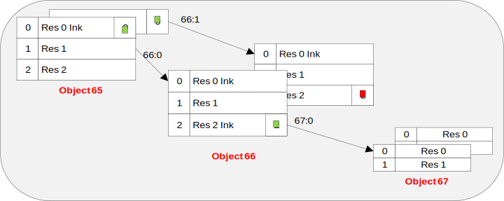

<strong> Appendix C. Data Types (Normative) </strong>

This appendix defines the data types that a Resource can be defined to be.

<table>
<tbody>
<tr class="odd">
<td><strong>Data Type</strong></td>
<td><strong>Description</strong></td>
<td><strong>Text Format</strong></td>
<td><strong>TLV Format</strong></td>
</tr>
<tr class="even">
<td><strong>String</strong></td>
<td>A UTF-8 string, the minimum and/or maximum length of the String MAY be defined.</td>
<td>Represented as a UTF-8 string.</td>
<td>Represented as a UTF-8 string of Length bytes.</td>
</tr>
<tr class="odd">
<td><strong>Integer</strong></td>
<td>An 8, 16, 32 or 64-bit signed integer. The valid range of the value for a Resource SHOULD be defined. This data type is also used for the purpose of enumeration.</td>
<td><p>Represented as an ASCII signed integer.</p>
<p>For example, the integer value -750 results in the 4 characters/byte long ASCII string “-750”.</p></td>
<td>Represented as a binary signed integer in network byte order, and in two’s complement representation. The value may be 1 (8-bit), 2 (16-bit), 4 (32-bit) or 8 (64-bit) bytes long as indicated by the Length field. When transmitted over network, the data is represented in network byte order (big endian).</td>
</tr>
<tr class="even">
<td><strong>Float</strong></td>
<td>A 32 or 64-bit floating point value. The valid range of the value for a Resource SHOULD be defined.</td>
<td><p>Represented as an ASCII signed numeric representation.</p>
<p>For example, we use a floating point number with the significand of 6.667, a base of 10 and the exponent of -11. This represents the number 6.667e-11 in scientific notation and will be represented as &quot;0.00000000006667&quot; as an ASCII string.</p></td>
<td>Represented as a binary floating point value [IEEE 754-2008] [FLOAT]. The value may use the binary32 (4 byte length) or binary64 (8 byte length) format as indicated by the Length field. When transmitted over network, the data is represented in network byte order (big endian).</td>
</tr>
<tr class="odd">
<td><strong>Boolean</strong></td>
<td>An 8 bit unsigned integer with the value 0 for False and the value 1 for True.</td>
<td>Represented as the ASCII value 0 or 1.</td>
<td>Represented as an 8 bit unsigned Integer with value 0, or 1. The Length of a Boolean value MUST always be 1 byte.</td>
</tr>
<tr class="even">
<td><strong>Opaque</strong></td>
<td>A sequence of binary octets, the minimum and/or maximum length of the String MAY be defined.</td>
<td><p>Represented as a Base64 encoding of the binary data [RFC4648].</p>
<p>For example, the sequence of bytes (in hex notation) {0x01, 0x02, 0x03, 0x04, 0x05} converts to the ASCII string “AQIDBAU=” in Base64 encoding.</p></td>
<td>Represented as a sequence of binary data of Length bytes.</td>
</tr>
<tr class="odd">
<td><strong>Time</strong></td>
<td>Unix Time. A signed integer representing the number of seconds since Jan 1<sup>st</sup>, 1970 in the UTC time zone.</td>
<td>Represented as an ASCII integer.<br />
For example, 1476186613 seconds since Jan 01 1970, which represents Tuesday, 11-Oct-16 11:50:13 UTC, are represented as the ASCII string &quot;1476186613&quot;, which has 10 characters/bytes.</td>
<td>Same representation as Integer.</td>
</tr>
<tr class="even">
<td><strong>Objlnk</strong></td>
<td><p>Object Link. The object link is used to refer an Instance of a given Object. An Object link value is composed of two concatenated 16 bit unsigned integers following the Network Byte Order convention. The Most Significant Half-word is an Object ID, the Least Significant Half-word is an Object Instance ID.</p>
<p>An Object Link referencing no Object Instance will contain the concatenation of 2 MAX-ID values (null link).</p></td>
<td>Represented as a UTF-8 string containing 2 16-bits ASCII integers separated by a ‘:’ ASCII character.</td>
<td>Same representation as two 16 bit unsigned integers one beside the other. The first one represents the Object ID, and the second one represents the Object Instance ID. This value is always 4 bytes long.</td>
</tr>
<tr class="odd">
<td><strong>none</strong></td>
<td>no specific data type affected to that resource: it exclusively concerns Executable Resource</td>
<td>Not applicable</td>
<td>Not applicable</td>
</tr>
</tbody>
</table>

 
```
Figure 19: Object link Resource simple illustration
```
