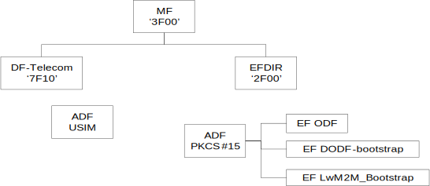

<strong> Appendix G. Storage of LwM2M Bootstrap Information on the Smartcard (Normative) </strong>

This appendix aims at specifying the storage mechanism of Bootstrap Information on UICC Smartcard platform type \[ETSI TS 102.221\] activated in 3G mode.

Note: There is no rational to equip LwM2M device with 2G-only Smart Card.

### G.1	File structure

The information format is based on \[PKCS\#15\] specification. The Bootstrap data is located under the PKCS\#15 directory allowing the card issuer to decide the identifiers and the file locations. The smartcard operations that are relevant include:

-   Application selection

-   Cardholder verification

-   File access (select file, read, write)

The \[PKCS\#15\] specification defines a set of files. Within the PKCS\#15 application, the starting point to access these files is the Object Directory File (ODF). The EF (ODF) contains pointers to other directory files. These directory files contain information on different types of objects (authentication objects, data objects, etc.). For the purpose of Bootstrap data, EF (ODF) MUST contain the EF Record describing the DODF-bootstrap. The EF (ODF) is described in Appendix G.3.1 and \[PKCS\#15\].

EF (ODF) contains pointers to one or more Data Object Directory Files (DODF) in priority order (i.e. the first DODF has the highest priority). Each DODF is regarded as the directory of data objects known to the PKCS\#15 application. For the purposes of LwM2M bootstrapping, EF (DODF-bootstrap) contains pointer to the Bootstrap data, namely LwM2M\_Bootstrap File. The EF (DODF-bootstrap) is described in Appendix G.3.2 and \[PKCS\#15\].

The provisioning files are stored as PKCS\#15 opaque data objects.<span id="_Object_Directory_File," class="anchor"></span>

The support of smartcard Bootstrap data will be indicated by the presence in the EF DIR (see \[ETSI TS 102.221\]) of an application template as defined here after.

The RECOMMENDED format of EF (DIR) is a linear fixed record in order to be in line with \[ETSI TS 102.221\].

EF (DIR) MUST contain the application template used for a PKCS\#15 application as defined in \[PKCS\#15\]. Application template MUST consist of Application identifier (tag 0x4F) and Path (tag 0x51) information.

The EF (ODF) and EF (DODF-bootstrap) MUST be used by the Device to determine the path of the LwM2M\_Bootstrap file.

UICC Smartcard platforms can support two modes of activation: 2G and 3G. In the context of LwM2M, for Device simplification, UICC MUST be activated in 3G Mode

UICC smartcard platform activated in a 3G mode has the physical and logical characteristics according to \[ETSI TS 102.221\]. In that case, smartcard operations for accessing the Bootstrap data are specified in Appendix G.2.

### G.2	Bootstrap Information on UICC (Activated in 3G Mode)

#### G.2.1 Access to the file structure

To select the PKCS\#15 application, the Device:

-   MUST evaluate the PKCS\#15 application template – i.e. PKCS\#15 AID - present in the EF (DIR),

-   MUST open a logical channel using UICC Command MANAGE CHANNEL as specified in \[ETSI TS 102.221\],

-   MUST select the PKCS\#15 ADF using the PKCS\#15 AID as parameter of the UICC Command SELECT, using direct application selection as defined in \[ETSI TS 102.221\].

LwM2M\_Bootstrap file will be located under the PKCS\#15 ADF.

#### G.2.2 Files Overview

 
```
Figure 23: 3G UICC File Structure and Bootstrap data location
```

#### G.2.3 Access Method

UICC Commands Read Binary and Update Binary, as defined in \[ETSI TS 102.221\], are used to access bootstrap data.

#### G.2.4 Access Conditions

The Device is informed of the access conditions of provisioning files by evaluating the “private” and “modifiable” flags in the corresponding DODF-bootstrap files structure.

In the case where one of the above mentioned flag is set, cardholder verification is required. The Device must evaluate the PIN references that must be verified as defined in \[ETSI TS 102.221\] (i.e. evaluate FCP)

#### G.2.5 Requirements on the 3G UICC

To retrieve the Bootstrap Information from the 3G UICC, the Device MUST perform the following steps:

-   Select PKCS\#15 file structure as specified in G.2.1.

-   Read ODF to locate the DODF-bootstrap,

-   Read DODF-bootstrap to locate the LwM2M\_Bootstrap file,

-   Read the LwM2M\_Bootstrap file

### G.3	Files Description

All files defined are binary files as defined in \[**ETSI TS 102.221**\]. These files are read and updated using 3G UICC Commands related to the application they belong to.

#### G.3.1 Object Directory File, EF ODF

The mandatory Object Directory File (ODF) (\[PKCS\#15\], Section 5.5.1) contains pointers to other EFs, each one containing a directory of PKCS\#15 objects of a particular class (e.g., DODF-bootstrap). The File ID is specified in \[PKCS\#15\]. The card issuer decides the file size. The EF (ODF) can be read but it MUST NOT be modifiable by the user.

The EF (ODF) is described below:

<table>
  <tr>
    <td colspan> Identifier: default 0x5031, see [PKCS#15] </td>
    <td colspan="2"> Structure: Binary </td>
    <td> Mandatory </td>
  </tr>
  <tr>
    <td colspan="2"> File size: decided by the card issuer </td>
    <td colspan="2"> Update activity: low </td>
  </tr>
  <tr>
    <td colspan="4"> Access Conditions: <br>
      READ           ALW <br>
           UPDATE           ADM<br>
           INVALIDATE       ADM <br>       
           REHABILITATE ADM <br>
    </td>
  </tr>
  <tr>
    <td colspan="4">
    Description
    </td>
  </tr>  
  <tr>
    <td colspan="4">
    See [PKCS#15]
    </td>
  </tr>
 </table> 

#### G.3.2 Bootstrap Data Object Directory File, EF DODF-bootstrap

This Data Object Directory File provisioning contains directories of provisioning data objects (\[PKCS\#15\], Section 6.7) known to the \[PKCS\#15\] application.

The File ID is described in the EF (ODF). The file size depends on the number of provisioning objects stored in the smartcard. Thus, the card issuer decides the file size.

<table>
  <tr>
    <td colspan> Identifier: 0x6430, See ODF </td>
    <td colspan="2"> Structure: Binary </td>
    <td> Mandatory </td>
  </tr>
  <tr>
    <td colspan="2"> File size: decided by the card issuer </td>
    <td colspan="2"> Update activity: low </td>
  </tr>
  <tr>
    <td colspan="4"> Access Conditions: <br>
      READ           ALW <br>
             or Universal / application / Local PIN (UICC, See Appendix G.2) <br>
           UPDATE           ADM<br>
           INVALIDATE       ADM <br>       
           REHABILITATE ADM <br>
    </td>
  </tr>
  <tr>
    <td colspan="4">
    Description
    </td>
  </tr>  
  <tr>
    <td colspan="4">
    See hereafter and [PKCS#15]
    </td>
  </tr>      
</table>

The EF (DODF-bootstrap) MUST contain information on provisioning objects:

-   Readable label describing the provisioning document (CommonObjectAttributes.label). The ME could display this label to the user.

-   Flags indicating whether the provisioning document is private (i.e., is protected with a PIN) and/or modifiable (CommonObjectAttributes.flags). The card issuer decides whether or not a file is private (it does not need to be if it does not contain any sensitive information)

-   Object identifier indicating a LwM2M boostrap Object and the type of the provisioning object (CommonDataObjectAttributes.applicationOID)

-   Pointer to the contents of the provisioning document (Path.path)

#### G.3.3 EF LwM2M_Bootstrap

Only the card issuer can modify EF LwM2M\_Bootstrap

<table>
  <tr>
    <td colspan> Identifier: See DODF </td>
    <td colspan="2"> Structure: Binary </td>
    <td> Optional </td>
  </tr>
  <tr>
    <td colspan="2"> File size: decided by the card issuer </td>
    <td colspan="2"> Update activity: low </td>
  </tr>
  <tr>
    <td colspan="4"> Access Conditions: <br>
      READ           ALW <br>
             or Universal / application / Local PIN (UICC, See Appendix G.2) <br>
           UPDATE           ADM<br>
           INVALIDATE       ADM <br>       
           REHABILITATE ADM <br>
    </td>
  </tr>
  <tr>
    <td colspan="4">
    Description
    </td>
  </tr>  
  <tr>
    <td colspan="4">
    Contains Bootstrap data (encapsulated LwM2M Objects)
    </td>
  </tr>      
</table>


This file size is limited to 32KB; the effective file size, in Bytes, is accessible from the File header.

In this file, the Bootstrap data relies on LwM2M TLV Data format specification.

The LwM2M specification already describes the TLV format for coding multiples instances and Resources of a given Object (§6.4.3), this section will only detailed how to store a collection of LwM2M Objects in this EF LwM2M\_Bootstrap file; each Object is coded with a header containing a LwM2M Object ID and its Object Version coded in one or 2 Bytes, a LwM2M-TLV coding the Object Instances as payload, and a length being the size in bytes of this payload (LwM2M-TLV of the Object Instances). Data are represented in network byte order (big endian).

Additionally, this Bootstrap data will have a 2 Byte header indicating the number of Objects contained in that file and another 2 Bytes for indicating the size of the full payload (size of the collection of LwM2M Objects).

Using a BNF-like description:

&lt;bootstrap\_data&gt; ::= &lt;number of objects&gt; &lt;size&gt; &lt;collection\_of\_lwm2m\_objects&gt;

&lt;number of Objects&gt; ::= HWORD

&lt;size&gt; ::= HWORD

&lt;collection\_of\_lwm2m\_objects&gt; ::= &lt;single\_lwm2m\_object&gt;\*

&lt;single\_lwm2m\_object&gt; ::= &lt;lwm2m\_object\_ID&gt; &lt;object\_version&gt; &lt;length\_of\_object&gt; &lt;lwm2m\_object\_instances&gt;

&lt;lwm2m\_object\_ID&gt; ::= HWORD

&lt;object\_version&gt; ::= IMPLICIT\_VERSION | &lt;other\_version&gt;

&lt;other\_version&gt; ::= MAJOR\_VERSION MINOR\_VERSION ; value %x0205 means version 2.5

&lt;length\_of\_object&gt; ::= HWORD

&lt;lwm2m\_object\_instances&gt; ::= TLV data format as described in §147138816.6.4.3

HWORD ::= %x00-FFFF

IMPLICIT\_VERSION ::= %x00 ; means version 1.0 or the Object is defined in the LwM2M Enabler

MAJOR\_VERSION ::= %x01-FF

MINOR VERSION ::= %x00-FF

In reading and processing the data of this file, the LwM2M Client is then able to be configured with the Bootstrap Information and thus to access the LwM2M Server(s).

