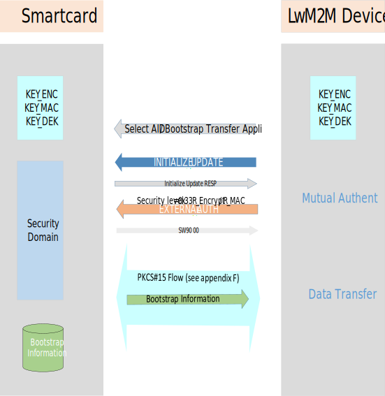

<strong> Appendix H. Secure channel between Smartcard and LwM2M Device Storage for secure Bootstrap Data provisioning (Normative) </strong>

During LwM2M Bootstrap procedure, sensitive data have to be provisioned in LwM2M Device.

When Bootstrap information comes from Smartcard, a secure channel SHOULD be established. When required this secure channel MUST follow the following procedure based on \[GLOBALPLATFORM\] \[GP SCP03\] which is illustrated below. The Bootstrap information will be retrieved from Smartcard as described in Appendix F of this document but in including the channel securisation.

Pre-requisite: the Smartcard and the LwM2M device have to share the same static Keys KEY\_ENC, KEY\_MAC, KEY\_DEK as specified in \[GLOBALPLATFORM\] \[GP SCP03\]

These keys are provisioned in the devices in using out-of-band methods.

The steps for the secure transfer are the following and are illustrated below (Figure 24):

-   The PKSC\#15 application used for transferring the Bootstrap information is selected

-   Secure channel (mutual authentication) is established

-   PKCS\#15 flow as described in Appendix F takes place for selecting and transferring the Bootstrap file from Smartcard to the device: the sensitive Bootstrap data are transferred crypted.

 
```
Figure 24: Bootstrap Information transfer from Smartcard to LwM2M Device using Secure channel according to [GLOBALPLATFORM] [GP SCP03] [GP AMD_A]
```

Note 1: The INITIALIZE\_UPDATE specifies the logical channel to use (CLA: 80H / 83H)

Note 2: The security level (P1) of the EXTERNAL\_AUTH command is C-DECRYPTION, R-ENCRYPTION, C-MAC and R-MAC (P1=0x33)


