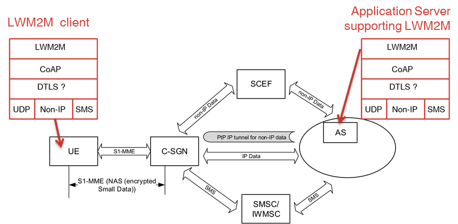

# Appendix M.	LWM2M over NB-IoT

## M.1	Introduction

Note: The 3GPP vocabulary and abbreviations used in the Annex are explained in [3GPP-TS_21.905].
3GPP has specified Narrow-Band IoT (NB-IoT) as part of their Release 13. NB-IoT includes solutions for support of infrequent data transmission via user plane and via control plane (=data transfer via MME). The user plane solution includes IP data and SMS support. The control plane solution includes IP data, non-IP data and SMS support.
Main focus of this Annex is on considerations and current limitations when running CoAP over the non-IP mode of NB-IoT.
The figure below shows the 3GPP NB-IoT architecture as in [3GPP-TR_23.720] and the LWM2M protocol stack. The shown C-SGN combines the functionality of MME, S-GW, and P-GW.

 

As can be seen from the above figure 3GPP defines two transmission paths for NIDD (Non-IP Data Delivery):
   1)	via PtP IP SGi tunnel (see [3GPP-TS_23.401])
   2)	via Service Capability Exposure Function (SCEF) (see [3GPP-TS_23.682])

When carrying LWM2M over NB-IoT non-IP mode some limitations and considerations apply which are explained in the following sub-sections.

## M.2	NIDD via PtP IP SGi tunnel

As specified in [3GPP-TS_23.401], for mobile originated traffic the P-GW is responsible for creating the IP-packets before sending them via the point-to-point tunnel to the AS. For this, the destination IP address and UDP port for PtP tunnelling based on UDP/IP need to be pre-configured on the P-GW.

As specified in [3GPP-TS_23.401], for mobile terminated traffic, in case PtP tunnelling based on UDP/IP is used, the AS sends the data using UDP/IP encapsulation with the IP address of the UE and the 3GPP defined port for “Non-IP” data. The IP-address of the UE is assigned by the P-GW, however, the UE is not aware of its IP address.  The P-GW removes the UDP/IP headers and the data is forwarded via the mobile network to the UE.

[3GPP-TS_29.061] provides further information on how to carry NIDD via the SGi interface.

From the above it can be seen that one limitation for the non-IP transport is the need to pre-configure the destination address in the P-GW so that payloads are correctly relayed. Thus, it is not possible to for a LWM2M client to selectively address more than one LWM2M server via its IP address. As a consequence, the LWM2M client cannot apply separate IP addresses for communicating with
  1)	different LWM2M Servers
  2)	separate LWM2M Server and separate LWM2M Bootstrap Server.

Client/Server initiated bootstrap could still be applied, however, for this the LWM2M Server and LWM2M Bootstrap Server would need to be combined and have the same server URI. From a security perspective it is advisable to keep LWM2M Server and LWM2M Bootstrap Server separate. Using factory bootstrap or smartcard bootstrap mode would remove the need of a LWM2M Bootstrap Server.

Another alternative would be to have an intermediary node between SGi and LWM2M server. Such a node could then inspect the CoAP messages for routing information such as URI-host and forward the messages accordingly to different LWM2M servers.

Further mechanisms to remove the above addressing limitation are for further consideration. E.g. a link layer protocol on top of NAS could re-establish addressing capabilities.

Given the required pre-configuration of the destination IP address in the mobile network an IoT platform provider needs to contact the mobile operator to get device-platform connectivity pre-configured (IP address, port number, dedicated APN if desired).

## M.3 NIDD via SCEF

[3GPP-TS_23.682] specifies NIDD via SCEF.

[3GPP-TS_23.682] also gives some guidelines how an AS can retrieve small data via the SCEF and suggests the message types “NIDD configuration request/response”, “NIDD submit request/response”, and “NIDD request/response” (see [3GPP-TS_23.682], clause 5.13). However, the definition of required APIs is considered out of 3GPP’s scope.

*Editor’s Note: If OMA provides the required APIs a reference should be added here The APIs should provide at least the following functionality:
 * NIDD from SCEF to LWM2M server and vice-versa, including the message types NIDD configuration request/response, NIDD submit request/response, and NIDD request/response
 * Information about device awake/sleep transitions
 * SCEF-LWM2M server bulk interface might be needed for which OMA would need to define a message structure.

Obviously in non-IP mode the device is not able to address LWM2M server(s) via their IP address. If NIDD via SCEF is selected all data goes via the SCEF. Thus, the UE can only talk to one LWM2M server since there is no additional information available at the IP layer that allows to selectively address more than one LWM2M server. This information would for regular LWM2M be available in the IP header.

An alternative would be to have an intermediary node between SCEF and LWM2M server. Such a node could then inspect the CoAP messages for routing information such as URI-host and forward the messages accordingly to different LWM2M servers.

The LWM2M server needs to identify the UE towards the SCEF via its MSISDN or External Identifier (see [3GPP-TS_23.682]).

## M.4	NAS Transport

[3GPP-TS_24.301] defines the transport of user data via the control plane procedure. Two dedicated NAS messages are specified for transferring small data via the MME, see CONTROL PLANE SERVICE REQUEST message and ESM DATA TRANSPORT message in 3GPP [3GPP-TS_24.301]. For initiation of user data transport via the control plane the CONTROL PLAN SERVICE REQUEST message is used which may include ESM DATA TRANSPORT message in its IE “ESM message container”. After the initiation of user data transport via control plane the separate ESM DATA TRANSPORT messages may be used for further transport of user data.

CoAP messages are placed into the IE “User data container” of the ESM DATA TRANSPORT message.

In case DTLS is used the same applies to the DTLS messages.

The user data container has a variable length and the maximum payload size is 32768 bytes. According to 3GPP TS 23.060 the network shall use a maximum packet size of at least 128 octets (this applies to both uplink and downlink). The maximum uplink packet size that the MS shall use can be provided by the network as a part of the session management configuration via the Protocol Configurations Options (PCO) (see [3GPP-TS_24.008] and [3GPP-TS_27.060]). According to [3GPP-TS_24.008] the maximum size for Non-IP link MTU is 1358 octets to prevent fragmentation in the backbone network. The maximum uplink packet size as indicated in the PCO may be retrieved by the LWM2M Server via the Communications Characteristics Object.

*Editor’s note: Reference to Communications Characteristics Object to be added.*

It has to be noted that there is no segmentation mechanism available for NAS transport. Thus, the LWM2M Client must not exceed the maximum uplink packet size as indicated via the PCO.

Furthermore, the LWM2M Server must not exceed the maximum downlink packet size supported for NAS transport.

The PCO is also used to covey a rate control instruction to the UE i.e. the maximum number of uplink/downlink messages per a specific time unit (see [3GPP-TS_23.401]). This can lead to a delay of LWM2M message delivery in case the rate is exceeded. The LWM2M server can get awareness of any applied rate control via the Cellular Network Connectivity Object (Serving PLMN Rate Control) and via the APN Connection Profile Object (APN Rate Control).

*Editor’s note: Reference to above Objects to be added, including byte control*

According to [3GPP-TS_24.301] the CONTROL PLANE SERVICE REQUEST message and the ESM DATA TRANSPORT message include an IE “Release assistance indication” to inform the network whether or not a downlink data transmission (e.g. acknowledgement or response) subsequent to the uplink data transmission is expected. For mobile originating LWM2M traffic this indicator SHOULD be set accordingly.

<table>
 
 <tr>
  <td> <strong> ‘Release assistance indication’ value </strong> </td>
  <td> <strong> Recommended Use </strong></td> 
 </tr> 
 
 <tr>
  <td> 00 (binary) </td>
  <td> In case an ongoing transaction is expected after an uplink message. This ensures that the MME doesn’t initiate the connection release. Example: LWM2M Client responding to READ, WRITE, etc. operations as the LWM2M Client doesn’t know how many commands it will receive from the LWM2M Server. </td> 
 </tr>
 
 <tr>
  <td> 10 (binary) </td> 
  <td> In case a single response or acknowledgement is expected after am uplink message. This leads to the MME initiating the connection release after the next downlink data transmission. Example: LWM2M Registration Update </td>
 </tr>
 
 
 <tr>
  <td> 01 (binary) </td> 
  <td> In case no response or acknowledgement is expected after an uplink message. This leads to the MME initiating the connection release immediately. Example: LWM2M Notification </td>
 </tr>
 
</table> 

*Note: Data transmission speed for uplink and downlink via NAS is expected to be around 300 bit/s, or more.*

## M.5	Large data transport with NB-IoT

Even NB-IoT is mainly designed for small data delivery it does not preclude delivery of very infrequent large data (e.g. software update/software patches).

[3GPP-TS_23.401] describes a control/user plane switch which could be used e.g. to switch the device communication from control plane to user plane in case a software update is expected. However, there will be devices which do only support communication via the control plane.

IETF has defined segmentation handling at the CoAP layer for large file transfer e.g. firmware updates. Blockwise transfers in CoAP: https://datatracker.ietf.org/doc/draft-ietf-core-block/

CoAP block transfer MAY be used with for carrying CoAP over NB-IoT. This option can be used with IP-mode and non-IP-mode.

*Editor’s note: The RFC will soon be finalised.*

An alternative approach is the use of CoAP over TCP. Obviously, this option works only with the IP-mode.

*Editor’s note: The RFC will soon be finalised.*

## M.6	Message buffering

NB-IoT devices are expected to be in a sleeping and power saving mode much or most of the time to enable a battery lifetime of several years. In case a device is in sleeping more, or, not reachable for other reasons downlink messages need to be buffered. 3GPP has defined such buffering operation as “extended buffering” at the SCEF (see [3GPP-TS_23.682]) and the S-GW (see [3GPP-TS_23.401]).

It has to be noted that there is a potential issue with DTLS timeout and CoAP CON retransmission timer if the messages are buffered in the mobile network. The could lead to the buffer being filled up with retransmissions.

Furthermore, in case LWM2M queue mode and network buffering are both applied then this could lead to the message being stored in each buffer resulting in duplicated delivery of the message after the device wakes up.

One way for avoiding this would be to use only LWM2M queue mode for buffering messages while the device is not reachable due to sleeping mode or other reasons. In that case “extended buffering” in the network should be deactivated. According to [3GPP-TS_23.401] “extended buffering” can be de-activated per APN, or per subscriber.

Alternatively, the LWM2M server could be configured to only send messages when the device is awake. Obvious precondition for this would be the LWM2M server being aware of the device state.

*Editor’s note: The device state info is available at the MME which informs the SCEF when the device has woken up from power saving mode (see 3GPP TS 23.682). A trigger mechanism from the SCEF to AS could be used, refer ENCap-M2M API from OMA ARC for such API availability.*

*It has to be noted that certain NB-IoT implementations need to support also time critical use cases for NB-IoT e.g. fire alarms.*

## M.7	NB-IoT transport configuration options

Various configuration options for NB-IoT transport are provided via the ConnMgmt enabler.

*Editor’s note: Reference to be added*

## M.8	Timer considerations
### M.8.1	Introduction

3GPP Rel-13 LTE NB-IoT is aimed at constrained low power IoT devices which require infrequent small data transfer and have a battery life of ~10 years. To minimise power consumption these devices use certain features such as Power Save Mode and extended Idle Mode DRX (eDRX) which govern how often the device wakes up, stays up and reachable. Effective use of these parameters in conjunction with LWM2M Registration Life Time, min/max notify periods, and – if LWM2M queue mode operation is used - ACK_TIMEOUT will help the device to have synchronised set of activities that could optimise its power consumption by avoiding unnecessary wake ups and transmissions.

### M.8.2	3GPP Parameters

<table>
 <tr>
  <td><strong>Parameter</strong></td>
  <td><strong>Range</strong></td>
  <td><strong>Purpose/how it’s used by the device</strong></td>
 </tr>
 
 <tr>
  <td> PSM Timer, Extended T3412 </td>
 <td> 10min-992 days1</td>
  <td> Max interval between periodic TAU if there is no other transmission from the device. During this time the device is considered as unreachable and can thereby shut down/deactivate. </td>
 </tr>
 
 
 <tr>
  <td> Active Timer, T3324 </td>
 <td> 2sec-31 min</td>
  <td> The time the UE has to stay up and remain reachable after transitioning to idle state in case there is pending data from the NW to send out. At the end of T3324 UE can shut down and deactivate. </td>
 </tr>
 
 <tr>
  <td> Extended DRX2 </td>
  <td> 5.12sec- 174 min </td>
  <td> Extended Idle mode DRX </td>
 </tr>

 <tr>
  <td> Higher Priority PLMN Search Timer </td>
  <td> </td>
  <td> Interval between periodic searches for higher priority PLMNs when camped on a visited PLMN, i.e. roaming scenario; based on SIM configuration, EFHPPLMN ([3GPP-TS_31.102], section 4.2.6) </td>
 </tr>
 
 <tr>
  <td> Rate Control </td>
  <td> TBD </td>
  <td> Determines the number of allowed uplink PDU transmissions per deci hour per APN as well as per serving PLMN </td>
 </tr>
 
</table> 

*Note 1: Table 10.5.163a in [3GPP-TS_24.008] specifies range N to 31\*N in increments of one where the units of N  can be 2 seconds, 30 seconds, 1 min, 10 min, 1 hour, 10 hour or 320 hours. In the context of NB-IoT units of 1 or 10 hours will probably be used in most scenarios?*

*Note 2: Extended DRX and PSM can coexist and be configured together.*

PSM Timer (Extended T3412), Active Timer (T3324) and Extended DRX can be requested by the device from the network by inclusion of requested values in Attach or TAU requests. On accepting the device request, the network will provide the device with values for these timers which the device should use.

The LWM2M server can configure the values which the device should request from the network via the xxx Resource of the Object. By observing this resource, the LWM2M also receives the finally applied timer in case the network has not accepted the device’s request.

### M.8.3	LWM2M Parameters

<table>
 <tr>
  <td><strong>Parameter</strong></td>
  <td><strong>Range</strong></td>
  <td><strong>Purpose/how it’s used by the device</strong></td>
 </tr>
 
 <tr>
  <td> Registration Life Time </td>
  <td> </td>
  <td> Max. interval between client performing registration updates </td>
 </tr>

 <tr>
  <td> Pmin </td>
  <td> </td>
 <td> Min. time in second between sending notifications for a resource if any of the notify conditions are met </td>
 </tr>

 <tr>
  <td> Pmax </td>
  <td> </td>
  <td> Max. time in seconds between sending successive notifications for a resource if none of other notify conditions are satisfied</td>
 </tr>

 <tr>
  <td> ACK_TIMEOUT </td>
  <td> </td>
  <td> CoAP timer used with LWM2M queue mode operation. The LWM2M Client MUST wait at least ACK_TIMEOUT seconds from the last CoAP message it sent to the LWM2M Server before intentionally going offline</td>
 </tr>
 
 </table>

### M.8.4	Interactions between parameters

From the two tables above it is clear that how often the device wakes up, transmits data and stays awake, is controlled by a combination of parameters defined by 3GPP and OMA that need to be configured in unison to maximise device power efficiency. For example, in the absence of any service data transmission, the device still has to wake up on a regular basis to: a) update its registration with the LWM2M server to make sure its registration stays valid and b) carry out periodic TAU to meet 3GPP requirements. If parameters are configured such that Registration lifetime <= T3412, then the need to perform TAU will automatically be eliminated because when the registration update is performed by the device, the periodic TAU timer will automatically be reset. However, if T3412 < Registration lifetime, then the device either wakes up twice to carry out these procedures separately, or unilaterally decides to update its registration on expiry of T3412 which will result in the LWM2M server receiving updates more frequently than it had asked for.

Both Active Timer (T3324) and CoAP MAX_TRANSMIT_WAIT are aimed to achieve the same result, namely keeping the device awake long enough to allow queued messages to be sent to the device. Depending on where the queuing occurs, only one of these timers is actually required and can be meaningfully used. It’s also worth noting that these timers do not start at the same time, MAX_TRANSMIT_WAIT is started after last transmission, while T3324 starts later when the device has released the connection and returned to idle state.

From 3GPP perspective eDRX determines how often the device needs to wake up and monitor its paging channel. From LWM2M perspective, a device that is monitoring a sensor at the minimum needs to wake up every Pmax to sample sensor data and transmit its value. It also does not need to wake up any more frequently than Pmin to read the sensor data, assuming no filtering & averaging. Pmin, Pmax and eDRX need to be configured such that a device can schedule its activities to minimise the number of times it needs to wake up and transmit data; this is also contingent on any configured Rate Control value being in line with Pmin & Pmax.

### M.8.5	Timer implementation options

Effective use of 3GPP timers in conjunction with LWM2M timers will help the device to have synchronised set of activities that could optimise its power consumption by avoiding unnecessary wake ups and transmissions.

The following recommendations apply:

   * After bootstrapping, registration or interaction with the LWM2M server, the device needs to examine above mentioned parameters and negotiate 3GPP parameters with the network as appropriate to maximise the power efficiency.

   * One set of possible relationships between the various parameters that could provide efficiency is given below.

The customer solution designer will define the values of Pmin and Pmax, and the Infrastructure solution provider will define the values of Extended T3412, LWM2M Registration lifetime and eDRX.

For efficient interaction between mechanisms, the following relationships can be maintained between values of LWM2M and 3GPP parameters:

   * Extended T3412 > LWM2M Registration lifetime > Pmax, in the scenarios where only Pmax is configured for simple periodic reporting such as a water meter reading Whenever Pmax expires the device will wake up, read the sensor, and sends service data to the server and can optionally send registration update at the same time. This way it will only need to wake up once every Pmax cycle.
   * Pmin < eDRX <Pmax <=translated value of Rate control (in deci-hours) to time interval. The assumption is Pmin is configured alongside the setting of thresholds on a resource (greater than, less than, step) which means the device needs to wake up every so often (at a minimum every Pmax) to sample some sensor input. Therefore, when eDRX is also configured the device can simply wake up every eDRX cycle to both sample its sensor input and monitor its paging. It can then evaluate its sensor data against a threshold and decide whether to transmit any data or not. It also does not make sense for rate control to stop the device meeting Pmax requirements.
   * When rate control is applied the Pmin and Pmax setting need to be chosen in a way to avoid notifications in a higher rate than rate control allows.

 
