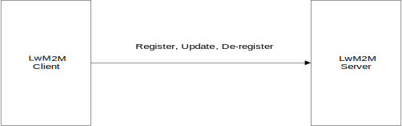

<table border="0" rules="none" cellspacing="0" cellpadding="0" width="600">
<tr>
<td></td>
</tr>

<tr>
<td align="right"><font size="6"><b>Lightweight Machine to Machine Technical Specification: Core</b></font></td>
</tr>

<tr>
<td align="right"><font size="5">Draft Version 1.1 – 01 Nov 2017</font></td>
</tr>

<tr>
 <td align="right"><font size="5"><b>Open Mobile Alliance</b></font></td>
</tr>


<tr>
<td align="right"><font size="5">OMA-TS-LightweightM2M-V1_1-Core-20170915-D </font></td>
</tr> 
</table>

Use of this document is subject to all of the terms and conditions of the Use Agreement located at <http://www.openmobilealliance.org/UseAgreement.html>.

Unless this document is clearly designated as an approved specification, this document is a work in process, is not an approved Open Mobile Alliance™ specification, and is subject to revision or removal without notice.

You may use this document or any part of the document for internal or educational purposes only, provided you do not modify, edit or take out of context the information in this document in any manner. Information contained in this document may be used, at your sole risk, for any purposes. You may not use this document in any other manner without the prior written permission of the Open Mobile Alliance. The Open Mobile Alliance authorizes you to copy this document, provided that you retain all copyright and other proprietary notices contained in the original materials on any copies of the materials and that you comply strictly with these terms. This copyright permission does not constitute an endorsement of the products or services. The Open Mobile Alliance assumes no responsibility for errors or omissions in this document.

Each Open Mobile Alliance member has agreed to use reasonable endeavors to inform the Open Mobile Alliance in a timely manner of Essential IPR as it becomes aware that the Essential IPR is related to the prepared or published specification. However, the members do not have an obligation to conduct IPR searches. The declared Essential IPR is publicly available to members and non-members of the Open Mobile Alliance and may be found on the “OMA IPR Declarations” list at <http://www.openmobilealliance.org/ipr.html>. The Open Mobile Alliance has not conducted an independent IPR review of this document and the information contained herein, and makes no representations or warranties regarding third party IPR, including without limitation patents, copyrights or trade secret rights. This document may contain inventions for which you must obtain licenses from third parties before making, using or selling the inventions. Defined terms above are set forth in the schedule to the Open Mobile Alliance Application Form.

NO REPRESENTATIONS OR WARRANTIES (WHETHER EXPRESS OR IMPLIED) ARE MADE BY THE OPEN MOBILE ALLIANCE OR ANY OPEN MOBILE ALLIANCE MEMBER OR ITS AFFILIATES REGARDING ANY OF THE IPR’S REPRESENTED ON THE “OMA IPR DECLARATIONS” LIST, INCLUDING, BUT NOT LIMITED TO THE ACCURACY, COMPLETENESS, VALIDITY OR RELEVANCE OF THE INFORMATION OR WHETHER OR NOT SUCH RIGHTS ARE ESSENTIAL OR NON-ESSENTIAL.

THE OPEN MOBILE ALLIANCE IS NOT LIABLE FOR AND HEREBY DISCLAIMS ANY DIRECT, INDIRECT, PUNITIVE, SPECIAL, INCIDENTAL, CONSEQUENTIAL, OR EXEMPLARY DAMAGES ARISING OUT OF OR IN CONNECTION WITH THE USE OF DOCUMENTS AND THE INFORMATION CONTAINED IN THE DOCUMENTS.

© 2017 Open Mobile Alliance All Rights Reserved.
Used with the permission of the Open Mobile Alliance under the terms set forth above.

## Table of Contents
1. [Scope](#1-scope)
2. [References](#2-references)
3. [Terminology and Conventions](#3-terminology-and-conventions)
4. [Introduction](#4-introduction)
5. [Interfaces](#5-interfaces)
6. [Identifiers and Resources](#6-identifiers-and-resources)
7. [Access Control](#7-access-control)


## 1 Scope

### V1_0_x

This document specifies version 1.0 of the Lightweight Machine-to-Machine (LwM2M) protocol. This Lightweight M2M 1.0 enabler introduces the following features:

-   Simple resource model with the core set of objects and resources defined in this specification. The full list of registered objects can be found at [OMNA](http://www.openmobilealliance.org/wp/OMNA/LwM2M/LwM2MRegistry.html).

-   Operations for creation, update, deletion, and retrieval of resources.

-   Asynchronous notifications of resource changes.

-   Support for several serialization formats, namely TLV, JSON, Plain Text and binary data formats and the core set of LightweightM2M Objects.

-   UDP and SMS transport support.

-   Communication security based on the DTLS protocol supporting different types of credentials.

-   Queue Mode offers functionality for a LwM2M Client to inform the LwM2M Server that it may be disconnected for an extended period and when it becomes reachable again.

-   Support for use of multiple LwM2M Servers.

-   Provisioning of security credentials and access control lists by a dedicated LwM2M bootstrap-server.

### V1_1_x

## 2 References

### 2.1 Normative References
--------------------

<table>
<tbody>
<tr class="odd">
<td><strong>[3GPP-TS_23.003]</strong></td>
<td>3GPP TS 23.003 “Numbering, addressing and identification”</td>
</tr>
<tr class="even">
<td><strong>[3GPP-TS_23.032]</strong></td>
<td>3GPP TS 23.032 “Universal Geographical Area Description (GAD)”</td>
</tr>
<tr class="odd">
<td><strong>[3GPP-TS_23.038]</strong></td>
<td>3GPP TS 23.038 “Alphabets and language-specific information”</td>
</tr>
<tr class="even">
<td><strong>[3GPP-TS_23.040]</strong></td>
<td>3GPP TS 23.040 “Technical realization of the Short Message Service (SMS)”</td>
</tr>
<tr class="odd">
<td><strong>[3GPP-TS_24.008]</strong></td>
<td>3GPP TS 24.008 “Mobile radio interface Layer 3 specification; Core network protocols; Stage 3”</td>
</tr>
<tr class="even">
<td><strong>[3GPP-TS_25.331]</strong></td>
<td>3GPP TS 25.331 “Radio Resource Control (RRC); Protocol specification”</td>
</tr>
<tr class="odd">
<td><strong>[3GPP-TS_31.111]</strong></td>
<td>3GPP TS 31.111 “Universal Subscriber Identity Module (USIM) Application Toolkit (USAT)”</td>
</tr>
<tr class="even">
<td><strong>[3GPP-TS_31.115]</strong></td>
<td>3GPP TS 31.115 “Remote APDU Structure for (U)SIM Toolkit applications”</td>
</tr>
<tr class="odd">
<td><strong>[CoAP]</strong></td>
<td><p>Shelby, Z., Hartke, K., Bormann, C., and B. Frank, “The Constrained Application Protocol (CoAP)”</p>
<p>IETF RFC 7252 – June 2014</p>
</td>
</tr>
<tr class="even">
<td><strong>[CoAP_Blockwise]</strong></td>
<td>C. Bormann, Z. Shelby, “Block-wise transfers in CoAP”, IETF RFC 7959.</td>
</tr>
<tr class="odd">
<td><strong>[CoAP-EST]</strong></td>
<td>S. Kumar, P. van der Stok, “EST based on DTLS secured CoAP (EST-coaps)”, draft-vanderstok-core-coap-est-00, October, 2016</td>
</tr>
<tr class="even">
<td><strong>[CoRE_Interface]</strong></td>
<td>Z. Shelby, M. Vial, “CoRE Interfaces”, draft-ietf-core-interfaces-01, Nov 2013</td>
</tr>
<tr class="odd">
<td><strong>[</strong><span id="reference_TS102_221" class="anchor"></span><strong>ETSI TS 102.221]</strong></td>
<td>“Smart Cards; UICC-Terminal interface; Physical and logical characteristics”, (ETSI TS 102 221 release 11), <a href="http://www.etsi.org/">URL:http://www.etsi.org/</a></td>
</tr>
<tr class="even">
<td><strong>[ETSI TS 102.223]</strong></td>
<td>“Smart Cards; Card Applications Toolkit (CAT) (Release 11)”<br />
<a href="http://www.etsi.org/">URL:http://www.etsi.org/</a></td>
</tr>
<tr class="odd">
<td><strong>[ETSI TS 102.225]</strong></td>
<td>ETSI TS 102 225 (V11.0.0): “Smart Cards; Secured packet structure for UICC based applications (Release 11)” <a href="http://www.etsi.org/">URL:http://www.etsi.org/</a></td>
</tr>
<tr class="even">
<td><strong>[FLOAT]</strong></td>
<td>
<p>IEEE Computer Society (August 29, 2008). IEEE Standard for Floating-Point Arithmetic. IEEE. doi:10.1109/IEEESTD.2008.4610935. ISBN 978-0-7381-5753-5. IEEE Std 754-2008</p>
</td>
</tr>
<tr class="odd">
<td><strong>[GLOBALPLATFORM]</strong></td>
<td>GlobalPlatform v2.2.1 - January 2011 -</td>
</tr>
<tr class="even">
<td><strong>[GP SCP03]</strong></td>
<td>GlobalPlatform Secure Channel Protocol 03 (SCP 03) Amendment D v1.1 Sept 2009</td>
</tr>
<tr class="odd">
<td><strong>[IEEE 754-2008]</strong></td>
<td>IEEE Computer Society (August 29, 2008). IEEE Standard for Floating-Point Arithmetic. IEEE. doi:10.1109/IEEESTD.2008.4610935. ISBN 978-0-7381-5753-5. IEEE Std 754-2008</td>
</tr>
<tr class="even">
<td><strong>[IOPPROC]</strong></td>
<td>“OMA Interoperability Policy and Process”, Version 1.13, Open Mobile Alliance™, OMA-IOP-Process-V1_13, <a href="URL:http://www.openmobilealliance.org/" class="uri">URL:http://www.openmobilealliance.org/</a></td>
</tr>
<tr class="odd">
<td><strong>[LwM2M-AD]</strong></td>
<td>“Lightweight Machine to Machine Architecture”, Open Mobile Alliance™, OMA-AD-LightweightM2M-V1_0, <a href="URL:http://www.openmobilealliance.org/" class="uri">URL:http://www.openmobilealliance.org/</a></td>
</tr>
<tr class="even">
<td><strong>[OBSERVE]</strong></td>
<td>Hartke, K. “Observing Resources in CoAP”, IETF RFC 7641.</td>
</tr>
<tr class="odd">
<td><strong>[</strong><span id="reference_PKCS_15" class="anchor"></span><strong>PKCS#15]</strong></td>
<td>“PKCS #15 v1.1: Cryptographic Token Information Syntax Standard”, RSA Laboratories, June 6, 2000. URL:<a href="ftp://ftp.cert.dfn.de/pub/pca/docs/PKCS/ftp.rsa.com/pkcs-15/pkcs-15v1_1.pdf" class="uri">ftp://ftp.cert.dfn.de/pub/pca/docs/PKCS/ftp.rsa.com/pkcs-15/pkcs-15v1_1.pdf</a></td>
</tr>
<tr class="even">
<td><strong>[RFC2119]</strong></td>
<td>“Key words for use in RFCs to Indicate Requirement Levels”, S. Bradner, March 1997, <a href="URL:http://www.ietf.org/rfc/rfc2119.txt" class="uri">URL:http://www.ietf.org/rfc/rfc2119.txt</a></td>
</tr>
<tr class="odd">
<td><strong>[RFC2234]</strong></td>
<td>“Augmented BNF for Syntax Specifications: ABNF”. D. Crocker, Ed., P. Overell. November 1997, <a href="URL:http://www.ietf.org/rfc/rfc2234.txt" class="uri">URL:http://www.ietf.org/rfc/rfc2234.txt</a></td>
</tr>
<tr class="even">
<td><strong>[RFC4122]</strong></td>
<td>“A Universally Unique Identifier (UUID) URN Namespace”, P. Leach, et al. July 2005, <a href="URL:http://www.ietf.org/rfc/rfc4122.txt" class="uri">URL:http://www.ietf.org/rfc/rfc4122.txt</a></td>
</tr>
<tr class="odd">
<td><strong>[RFC5246]</strong></td>
<td>The Transport Layer Security (TLS) Protocol Version 1.2</td>
</tr>
<tr class="even">
<td><strong>[RFC5280]</strong></td>
<td>D. Cooper, et al., “Internet X.509 Public Key Infrastructure Certificate and Certificate Revocation List (CRL) Profile”, RFC 5280, May 2008.</td>
</tr>
<tr class="odd">
<td><strong>[RFC5289]</strong></td>
<td>TLS Elliptic Curve Cipher Suites with SHA-256/384 and AES Galois Counter Mode (GCM)</td>
</tr>
<tr class="even">
<td><strong>[RFC5487]</strong></td>
<td>Pre-Shared Key Cipher Suites for TLS with SHA-256/384 and AES Galois Counter Mode</td>
</tr>
<tr class="odd">
<td><strong>[RFC5958]</strong></td>
<td>S. Turner, “Asymmetric Key Packages”, RFC 5958, August 2010.</td>
</tr>
<tr class="even">
<td><strong>[RFC6347]</strong></td>
<td>Rescorla, E. and N. Modadugu, “Datagram Transport Layer Security Version 1.2”, <a href="http://tools.ietf.org/html/rfc6347">RFC 6347</a>, January 2012.</td>
</tr>
<tr class="odd">
<td><strong>[RFC6655]</strong></td>
<td>McGrew, D. and D. Bailey, “AES-CCM Cipher Suites for TLS”, RFC6655, July 2012.</td>
</tr>
<tr class="even">
<td><strong>[RFC6690]</strong></td>
<td>Shelby, Z. “Constrained RESTful Environments (CoRE) Link Format”, RFC6690, Aug 2012.</td>
</tr>
<tr class="odd">
<td><strong>[RFC7292]</strong></td>
<td>K. Moriarty, et al., “PKCS #12: Personal Information Exchange Syntax v1.1”, RFC 7292, July 2014.</td>
</tr>
<tr class="even">
<td><strong>[SENML]</strong></td>
<td>C. Jennings, Z. Shelby, J. Arkko, “Media Types for Sensor Markup Language (SENML)”, draft-jennings-senml-10 (work in progress), April 2013.</td>
</tr>
<tr class="odd">
<td><strong>[TR-069]</strong></td>
<td>Broadband Forum: “TR-069 CPE WAN Management Protocol” Issue: 1 Amendment 5.<br />
<a href="URL:http://www.broadband-forum.org/technical/download/TR-069_Amendment-5.pdf" class="uri">URL:http://www.broadband-forum.org/technical/download/TR-069_Amendment-5.pdf</a></td>
</tr>
<tr class="even">
<td><strong>[WAP-WDP]</strong></td>
<td>Wireless Application Protocol Forum, “Wireless Datagram Protocol”, June 2001.</td>
</tr>
<tr class="odd">
<td><strong>[SCRRULES]</strong></td>
<td>Open Mobile Alliance, "SCR Rules and Procedures, Version 1.0", 19. September 2006, URL: http://member.openmobilealliance.org/ftp/Public_documents/iop/Permanent_documents/OMA-ORG-SCR_Rules_and_Procedures-V1_0-20060919-A.zip</td>
</tr>
</tbody>
</table>

### 2.2 Informative References

<table>
<tbody>
<tr class="odd">
<td><strong>[3GPP TS 31.116]</strong></td>
<td>3GPP TS 31.116 (V10.2.0): “Remote APDU Structure for (Universal) Subscriber Identity Module (U)SIM Toolkit applications (Release 10)”</td>
</tr>
<tr class="even">
<td><strong>[3GPP2 C.S0078-0]</strong></td>
<td>3GPP2 C.S0078-0 (V1.0): “Secured packet structure for CDMA Card Application Toolkit (CCAT) applications”</td>
</tr>
<tr class="odd">
<td><strong>[3GPP2 C.S0079-0]</strong></td>
<td>3GPP2 C.S0079-0 (V1.0) “Remote APDU Structure for CDMA Card Application Toolkit (CCAT) applications”</td>
</tr>
<tr class="even">
<td><strong>[DMREPPRO]</strong></td>
<td>“OMA Device Management Representation Protocol, Version 1.3”.<br />
Open Mobile Alliance™. OMA-TS-DM_RepPro-V1_3. <a href="URL:http://www.openmobilealliance.org" class="uri">URL:http://www.openmobilealliance.org</a></td>
</tr>
<tr class="odd">
<td><strong>[DYNAMIC LINK]</strong></td>
<td>“Dynamic Resource Linking for Constrained RESTful Environments”, Z.Shelby, Z.Vial, M.Koster, C.Groves, Oct 2016, draft-ietf-core-dynlink-01</td>
</tr>
<tr class="even">
<td><strong>[ETSI TS 102 226]</strong></td>
<td>ETSI TS 102 226 (V11.0.0): “Smart cards; Remote APDU structure for UICC based applications (Release 11)”</td>
</tr>
<tr class="odd">
<td><strong>[ISO/IEC18031:2011]</strong></td>
<td>ISO, “ISO/IEC 18031:2011: Information technology -- Security techniques -- Random bit generation”, November 2011, available at <a href="http://www.iso.org/iso/catalogue_detail.htm?csnumber=54945" class="uri">http://www.iso.org/iso/catalogue_detail.htm?csnumber=54945</a></td>
</tr>
<tr class="even">
<td><strong>[OMADICT]</strong></td>
<td>“Dictionary for OMA Specifications”, Open Mobile Alliance™,<br />
OMA-ORG-Dictionary-V2_9, <a href="URL:http://www.openmobilealliance.org/" class="uri">URL:http://www.openmobilealliance.org/</a></td>
</tr>
<tr class="odd">
<td><strong>[OMNA]</strong></td>
<td>“OMNA Lightweight M2M (LwM2M) Object &amp; Resource Registry”, <a href="http://www.openmobilealliance.org/"><em>URL:http://www.openmobilealliance.org/</em></a></td>
</tr>
<tr class="even">
<td><strong>[RESOURCE DIRECTORY]</strong></td>
<td>“CoRE Resource Directory”, Z.Shelby, M.Koster, C.Bormann, P.Van Der Stok Oct 2016, draft-ietf-core-resource-directory-09</td>
</tr>
<tr class="odd">
<td><strong>[RFC3986]</strong></td>
<td>T. Berners-Lee, R. Fielding, L. Masinter, “Uniform Resource Identifier (URI): Generic Syntax”, RFC 3986, January 2005.</td>
</tr>
<tr class="even">
<td><strong>[RFC4086]</strong></td>
<td>D. Eastlake, J. Schiller, S. Crocker, “Randomness Requirements for Security”, RFC 4086, June 2005.</td>
</tr>
<tr class="odd">
<td><strong>[RFC6698]</strong></td>
<td>P. Hoffman, J. Schlyter, “The DNS-Based Authentication of Named Entities (DANE) Transport Layer Security (TLS) Protocol: TLSA”, RFC 6698, August 2012.</td>
</tr>
<tr class="even">
<td><strong>[RFC7459]</strong></td>
<td>“Representation of Uncertainty and Confidence in the Presence Information Data Format Location Object (PIDF-LO)”, M. Thomson, J. Winterbootom, February 2015. <a href="URL:https://tools.ietf.org/html/rfc7459" class="uri">URL:https://tools.ietf.org/html/rfc7459</a></td>
</tr>
<tr class="odd">
<td><strong>[SMS-DTLS]</strong></td>
<td>“Transport Layer Security (TLS) / Datagram Transport Layer Security (DTLS) Profiles for the Internet of Things”, H. Tschofenig, T. Fossati, July 2016, <a href="http://www.ietf.org/rfc/rfc7925.txt">URL:http://www.ietf.org/rfc/rfc7925.txt</a></td>
</tr>
<tr class="even">
<td><strong>[SP800-90A]</strong></td>
<td>Elaine Barker, John Kelsey, “Recommendation for Random Number Generation Using Deterministic Random Bit Generators, NIST Special Publication 800-90A”, Revision 1, June 2015, available at <a href="http://nvlpubs.nist.gov/nistpubs/SpecialPublications/NIST.SP.800-90Ar1.pdf" class="uri">http://nvlpubs.nist.gov/nistpubs/SpecialPublications/NIST.SP.800-90Ar1.pdf</a></td>
</tr>
</tbody>
</table>

## 3. Terminology and Conventions

### 3.1 Conventions

The key words “MUST”, “MUST NOT”, “REQUIRED”, “SHALL”, “SHALL NOT”, “SHOULD”, “SHOULD NOT”, “RECOMMENDED”, “MAY”, and “OPTIONAL” in this document are to be interpreted as described in \[RFC2119\].

All sections and appendixes, except “Scope” and “Introduction”, are normative, unless they are explicitly indicated to be informative.

### 3.2 Definitions


<table>
<tr>
 <td> LwM2M Bootstrap-Server Account </td>
 <td> LwM2M Security Object Instance with Bootstrap-Server Resource true </td>
 </tr>
 <tr>
  <td> LwM2M Server Account </td> 
  <td> LwM2M Security Object Instance with Bootstrap-Server Resource false and associated LwM2M Server Object Instance </td>
 </tr> 
</table>
Kindly consult [OMADICT] for more definitions used in this document. 

Abbreviations
-------------

<table>
<tr>
 <td>kB</td>
 <td>Kilobyte; one kilobyte is 1000 bytes</td>
 </tr>
</table>

## 4. Introduction

This enabler defines the application layer communication protocol between a LwM2M Server and a LwM2M Client, which is located in a LwM2M Device. The OMA Lightweight M2M enabler includes device management and service enablement for LwM2M Devices. The target LwM2M Devices for this enabler are mainly resource constrained devices. Therefore, this enabler makes use of a light and compact protocol as well as an efficient resource data model.

A Client-Server architecture is introduced for the LwM2M Enabler, where the LwM2M Device acts as a LwM2M Client and the M2M service, platform or application acts as the LwM2M Server. The LwM2M Enabler has two components, LwM2M Server and LwM2M Client. Four interfaces are designed between these two components as shown below:

-   Bootstrap

-   Client Registration

-   Device management and service enablement

-   Information Reporting

This architecture is shown in Figure 1. The LwM2M Enabler uses the Constrained Application Protocol (CoAP) with UDP and/or SMS bindings. Datagram Transport Layer Security (DTLS) provides security for UDP transport layer. The LwM2M Enabler protocol stack is shown in Figure 2.

 
```
Figure 1: The overall architecture of the LwM2M Enabler
```

 
```
Figure 2: The protocol stack of the LwM2M Enabler
```

### 4.1 Version 1.0

Version 1.0 of LwM2M brings in basic enablers needed, the following are the list of object enablers defined as part of core TS.

0. Security Object

1. Server Object

2. Access Control Object

3. Device Object

4. Connectivity Monitoring Object

5. Firmware Update Object

6. Location Object

7. Connectivity Statistics Object

## 5. Interfaces

According to the architecture diagram \[LwM2M-AD\], there are four interfaces: 1) Bootstrap, 2) Client Registration, 3) Device Management and Service Enablement, and 4) Information Reporting. The operations for the four interfaces can be classified as uplink operations and downlink operations. The operations of each interface are defined in this section, and then mapped to protocol mechanisms in Section 8 Transport Layer Bindings and Encodings.

Figure 3 shows the operation model for interface “Bootstrap”. For this interface, the operations are an uplink operation named “Bootstrap-Request” and downlink operations named “Discover”, “Write”, “Delete” and “Bootstrap-Finish”. These operations are used to initialize the needed Object(s) for the LwM2M Client to register with one or more LwM2M Servers. With the “Write” operation on this interface, the LwM2M Client MUST write the value included in the payload regardless of an existence of the targeting Object Instance(s) or Resource(s) and access rights. In the mode where the Server is addressing the Bootstrap Information to the LwM2M Client, the Server MUST inform the LwM2M Client when this transfer is over by sending a “Bootstrap-Finish” command.

Bootstrapping is also defined using Factory Bootstrap (e.g., storage in Flash) or Bootstrap from Smartcard (storage in a Smartcard).


```
Figure 3: Bootstrap
```

Figure 4 shows the operation model for the interface “Client Registration”. For this interface, the operations are uplink operations named “Registration”, “Update” and “De-register”.


```
Figure 4: Client Registration
```

Figure 5 shows the logical operation model for interface “Device Management and Service Enablement”. For this interface, the operations are downlink operations named “Read”, “Create”, “Delete”, “Write”, “Execute”, “Write-Attributes”, and “Discover”. These operations are used to interact with the Resources, Resource Instances, Objects, Object Instances and/or their attributes exposed by the LwM2M Client. The “Read” operation is used to read the current values; the “Discover” operation is used to discover attributes and to discover which Resources are implemented in a certain Object; the “Write” operation is used to update the values; the “Write-Attributes” operation is used to change attribute values and the “Execute” operation is used to initiate an action. The “Create” and “Delete” operations are used to create or delete Instances.


```
Figure 5: Device Management and Service Enablement
```

Figure 6 shows the operation model for interface “Information Reporting”. For this interface, the operations are downlink operations “Observe” or “Cancel Observation” and an uplink operation “Notify”. This interface is used to send the LwM2M Server a new value related to a Resource on the LwM2M Client.


```
Figure 6: Information Reporting
```

The relationship between operations and interfaces is listed in the following Table 1.

| **Interface**                            | **Direction** | **Operation**                                                    |
|------------------------------------------|---------------|------------------------------------------------------------------|
| Bootstrap                                | Uplink        | Bootstrap-Request                                                |
| Bootstrap                                | Downlink      | Write, Discover, Delete, Bootstrap-Finish                        |
| Client Registration                      | Uplink        | Register, Update, De-register                                    |
| Device Management and Service Enablement | Downlink      | Create, Read, Write, Delete, Execute, Write-Attributes, Discover |
| Information Reporting                    | Downlink      | Observe, Cancel Observation                                      |
| Information Reporting                    | Uplink        | Notify                                                           |

<span id="_Ref474359085" class="anchor"><span id="_Ref368262857" class="anchor"><span id="_Toc492475254" class="anchor"></span></span></span>
```
Table 1: Relationship of operations and interfaces
```
### 5.1 Attributes

#### 5.1.1 Attributes Definitions and Rules

Attributes are metadata which can be attached to an Object, an Object Instance or a Resource. The value of an Attribute is LwM2M Server specific. These attributes can fulfil various roles: from just carrying information (e.g., Discover), up to containing parameters for Notification for example.

Attributes attached to Object, Object Instance, Resource, are respectively named O-Attribute, OI-Attribute, R-Attribute.

These Attributes MAY be carried in the message payload of Registration and Discover operations; they also MAY be updated - when writable - through the “Write-Attributes” operation.

Regardless to the LwM2M entity a given Attribute is attached to, the value of such an Attribute can be assigned at various levels: Object, Object Instance, Resource levels. Additionally, precedence rules apply when the same Attribute receives a value at different levels.

Several rules govern usage of LwM2M Attributes

*   The value of an O-Attribute MAY only be set at the Object level.

*   The value of an OI-Attribute MAY be set at the Object Instance level, and at the Object level.

    precedence rules:

    * Rule 1: When set at both levels, the value of the OI-Attribute set at Object Instance level will prevail.
    * Rule 2: When the Attribute value is set at the Object level, the scope of the OI-Attribute value extends to all the Instances of that Object, as long as the Rule 1 is respected.

*   An R-Attribute MAY be set at 3 different levels: the Resource level, the Object Instance level and the Object level.

    precedence rules:

    * Rule 3: When set at the Resource level, the value of an R-Attribute prevails for that Resource whatever a value for this R-Attribute is also specified at an upper level (Object or Object Instance level).
    * Rule 4: When set at the Object Instance level, the scope of an R-Attribute value extends to all the Resources of that Object Instance as long as the Rule 3 is respected.
    * Rule 5: When set at the Object level, the scope of an R-Attribute value extends to all the resources of any Instance of that Object, as long as the Rule 4 is respected.

An attribute is fully determined by several characteristics which are listed in the table below:
<table>
 <thead>
 <tr>
  <td> <strong>Attribute characteristics</strong> </td> 
  <td> <strong>Description</strong> </td> 
 </tr>
 </thead>
 <tbody>
 <tr>
  <td> Name </td>
  <td> Attribute Name used to reference a specific Attribute in that Enabler (e.g., “Minimum Period”) </td>
 </tr>
 <tr>
  <td> CoRE Link Param </td>
  <td> the string used when this Attribute is transferred to CoAP as a CoRE link parameter (ex pmin) </td>
 </tr>
 <tr>
  <td> Attachment </td>
  <td> The Object, Object Instance or Resource, to which an Attribute is logcally applied </td>
 </tr>
 <tr>
  <td> Assignation Level </td>
  <td> The Level (Object, Object Instance, Resource) where the value of the Attribute is set (by WRITE-ATTRIBUTE). </td>
 </tr>
 <tr>
  <td> Class </td>
  <td> 
Attributes are organized according to their purpose;<br/>
2 Class of Attributes are supported in LwM2M TS 1.0<br/>
&lt;NOTIFICATION&gt; gather Attributes regarding Notify operations parameters<br/>
&lt;PROPERTIES&gt; gather Attributes regarding general information<br/>
  </td>
 </tr>
 <tr>
  <td> Access Mode </td>
  <td> R, W, RW: operation allowed by the LwM2M Server. </td>
 </tr>
 <tr>
  <td> Applicability </td>
  <td> Condition to fulfil for allowing to attach such an Attribute </td>
 </tr>
 <tr>
  <td> Default Value </td>
  <td> &lt;value&gt; or “-” or “ ”  </td>
 </tr>
 <tr>
  <td> Value Type </td>
  <td> Data Type (Refer Appendix C)  </td>
 </tr>
 <tr>
  <td> Value </td>
  <td> The Value carried by this Attribute : its data type must be of “Value Type” </td>
 </tr>
 </tbody> 
</table>

```
Table 2: Attribute Characteristics
```

Some Attributes MAY be exposed to the LwM2M Server in the payload response to a “Discover” command (Section 5.4.2).

The value of some Attributes MAY be changed by the LwM2M Server in using the “Write-Attributes” command (Section 5.4.4); which Attribute are concerned are marked as “W” (writable) in the table of the next Section.

Note: A payload response to a “Discover” command is a list of application/link-format CoRE Links \[RFC6690\] which will include the LwM2M Attributes.

#### 5.1.2 Attributes Classification

&lt;PROPERTIES&gt; Class Attributes

The role of these Attributes is to provide metadata which may communicate helpful information to LwM2M Server for example easing data management.

Except when specifically mentioned as required, the LwM2M Server and LwM2M Client SHOULD support &lt;PROPERTIES&gt; Class Attributes listed Table 3.

| **Attribute**  **Name** | **CoRE Link param** | **Attachment** | **Assignation Level** | **Support Required** | **Access Mode** | **Value Type** | **Default Value** | **Applicability** | **Notes**                                                                                                                                |
|----------------|---------------------|----------------|-----------------------|---------------------------------------------------------------|-----------------|----------------|-----------------------|-------------------|------------------------------------------------------------------------------------------------------------------------------------------|
| Dimension | dim | Resource | Resource | YES (Client) | R | Integer  \[0:255\] | - | Multiple Resource | Number of Instantiations for a Multiple Resource |
| Object Version | ver | Object | Object | YES (Server)  YES (Client) when able to support Objects in version &gt; 1.0 | R | String | 1.0 (Initial Version) |                   | Provide the version of the associated Object. The rules governing the usage of this parameter are specified in Section 6.2 and Table 19. |

<span id="_Ref461092563" class="anchor"><span id="Table_3" class="anchor"><span id="_Toc492475256" class="anchor"></span></span></span>
```
Table 3: <PROPERTIES> Class Attributes
```
&lt;NOTIFICATION&gt; Class Attributes

The role of these R-Attributes is to provide parameters to the “Notify” operation; any readable Resource can have such R-attributes.

In the message sent by a LwM2M Client in response to an “Observe” operation, the current Resource value is reported; this event can be considered as the initial notification.

Each time a Resource notification is sent, the “Minimum Period” and “Maximum Period” timers associated to this Resource are restarted.

The notification of a Resource value will be sent when the combination of a change value condition (“Greater Than”, “Less Than”, OR “Step”) AND the “Minimum Period” timing conditions are both fulfilled for that Resource.

The LwM2M Server MUST support and LwM2M Client SHOULD support all the &lt;NOTIFICATION&gt; Class Attributes listed Table 4.

<table>
  <tr>
    <td> <b>Attribute Name</b> </td> 
    <td> <b>CoRE Link param</b> </td> 
    <td> <b>Attachment</b> </td> 
    <td> <b>Assignation Level</b> </td> 
    <td> <b>Required</b> </td> 
    <td> <b>Access Mode</b> </td> 
    <td> <b>Value Type</b> </td> 
    <td> <b>Default Value</b> </td> 
    <td> <b>Apply Condition</b> </td>
 </tr>
  <tr>
    <td> Minimum Period </td> 
    <td> pmin </td> 
    <td> Resource </td> 
    <td> Resource Object Instance Object </td> 
    <td> No </td> 
    <td> RW </td> 
    <td> Integer </td> 
    <td> 0 (sec) </td> 
    <td> Readable Resource </td> 
 </tr> 
 <tr> 
   <td colspan=9> <i>Notes:</i> The Minimum Period Attribute indicates the minimum time in seconds the LwM2M Client MUST wait between two notifications. If a Resource value has to be notified during the specified quiet period, the notification MUST be sent as soon as this period expires. In the absence of this parameter, the Minimum Period is defined by the Default Minimum Period set in the LwM2M Server Account.</td>
 </tr>
 <tr> 
    <td> Maximum Period </td> 
    <td> pmax </td> 
    <td> Resource </td> 
    <td> Resource Object Instance Object </td> 
    <td> No </td> 
    <td> RW </td> 
    <td> Integer </td> 
    <td> - </td> 
    <td> Readable Resource </td> 
 </tr>
 <tr>
   <td colspan=9> <i>Notes:</i> The Maximum Period Attribute indicates the maximum time in seconds the LwM2M Client MAY wait between two notifications. When this “Maximum Period” expires after the last notification, a new notification MUST be sent. In the absence of this parameter, the “Maximum Period” is defined by the Default Maximum Period set in the LwM2M Server Account. The maximum period parameter MUST be not smaller than the minimum period parameter.</td>
 </tr>
 <tr> 
    <td> Greater Than </td> 
    <td> gt </td> 
    <td> Resource </td> 
    <td> Resource </td> 
    <td> No </td> 
    <td> RW </td> 
    <td> Float </td> 
    <td> - </td> 
    <td> Numerical &Readable Resource </td> 
 </tr>
  <tr> <td colspan=9> <i>Notes:</i> This “gt” Attribute defines a threshold high value. When this Attributes is present, the LwM2M Client MUST notify the Server each time the Observed Resource value crosses this threshold with respect to pmin parameter.</td>
 </tr>
 <tr>  
    <td> Less Than </td> 
    <td> lt </td> 
    <td> Resource </td> 
    <td> Resource </td> 
    <td> No </td> 
    <td> RW </td> 
    <td> Float </td> 
    <td> - </td> 
    <td> Numerical &Readable Resource </td> 
 </tr>
 <tr>  
   <td colspan=9> <i>Notes:</i> This “lt” Attribute defines a threshold low value. When this Attributes is present, the LwM2M Client MUST notify the Server each time the Observed Resource value crosses this threshold with respect to pmin parameter.</td>
  </tr>
  <tr>
    <td> Step </td> 
    <td> st </td> 
    <td> Resource </td> 
    <td> Resource </td> 
    <td> No </td> 
    <td> RW </td> 
    <td> Float </td> 
    <td> - </td> 
    <td> Numerical &Readable Resource </td>
  </tr>
  <tr>
    <td colspan=9> <i>Notes:</i> This “Step” Attribute defines a minimum change value between two notifications. When this Attribute is present, the change value condition will occur when the value variation since the last notification of the Observed Resource, is greater or equal to the “Step” Attribute value. When the “Step” change value condition occurs, the LwM2M Client MUST notify the Server with respect to “Period Minimum” rule. </td>
  </tr>  
</table>

Note: the following rules MUST be respected:

-   **(“lt” value &lt; “gt” value)**

-   **(“lt” value + 2\*“st” values &lt;“gt” value)**

<span id="_Ref461092608" class="anchor"><span id="Table_4" class="anchor"><span id="_Toc492475257" class="anchor"></span></span></span>
```
Table 4: <NOTIFICATION> class Attributes
```
Examples illustrating Attributes setting are provided in Section 8.2.5 (Device Management & Service Enablement Interface).

### 5.2 Bootstrap Interface

The Bootstrap Interface is used to provision essential information into the LwM2M Client to enable the LwM2M Client to perform the operation “Register” with one or more LwM2M Servers.

During the Bootstrap Phase, the Client MAY ignore requests and flush all pending responses not related to the Bootstrap sequence. There are four bootstrap modes supported by the LwM2M Enabler:

-   Factory Bootstrap

-   Bootstrap from Smartcard

-   Client Initiated Bootstrap

-   Server Initiated Bootstrap

The last two Bootstrap modes require the help of a LwM2M Bootstrap-Server to achieve the ultimate goal to connect a LwM2M Client to their LwM2M Server(s).As specified in section 5.2.3.4, the "Server Initiated Bootstrap" mode is a method to invoke the "Client Initiated Boostrap" mode.

The LwM2M Client MUST support at least one bootstrap mode specified in the Bootstrap Interface.

The LwM2M Bootstrap-Server MUST support the "Client Initiated Bootstrap" mode specified in the Bootstrap Interface.

This section describes what information is conveyed across the Bootstrap Interface, where the LwM2M Client puts that information and how to provision the Bootstrap Information for each of these bootstrap modes.<span id="_Ref339619648" class="anchor"></span>


#### 5.2.1 LwM2M Bootstrap-Server 

The LwM2M Bootstrap-Server is used to provision the LwM2M Client with the information required to contact the LwM2M Server(s).

In order for the LwM2M Client and the LwM2M Bootstrap-Server to establish a connection on the Bootstrap Interface, either in Client Initiated Bootstrap mode or in Server Initiated Bootstrap mode, the LwM2M Client MUST have a LwM2M Bootstrap-Server Account pre-provisioned in it.

#### 5.2.2 Bootstrap Information

This section specifies the information that needs to be configured in LwM2M Client for connecting to the LwM2M Server(s) or the LwM2M Bootstrap-Server. This Bootstrap Information can be available before performing the Bootstrap Sequence described in Section 5.2.4 or obtained as a result of the Bootstrap Sequence.

Bootstrap Information can be categorized into two types:

-   LwM2M Server Bootstrap Information

-   LwM2M Bootstrap-Server Bootstrap Information

The LwM2M Client MUST have the LwM2M Server Bootstrap Information after the Bootstrap Sequence specified in Section 5.2.4.

The LwM2M Client SHOULD have the LwM2M Bootstrap-Server Bootstrap Information.

The LwM2M Server Bootstrap Information is used by the LwM2M Client to register and connect to the LwM2M Server.

The LwM2M Server Bootstrap Information MUST contain at least a LwM2M Server Account.

Note that according to the LwM2M Server Account definition, a usual LwM2M Server Account is composed of a Security Object Instance and a Server Object Instance which are paired by sharing (respectively in Resource 10 and Resource 0 of that Objects) the same Short Server ID; a Short Server ID being unique in the LwM2M Client.

The LwM2M Server Bootstrap Information MAY additionally contain further Object Instances (e.g., Access Control, Connectivity Monitoring Object).

The LwM2M Client MAY be configured to use one or more LwM2M Server Account(s).

The LwM2M Client MUST have at most one LwM2M Bootstrap-Server Account.

The LwM2M Bootstrap-Server Bootstrap Information is used by the LwM2M Client to contact the LwM2M Bootstrap-Server to get the LwM2M Server Bootstrap Information.

The LwM2M Bootstrap-Server Bootstrap Information MUST be a LwM2M Bootstrap-Server Account.
<table>
 <tr>
  <td> <strong>Bootstrap Information Type</strong> </td>
  <td> <strong>Entity</strong> </td>
  <td> <strong>Required</strong> </td>
 </tr>
 <tr>
  <td rowspan="2"> The LwM2M Server Bootstrap Information </td>
   
   <td> LwM2M Server Account </td>
   <td> Yes* </td>
 </tr>
  
   <td> Additional Object Instances (e.g., Access Control, Connectivity Monitoring Object) </td>
   <td> No </td> 
 </tr>
  <tr>
 <td> The LwM2M Bootstrap-Server Bootstrap Information </td>
 <td> LwM2M Bootstrap-Server Account <br\> (Security Object instance) </td>
 <td> No </td> 
 </tr> 
 </table>


```
Table 5: Bootstrap Information List
```
\*the LwM2M Client MUST have at least one LwM2M Server Account after completion of Bootstrap Sequence specified in 5.2.4.

Please note that the LwM2M Client MUST accept Bootstrap Information sent via Bootstrap Interface without applying access control as specified in Section 7.3.2 Authorization.

#### 5.2.3 Bootstrap Modes

This section of the specification provides description and further information for each of the following Bootstrap Modes:

-   Factory Bootstrap

-   Bootstrap from Smartcard

-   Client Initiated Bootstrap

-   Server Initiated Bootstrap

##### 5.2.3.1 Factory Bootstrap

In this mode, the LwM2M Client has been configured with the necessary Bootstrap Information prior to deployment of the device.

##### 5.2.3.2 Bootstrap from Smartcard

When the Device supports a Smartcard, the LwM2M Client MUST retrieve and process the bootstrap data contained in the Smartcard as described in Appendix G. When the bootstrap data retrieval is successful, the LwM2M Client MUST process the bootstrap data from the Smartcard and SHOULD apply the Bootstrap Information to its configuration to enhance security benefits.

Due to the sensible nature of the Bootstrap Information, a secure channel SHOULD be established between the Smartcard and the LwM2M Device.

When such a secure channel is established between the Smartcard and the LwM2M Device, this secure channel MUST be based on \[GLOBALPLATFORM\] procedure, mainly described in Appendix H.

In this Bootstrap mode, the LwM2M Client MUST also ensure that the bootstrap data previously retrieved from the Smartcard is unchanged within the Smartcard. If bootstrap data is changed, and if the previous Bootstrap Information was applied from Smartcard, this previous Bootstrap Information MUST be disabled in the LwM2M Client and the LwM2M Client SHOULD apply the new Bootstrap Information from Smartcard to its configuration.

If the Smartcard is disabled (e.g., removing the Smartcard) then the Bootstrap Information created from the bootstrap data of the previous Smartcard MUST be deleted.

Checking for Smartcard change and disabling MUST be performed by LwM2M Client, each time a “Register” or “Update” operation take place, with a LwM2M Server provisioned from Smartcard. As usual, the Bootstrap security rules (5.2.5) then apply.

NOTE: Bootstrap Information in Smartcard can be updated by using Smartcard OTA protocol as specified in ETSI TS 102 225 \[ETSI TS 102.225\] / TS 102 226 \[ETSI TS 102 226\] and extensions such as 3GPP TS 31.115 \[3GPP TS 31.115\] / TS 31.116 \[3GPP TS 31.116\] and 3GPP2 C.S0078-0 \[3GPP2 C.S0078-0\] / C.S0079-0 \[3GPP2 C.S0079-0\].

##### 5.2.3.3 Client Initiated Bootstrap

As defined in Section 5.2.4 Bootstrap Sequence, scenarios exist when the LwM2M Server is not configured within the LwM2M Client or attempts to perform the “Register” operation with LwM2M Servers have failed.

When these conditions occur, the "Client Initiated Bootstrap" mode provides a mechanism for the LwM2M Client to retrieve the Bootstrap Information from a LwM2M Bootstrap-Server.

The "Client Initiated Bootstrap" mode requires a LwM2M Bootstrap-Server Account preloaded in the LwM2M Client.

The minimum information that needs to be preloaded, is the security credentials required for a secure DTLS connection to the LwM2M Bootstrap-Server.

The figure below depicts the "Client Initiated Bootstrap" flow.

 
```
Figure 7: Procedure of Client Initiated Bootstrap.
```

Step \#0: Bootstrap-Request to bootstrap URI

The LwM2M Client sends a “Bootstrap-Request” operation to LwM2M Bootstrap-Server URI which has been pre-provisioned. When requesting the bootstrap, the LwM2M Client sends the LwM2M Client’s “Endpoint Client Name” as a parameter to allow the LwM2M Bootstrap-Server to provision the proper Bootstrap Information for the LwM2M Client.

Step \#1: Configure Bootstrap Information

The LwM2M Bootstrap-Server configures the LwM2M Client with the Bootstrap Information using the “Write” and/or “Delete” operation.

This Bootstrap mode MAY be used to configure some Resources of the Bootstrap Information in the LwM2M Client after initial bootstrap to update Bootstrap Information. In this case, all the Bootstrap Information is OPTIONAL.

Step \#2: Bootstrap-Finish Indication

When the LwM2M Server has finished to send all the Bootstrap Information to the LwM2M Client, the Server MUST send a Finish Bootstrap Indication to the Client to properly end this phase.

In case the LwM2M Client didn’t receive such a Finish Bootstrap Indication in a certain period (EXCHANGE\_LIFETIME) after the last received Bootstrap-Server command, the LwM2M Client MUST consider the Bootstrap procedure is failed.

EXCHANGE\_LIFETIME is defined in RFC 7252 \[CoAP\].

Step \#3: Clean-up after successful Bootstrapping

Successful Bootstrapping means that the Bootstrap-Finish command has been received by the LwM2M Client, AND the loaded Configuration is considered consistent by the LwM2M Client, i.e. the Bootstrap-Finish response code sent to the Bootstrap-Server is 2.04 (Changed); if these two conditions are not met, it is an unsuccessful Bootstrapping, and in that case the Bootstrap-Server Account MUST retain the values it had before the unsuccessful Bootstrapping sequence starts; consequently the following specification of this step\#3 doesn’t apply.

If the Bootstrap-Server Account Timeout Resource is instantiated in the Security Object Instance of the Bootstrap-Server, the LwM2M Client MUST purge the LwM2M Bootstrap-Server Account after the expiration time provided by the value of this Resource. If this Resource is not instantiated or its value is set to 0, the Bootstrap-Server Account lifetime is infinite (Section E.1 Security Object).

High entropy keys that are unique per device SHOULD be used for the LwM2M Bootstrap-Server Account. In that case the LwM2M Bootstrap-Server Account SHOULD be kept after bootstrapping i.e. the Bootstrap-Server Account Timeout Resource may be set to 0, or may stay not instantiated.

In case the Bootstrap-Server Account has to be replaced, the replacement and the purge of the previous Bootstrap-Server Account MUST properly take place before the Client sends the Bootstrap-Finish response message back to the Bootstrap-Server; otherwise a “4.06 Not Acceptable” Response code MUST be returned, and the previous Bootstrap-Server Account is still the only one active.

Note: If the original LwM2M Bootstrap-Server Account is purged from the device, and a new LwM2M Bootstrap-Server Account has NOT been created, further adding or removing of LwM2M Server Accounts will no longer be possible. Furthermore, updating security credentials e.g., X.509 certificates will also no longer be possible.

##### 5.2.3.4 Server Initiated Bootstrap

In this mode, the decision to trigger a Bootstrap Sequence is made by an authorized LwM2M Server. However, the LwM2M Server triggers the LwM2M Client to enter the "Client Initiated Boostrap" mode rather than initiating a different protocol for configuring the Bootstrap Information in the LwM2M Client.

The trigger mechanism is performed by an authorized LwM2M Server through the execution of the "Bootstrap-Request Trigger" Resource available from the related Server Object Instance; this can be considered a "secundary" Bootstrap mode, since a connection between a LwM2M Client and a LwM2M Server must already exist to enter this "Server Initiated Bootstrap" mode.
Note: proprietary mechanisms can be used to push a LwM2M Client to enter the standard "Client Initiated Bootstrap" mode, but that is outside the scope of this specification. 

The figure below depicts the "Server Initiated Bootstrap" flow initiated by an authorized LwM2M Server.


```
Figure 8: Procedure of Server Initiated Bootstrap initiated by an authorized LwM2M Server
```
#### 5.2.4 Bootstrap Sequence

The LwM2M Client MUST respect step by step the procedural sequence specified below when attempting to bootstrap a LwM2M Device:

1.  If the LwM2M Device has Smartcard, the LwM2M Client tries to obtain Bootstrap Information from the Smartcard using the Bootstrap from Smartcard mode.
    Any Server Initiated Bootstrap attempt MUST be ignored by the LwM2M Client until it has tried to bootstrap via Smartcard or Factory Bootstrap mode.

2.  If the LwM2M Client is not configured using the Bootstrap from Smartcard mode, the LwM2M Client tries to obtain the Bootstrap Information by using Factory Bootstrap mode.
    Any Server Initiated Bootstrap attempt MUST be ignored by the LwM2M Client until it has tried to bootstrap via Smartcard or Factory Bootstrap mode.

3.  If the LwM2M Client has any LwM2M Server Object Instances from the previous steps, the LwM2M Client tries to register to the LwM2M Server(s) configured in the LwM2M Server Object Instance(s).

4.  If LwM2M Client fails to register to all the LwM2M Servers or the Client doesn’t have any LwM2M Server Object Instances, the LwM2M Client performs the Client Initiated Bootstrap.<span id="_Toc355616250" class="anchor"><span id="_Toc355616817" class="anchor"><span id="_Toc355617116" class="anchor"><span id="_Toc355617312" class="anchor"><span id="_Toc355675043" class="anchor"><span id="_Toc355687972" class="anchor"><span id="_Toc355876289" class="anchor"><span id="_Toc357001259" class="anchor"><span id="_Toc355616251" class="anchor"><span id="_Toc355616818" class="anchor"><span id="_Toc355617117" class="anchor"><span id="_Toc355617313" class="anchor"><span id="_Toc355675044" class="anchor"><span id="_Toc355687973" class="anchor"><span id="_Toc355876290" class="anchor"><span id="_Toc357001260" class="anchor"></span></span></span></span></span></span></span></span></span></span></span></span></span></span></span></span>

5.  A Server Initiated Bootstrap attempt (e.g., for updating an LwM2M Server Account) remains possible, but only if the LwM2M Client retains the corresponding LwM2M Bootstrap-Server Account.

#### 5.2.5 Bootstrap Security

The information conveyed through the Bootstrap Interface is sensitive and requires that communication session, security mechanisms and/or keys MUST be different instances from the one that is used for the other LwM2M Interfaces.

If the LwM2M Client or the LwM2M Bootstrap-Server needs to convey Bootstrap Information across the Bootstrap Interface, the LwM2M Client or the LwM2M Bootstrap-Server MUST establish a new secure communication session.

If security materials (e.g., LwM2M Server URI, Security Mode, and Security Key), are changed in the LwM2M Client, the LwM2M Client MUST disconnect the existing communication session between the LwM2M Server and LwM2M Client and establish a new secure communication session between the LwM2M Server and LwM2M Client using the security mechanism and/or keys which have been configured by Bootstrap Interface.

#### 5.2.6 Bootstrap and Configuration Consistency

When a Bootstrap Information is loaded in the LwM2M Client, any detected inconsistency MUST be reported in sending an error response code to the BOOTSTRAP-FINISH command.

As an example, during a Bootstrap phase, a Multi-Servers Configuration is loaded in a LwM2M Client with the associated Instances of the Access Control Object, while this particular LwM2M Client is not supporting the Access Control Object itself (Single Server context support only). In that case, the client is not able to find a satisfactory consistent configuration by itself, so that the Bootstrap sequence cannot be ended successfully.

On receipt of the error response code to the BOOTSTRAP-FINISH command, the Bootstrap-Server MAY take corrective actions before issuing a new BOOTSTRAP-FINISH command.

As specified in Section 5.2.3 “Bootstrap Modes”, the LwM2M Client MUST consider the Bootstrap procedure is failed when the LwM2M Client didn’t receive a BOOTSTRAP-FINISH command in a certain period (EXCHANGE\_LIFETIME).

#### 5.2.7 Bootstrap Commands

The mapping to CoAP Methods of the LwM2M Bootstrap Interface operations specified in this section, is detailed in chapter 8 of the present document (Transport Layer Binding and Encodings).

##### 5.2.7.1 BOOTSTRAP-REQUEST

The Bootstrap-Request operation is only performed to initiate the Bootstrap Sequence in the “Client Initiated Bootstrap” mode.

The Bootstrap-Request operation has the following parameter:

| **Parameter**                 | **Required** | **Default Value** | **Notes** |
|:-------------------------------|:--------------|:-------------------|:------------------------------------------|
| /bs?ep={Endpoint Client Name} | Yes          | -                 | Indicates the LwM2M Client’s “Endpoint Name” in order to allow the LwM2M Bootstrap to provision the Bootstrap Information for the LwM2M Client. |

##### 5.2.7.2 BOOTSTRAP-FINISH

The Bootstrap-Finish operation is performed to terminate the Bootstrap Sequence previously initiated in “Client Initiated Bootstrap” mode (or in “Server Initiated Bootstrap” mode by extension).

This command informs the LwM2M Client, that all the Bootstrap Information have been provided by the LwM2M Bootstrap-Server.

The Bootstrap-Finish operation has the following parameter:

<table>
 <tr>
  <td> <strong> Parameter </strong> </td>
  <td> <strong> Required </strong> </td>
  <td> <strong> Default Value </strong> </td>
  <td> <strong> Notes </strong> </td>
 </tr>
 <tr>
   <td> /bs </td>
   <td> Yes </td>
   <td> - </td>
   <td> - </td>
 </tr>
</table> 


##### 5.2.7.3 BOOTSTRAP DISCOVER

The “Discover” operation in Bootstrap Interface is different from the “Discover” operation in Device Management and Service Enablement interface.

The “Discover” operation on the Bootstrap Interface is used to discover which LwM2M Objects and Object Instances are supported by a certain LwM2M Client. In particular, the Security Object Instances (ID:0) are reported, while they are not accessible in Device Management and Service Enablement Interface. This operation is useful to clean-up or to update a LwM2M Client configuration (e.g., adding (removing) a LwM2M Server Account to (from) the LwM2M Client configuration).

The returned payload is a list of application/link-format CoRE Links \[RFC6690\] containing the LwM2M Enabler Version and for each targeted Object - in addition with the LwM2M Enabler Version and the Object Versions if they are required (see section 6.2 “Object Versioning” and Table 3 of this document &lt;PROPERTIES&gt; Class Attributes) - a sub-list of its Object Instances. In order to fully identify the Server supported by the Client, the Object Instances of the Server Account(s) (Object ID:0, Object ID:1) also includes the associated Short Server ID in the parameters list.

The Bootstrap-Server Security Object Instance doesn’t include a Short Server ID in its parameter list, since it has none associated with.

The targeted URI ‘/’ is accepted in place of the Object ID URI, for informing the Client to report all existing Object Instances.

The “Discover” operation has the following parameters:

<table>
 <tr>
  <td> <strong> Parameter </strong> </td>
  <td> <strong> Required </strong> </td>
  <td> <strong> Default Value </strong> </td>
  <td> <strong> Notes </strong> </td>
 </tr>
 <tr>
   <td> Object ID </td>
   <td> No </td>
   <td> - </td>
   <td> Indicates the Object. (/ means all Objects ) </td>
 </tr>
</table> 


```
Table 6: Bootstrap Discover parameters
```

For example:

* when the “Discover” operation targets an Object with Object ID of 0 (Security Object), the response to the operation could be:
  
  lwm2m="1.0",&lt;/0/0&gt;;ssid=101, &lt;/0/1/&gt;, &lt;/0/2&gt;;ssid=102 with the meaning 3 LwM2M Servers are supported in that Client (that supports the LwM2M Enabler in version 1.0), while the Instance ID:1 of the Security Object ID:0 contains the credentials for the LwM2M Bootstrap-Server.

* when the “Discover” operation targets an Object with ‘/’ the response to the operation could be
  
  lwm2m="1.0",&lt;/0/0&gt;;ssid=101,&lt;/0/1&gt;, &lt;/1/0/&gt;;ssid=101, &lt;/3/0&gt;,&lt;/5&gt;,&lt;/4&gt; with the meaning the Client is supporting (in LwM2M version 1.0) a Bootstrap-Server Account (/0/1), a Server Account (/0/0, /1/0) with a Short Server ID=101, A Device Object Instance (/3/0) and 2 other Objects which are not instantiated yet (Firmware Update /5, and Connectivity Monitory Object /4).

* When the “Discover” addresses a LwM2M Client supporting the LwM2M Enabler in release 2.0, and containing a configuration with an hypothetical LwM2M Object ID:55 in Version 1.9, with one Instance (/55/0)
  
  lwm2m="2.0",&lt;/0/0&gt;,&lt;/0/1&gt;;ssid=101, &lt;/1/0/&gt;;ssid=101, &lt;/3/0&gt;,&lt;/5&gt;,&lt;/4&gt;,&lt;/55&gt;;ver=1.9, &lt;/55/0&gt;

##### 5.2.7.4 BOOTSTRAP WRITE

The “Write” operation in Bootstrap Interface is different from the “Write” Operation in Device Management and Service Enablement interface; the LwM2M Client MUST write the value included in the payload regardless of an existence of the targeted Object Instance(s) or Resource(s).

When the “Write” operation targets an Object or an Object Instance, the LwM2M Client MUST ignore optional resources it does not support in the payload. If the LwM2M Client supports optional resources not present in the payload, it MUST NOT instantiate these optional resources.

The Write operation can be sent multiple times.

Only in Bootstrap Interface, the “Write” MAY target just an Object ID, which will allow a Bootstrap-Server in using a TLV or JSON formatted payload, to populate a LwM2M Client in a single message containing several Instances of the same Object.

The Bootstrap “Write” operation has the following parameters:


<table>
 <tr>
  <td> <strong> Parameter </strong> </td>
  <td> <strong> Required </strong> </td>
  <td> <strong> Default Value </strong> </td>
  <td> <strong> Notes </strong> </td>
 </tr>
 <tr>
   <td> Object ID </td>
   <td> Yes </td>
   <td> - </td>
   <td> Indicates the Object. </td>
 </tr>
 <tr>
   <td> Object Instance ID </td>
   <td> No </td>
   <td> - </td>
   <td> Indicates the Object Instance to write. <br\> If no Object Instance ID is indicated, Object Instance(s) MUST be specified in the TLV or JSON payload. </td>
 </tr>
 <tr>
   <td> Resource ID </td>
   <td> No </td>
   <td> - </td>
   <td> Indicates the Resource to write. The payload is the new value for the Resource.<br\> If no Resource ID is indicated, then the value included payload is an Object Instance containing the Resource values. </td>
 </tr>
 <tr>
   <td> New Value </td>
   <td> Yes </td>
   <td> - </td>
   <td> The new value included in the payload to update the Object Instance(s) or Resource </td>
 </tr> 
</table> 


##### 5.2.7.5 BOOTSTRAP DELETE

The Delete operation targets one or several Object Instances and can be sent multiple times.

Only in Bootstrap Interface, the Delete operation MAY target any Instance or all Instances of any Object including the Security Object (ID:0), supported by the LwM2M Client. The two exceptions are the LwM2M Bootstrap-Server Account and the single Instance of the Mandatory Device Object (ID:3) which are not affected by any Delete operation.

When the Delete operation is used without any parameter (i.e. without Object ID parameter), all Instances of all Objects in the LwM2M Client MUST be removed (except for the two cases mentioned above); this functionality could be used for initialization purpose before LwM2M Bootstrap-Server sends Write operation(s) to the LwM2M Client.

The Delete operation has the following parameters:

| **Parameter**      | **Required** | **Default Value** | **Notes**|
|--------------------|--------------|-------------------|----------|
| Object ID          | No           | -                 | Indicates the Object from which Object Instance will be deleted; if no Object ID is indicated, all existing Object Instances (except the LwM2M Bootstrap-Server Account and the Instance of the Device Object) in the LwM2M Client will be deleted. |
| Object Instance ID | No           | -                 | Indicates the Object Instance to delete. If no Object Instance ID is indicated, then all Instances of the designated Object (Object ID MUST be provided) are deleted.                                                                               |

### 5.3 Client Registration Interface

The LwM2M Server MUST support all the operations in this interface and the LwM2M Client MUST support “Register” and “Update” and SHOULD support “De-register” operation.

The Client Registration Interface (Note) is used by a LwM2M Client to register with one or more LwM2M Servers, maintain each registration and de-register from a LwM2M Server. The registration is based on the Resource Model and Identifiers defined in Section 6 Identifiers and Resources. When registering, the LwM2M Client performs the “Register” operation and provides the properties the LwM2M Server requires to contact the LwM2M Client (e.g., End Point Name); maintain the registration and session (e.g., Lifetime, Queue Mode) between the LwM2M Client and LwM2M Server as well as knowledge of the Objects the LwM2M Client supports and existing Object Instances in the LwM2M Client. The registration is soft state, with a lifetime indicated by the Lifetime Resource of that LwM2M Server Object Instance. The LwM2M Client periodically performs an update of its registration information to the registered LwM2M Server(s) by performing the “Update” operation–possibly without any parameters. If the lifetime of a registration expires without receiving an update from the LwM2M Client:

* the LwM2M Server MUST remove the registration of that Client;

* the LwM2M Client MUST re-register (“Update” is not sufficient) to the LwM2M Server in order to be connected again, before initiating any further communication.

If the LwM2M Server or the LwM2M Client set a value to the Lifetime Resource of the Server Object Instance, this value becomes the new lifetime of the Registration session.

During “Register” or “Update” Operations, the parameter Lifetime – if present – MUST match the current value of the Mandatory Lifetime Resource of the LwM2M Server Object Instance.

Finally, when shutting down or discontinuing use of a LwM2M Server, the LwM2M Client performs a “De-register” operation.

The Binding Resource of the LwM2M Server Object informs the LwM2M Client of the transport protocol preferences of the LwM2M Server for the communication session between the LwM2M Client and LwM2M Server. The LwM2M Client SHOULD perform the operations with the modes indicated by the Binding Resource of the LwM2M Server Object Instance.


```
Figure 9: Client Registration Interface example flows
```

(Note) The mapping to CoAP Methods of the LwM2M Client Registration Interface Operations specified in this section, is detailed in Transport TS (Transport Layer Bindings and Encodings)

#### 5.3.1 Register

Registration is performed when a LwM2M Client sends a “Register” operation to the LwM2M Server. After the LwM2M Device is turned on and the bootstrap procedure has been completed, the LwM2M Client MUST perform a “Register” operation to each LwM2M Server that the LwM2M Client has a Server Object Instance. Table 7 describes the parameters used for the “Register” operation.

The “Register” operation includes the Endpoint Client Name parameter along with other parameters listed in Table 7. The “Register” operation MUST include a value for the Endpoint Client Name parameter that is unique on that LwM2M Server.

Upon receiving a “Register” operation from the LwM2M Client, the LwM2M Server records the connection information of the registration message (e.g., source IP address and port or MSISDN) and uses this information for all future interactions with that LwM2M Client.

If the LwM2M Client sends a “Register” operation to the LwM2M Server even though the LwM2M Server has registration information of the LwM2M Client, the LwM2M Server removes the existing registration information and performs the new “Register” operation. This situation happens when the LwM2M Client forgets the state of the LwM2M Server (e.g., factory reset).

The LwM2M Server MUST support all the parameters listed at Table 7 and the LwM2M Client MUST support Endpoint Client Name, LwM2M Version, Lifetime, and Object and Object Instances and MAY support Binding Mode and SMS Number.

<table>
 <tr>
  <td> <strong> Parameter </strong> </td>
  <td> <strong> Required </strong> </td>
  <td> <strong> Default Value </strong> </td>
  <td> <strong> Notes </strong> </td>
 </tr>
 <tr>
   <td> Endpoint Client Name </td>
   <td> Yes </td>
   <td>  </td>
   <td> See Section 6.3 </td>
 </tr>
 <tr>
   <td> Lifetime </td>
   <td> Yes </td>
   <td>  </td>
   <td> Indicates the expected lifetime of the registration for this LwM2M client. This value MUST be the same as the value held in the Resource named “Lifetime” of the corresponding instance of Server Object (ID \#1): /1/x/1. </td>
 </tr>
 <tr>
   <td> LwM2M Version </td>
   <td> Yes </td>
   <td>  </td>
   <td> Indicates the version of the LwM2M Enabler that the LwM2M Client supports. </td>
 </tr>
 <tr>
   <td> Binding Mode </td>
   <td> No </td>
   <td> U </td>
   <td> Indicates current binding and Queue mode of the LwM2M Client. This value MUST be the same as the value held in the Resource named “Binding” of the corresponding instance of Server Object (ID \#1): /1/x/7. <br\> The valid values of the parameter are listed in the Section 5.3.1.1. </td>
 </tr> 
  <tr>
   <td> SMS Number </td>
   <td> No </td>
   <td>  </td>
   <td> The value of this parameter is the MSISDN where the LwM2M Client can be reached for use with the SMS binding. </td>
 </tr> 
   <tr>
   <td> Objects and Object Instances </td>
   <td> Yes </td>
   <td>  </td>
   <td> The list of Objects supported and Object Instances available on the LwM2M Client (Security Object ID:0 MUST not be part of this list). </td>
 </tr> 
</table> 

```
Table 7: Registration parameters
```

A LwM2M Server MUST refuse a Client’s Registration request, if it doesn’t support the LwM2M Enabler version indicated by the Client (i.e. major digit of the LwM2M versions in Client and Server are different, or the LwM2M version supported by the Client – e.g., 1.1 - is superior to the LwM2M version supported by the Server – e.g., 1.0 -).

The list of Objects and Object Instances is included in the payload of the registration message. Except the Security Object (ID:0), all the mandatory Objects defined in the LwM2M Enabler (i.e. Server Object ID:1 and the Device Object ID:3) MUST be part of the registration payload list. The Security Object ID:0 MUST NOT be part of the Registration Objects and Object Instances list.

When an Object defined outside of a LwM2M Enabler has to-be-registered by the Client, but is not supported by the Server (unknown Object or unsupported Object version) it MUST be silently ignored by this Server and will not prevent the Client’s Registration request to be accepted.

The payload Media-Type of that registration message MUST be the Core Link Format (application/link-format) defined in \[RFC6690\], so that each Object is described as a Link according to that format. The Target component of the link is required, and consists of the Object path augmented of the Object Version Core link parameters “ver” if required as it is defined in section 6.2 of this document. Any other parameters included in the link MUST be silently ignored, unless specified for use by the LwM2M Enabler.

The payload for a LwM2M Client supporting LwM2M Server, Access Control, Device, Connectivity Monitoring and Firmware Update Objects from Appendix E would simply be:

&lt;/1&gt;, &lt;/2&gt;, &lt;/3&gt;, &lt;/4&gt;, &lt;/5&gt;

If Objects Instances are already available on the LwM2M Client at the time of registration, then the format would be (for the example client of Appendix F):

&lt;/1/0&gt;,&lt;/1/1&gt;,&lt;/2/0&gt;,&lt;/2/1&gt;,&lt;/2/2&gt;,&lt;/2/3&gt;,&lt;/2/4&gt;,&lt;/3/0&gt;,&lt;/4/0&gt;,&lt;/5&gt;

If the LwM2M Client supports the JSON data format for all the Objects it SHOULD inform the LwM2M Server by including the content type in the root path link using the ct= link attribute. An example is as follows (note that the content type value 11543 is the value assigned in the CoAP Content-Format Registry for the LwM2M JSON format).

&lt;/&gt;;ct=11543, &lt;/1/0&gt;,&lt;/1/1&gt;,&lt;/2/0&gt;,&lt;/2/1&gt;,&lt;/2/2&gt;,&lt;/2/3&gt;,&lt;/2/4&gt;,&lt;/3/0&gt;,&lt;/4/0&gt;,&lt;/5&gt;

##### 5.3.1.1 Behaviour with Current Transport Binding and Mode

Behaviour of the LwM2M Server and the LwM2M Client is differentiated by Current Transport Binding and Mode. Current Transport Binding and Mode is decided by “Binding” Resource set by the LwM2M Server and whether SMS and/or Queue Mode are supported by the LwM2M Client. Queue Mode is useful when the LwM2M Device is not reachable by the LwM2M Server at all the times and it could help the LwM2M Client sleep longer. Table 8 describes the behaviour of the LwM2M Server and the LwM2M Client for each Current Transport Binding and Mode.

<table>
<tbody>
<tr class="odd">
<td><strong>Current Transport Binding and Mode</strong></td>
<td><strong>Behaviour</strong></td>
</tr>
<tr class="even">
<td>U (UDP)</td>
<td><p>The LwM2M Server expects that the LwM2M Client is reachable via the UDP binding at any time.<br />
The LwM2M Server MUST send requests to a LwM2M Client using the UDP binding. The LwM2M Client MUST send the response to such a request over the UDP binding.</p>
<p>This is the normal default mode of operation.</p></td>
</tr>
<tr class="odd">
<td>UQ (UDP with Queue Mode)</td>
<td>The Server MUST queue all requests to the LwM2M Client, sending requests via UDP when the LwM2M Client is on-line as described in Section 8.4 Queue Mode Operation.<br />
The LwM2M Server MUST send requests to a LwM2M Client using the UDP binding. The LwM2M Client MUST send the response to such a request over the UDP binding.</td>
</tr>
<tr class="even">
<td>S (SMS)</td>
<td><p>The LwM2M Server expects that the LwM2M Client is reachable via the SMS binding at any time.</p>
<p>The LwM2M Server MUST send requests to a LwM2M Client using the SMS binding. The LwM2M Client MUST send the response to such a request over the SMS binding.</p></td>
</tr>
<tr class="odd">
<td>SQ (SMS with Queue Mode)</td>
<td>The Server MUST queue all requests to the LwM2M Client, sending requests via SMS when the LwM2M Client is on-line as described in Section 8.4 Queue Mode Operation.<br />
Requests MUST be sent to the LwM2M Client using the SMS binding. The LwM2M Client MUST send the response to such a request over the SMS binding.</td>
</tr>
<tr class="even">
<td>US (UDP and SMS)</td>
<td><p>The LwM2M Server expects that the LwM2M Client is reachable via the UDP binding at any time.</p>
<p>The LwM2M Server expects that the LwM2M Client is reachable via the SMS binding at any time.</p>
<p>If the LwM2M Server sends requests to a LwM2M Client using the UDP binding, The LwM2M Client MUST send the response to such a request over the UDP binding.</p>
<p>If the LwM2M Server sends requests to a LwM2M Client using the SMS binding, The LwM2M Client MUST send the immediate response to such a request over the SMS binding.</p></td>
</tr>
<tr class="odd">
<td>UQS (UDP with Queue Mode and SMS)</td>
<td><p>The Server MUST queue all requests to the LwM2M Client, sending requests via UDP when the LwM2M Client is on-line as described in Section 8.4 Queue Mode Operation.</p>
<p>The LwM2M Server expects that the LwM2M Client is reachable via the SMS binding at any time.</p>
<p>If the LwM2M Server sends requests to a LwM2M Client using the UDP binding, The LwM2M Client MUST send the response to such a request over the UDP binding.</p>
<p>If the LwM2M Server sends requests to a LwM2M Client using the SMS binding, The LwM2M Client MUST send the immediate response to such a request over the SMS binding.</p>
<p>The LwM2M Server MAY request the LwM2M Client to perform “Update” operation via UDP by sending “Execute” operation on “Registration Update Trigger” Resource via SMS.</p></td>
</tr>
<tr class="even">
<td>UQT (UDP with Queue Mode and SMS Trigger)</td>
<td><p>The Server MUST queue all requests to the LwM2M Client, sending requests via UDP when the LwM2M Client is on-line as described in Section 8.4 Queue Mode Operation.</p>
<p>The LwM2M Server expects that the LwM2M Client is reachable via the SMS binding at any time (only for the purposes of sending an SMS Trigger).</p>
<p>If the LwM2M Server sends requests to a LwM2M Client using the UDP binding, The LwM2M Client MUST send the response to such a request over the UDP binding.</p>
<p>The LwM2M Server MAY request the LwM2M Client to perform “Update” operation via UDP by sending “Execute” operation on “Registration Update Trigger” Resource via SMS. No SMS response to this request is expected.</p></td>
</tr>
</tbody>
</table>

```
Table 8: Behaviour with Current Transport Binding and Mode
```

UQSQ and USQ are not supported.

#### 5.3.2 Update

Periodically or based on certain events within the LwM2M Client or initiated by the LwM2M Server, the LwM2M Client updates its registration information with a LwM2M Server by sending an “Update” operation to the LwM2M Server.

The “Update” operation can be initiated by the LwM2M Server via an “Execute” operation on the “Registration Update Trigger” Resource of the LwM2M Server Object. The LwM2M Client can perform an “Update” operation to refresh the lifetime of its registration to a LwM2M Server.

When any of the parameters listed in Table 9 changes, the LwM2M Client MUST send an “Update” operation to the LwM2M Server. This “Update” operation MUST contain only the parameters listed in Table 9 which have changed compared to the last registration parameters sent to the LwM2M Server.

| **Parameter**                | **Required** |
|------------------------------|--------------|
| Lifetime                     | No           |
| Binding Mode                 | No           |
| SMS Number                   | No           |
| Objects and Object Instances | No           |


```
Table 9: Update parameters
```

When present,the Objects and Object Instance list MUST contain all the supported Objects and Object Instances available on the LwM2M Client. The Security Object ID:0 MUST NOT be part of Update Objects and Object Instances list.

The payload Media-Type of that “Update” message is the same as the one of the “Registration” message (section 5.3.1).

When an Object defined outside of a LwM2M Enabler is part of the Client update registration list, but is not supported by the Server (unknown Object or unsupported Object version), it MUST be silently ignored by this Server and will not prevent the Client’s Registration request to be accepted.

Two common operations are:

1.  Extending the lifetime of a registration

In this case the Client sends a Registration Update with no parameters.

Figure 10 shows an example exchange where the Client sends a Registration Update message that only refreshes the registration, i.e., the message does not contain any parameters. With the second Registration Update the Client changes the lifetime field to 6000 (seconds) and hence the lt parameter is included in the message.


```
Figure 10: Client Registration Update example flows #1
```

2.  Adding and removing Objects and Object Instances

In this case the client sends registration update with a body listing the complete list of objects and object instances.

Figure 11 shows an example exchange whereby the Client starts with an initial registration of two instances for a LwM2M Object with ID 12. Later, the server adds a third instance and subsequently deletes the second. In Registration Update messages, the Client includes the new list of Objects and Object Instances.

 
```
Figure 11: Client Registration Update example flows #2
```

#### 5.3.3 De-register

When a LwM2M Client determines that it no longer requires to be available to a LwM2M Server (e.g., LwM2M Device factory reset), the LwM2M Client SHOULD send a “De-register” operation to the LwM2M Server. Upon receiving this message, the LwM2M Server removes the registration information from the LwM2M Server.

### 5.4 Device Management & Service Enablement Interface

The LwM2M Server and the LwM2M Client MUST support all the operations in this interface.

The Device Management and Service Enable Interface (Note) is used by the LwM2M Server to access Object Instances and Resources available from a registered LwM2M Client. The interface provides this access through the use of “Create”, “Read”, “Write”, “Delete”, “Execute”, “Write-Attributes”, or “Discover” operations. The operations that Resource supports are defined in the Object definition using the Object Template. The Object Template is described in Appendix D.1 Object Template. The Normative Objects defined by the LwM2M Enabler are described in Appendix E.

The LwM2M Client MUST ignore LwM2M Servers operations on this interface during a Server Initiated Bootstrap.

The LwM2M Client MUST ignore the LwM2M Server operation on this interface until it received its Registration acknowledgement.

The LwM2M Server SHOULD NOT perform any operation on this interface before replying to the registration of this LwM2M Client.


```
Figure 12: Example flows of Device Management & Service Enablement Ineterface
```

Note : The mapping of CoAP Methods of the LwM2M Client Registration Interface operations specified in this section, is detailed in Transport TS (Transport Layer Binding and Encodings)

#### 5.4.1 Read

The “Read” operation is used to access the value of a Resource, an array of Resource Instances, an Object Instance or all the Object Instances of an Object. The “Read” operation has the following parameters:

<table>
 <tr>
  <td> <strong> Parameter </strong> </td>
  <td> <strong> Required </strong> </td>
  <td> <strong> Default Value </strong> </td>
  <td> <strong> Notes </strong> </td>
 </tr>
 <tr>
   <td> Object ID </td>
   <td> Yes </td>
   <td> - </td>
   <td> Indicates the Object. </td>
 </tr>
  <tr>
   <td> Object Instance ID </td>
   <td> No </td>
   <td> - </td>
   <td> Indicates the Object Instance to read. <br\> If no Object Instance ID is indicated, then the Object Instances of the Object, which the Server is authorized to, are returned </td>
 </tr>
  <tr>
   <td> Resource ID </td>
   <td> No </td>
   <td> - </td>
   <td> Indicates the Resource to read. If no Resource ID is indicated, then the whole Object Instance is returned </td>
 </tr>
 
</table> 

```
Table 10: Read parameters
```

#### 5.4.2 Discover

The “Discover” operation is used to discover LwM2M Attributes attached to an Object, Object Instances, and Resources. This operation can be used to discover which Resources are instantiated in a given Object Instance. The returned payload is a list of application/link-format CoRE Links \[RFC6690\] for each targeted Object, Object Instance, or Resource, along with their assigned or attached Attributes including the Object Version attribute if required (see section 6.2 “Object Versioning” and Table 3 of this document &lt;PROPERTIES&gt; Class Attributes).

The “Discover” operation has the following parameters:

| **Parameter**      | **Required** | **Default Value** | **Notes**                      |
|--------------------|--------------|-------------------|--------------------------------|
| Object ID          | Yes          | -                 | Indicates the Object.          |
| Object Instance ID | No           | -                 | Indicates the Object Instance. |
| Resource ID        | No           | -                 | Indicates the Resource.        |

<span id="_Toc492475264" class="anchor"></span>
```
Table 11: Discover parameters
```
* If Object ID is only specified, the LwM2M Client MUST respond to the “Discover” operation with the list of Object Instances and the list of their respective instantiated Resources. In addition, the list of Attributes which have be assigned to this Object level (see section 5.1.2 Attribute Classification) are also returned.

  For example: when the “Discover” operation targets an Object with Object ID of 3, the response to the operation could be:

  &lt;/3&gt;;pmin=10,&lt;/3/0&gt;,&lt;/3/0/1&gt;, &lt;/3/0/2&gt;, &lt;/3/0/3&gt;, &lt;/3/0/4&gt;, &lt;/3/0/6&gt;,&lt;/3/0/7&gt;,&lt;/3/0/8&gt;,&lt;/3/0/11&gt;,&lt;/3/0/16&gt;
  which means that the LwM2M Client supports the Device Info Object (Instance 0) Resources with IDs 1,2,3,4 6,7,8,11, and 16 among the Resources of Device Info Object, with an R-Attributes assigned to the Object level.

* If Object ID and Object Instance ID are only specified, the list of Attributes assigned to that Object Instance MUST be reported, and the list of instantiated Resources and their assigned Attributes MUST be returned in the response as well.

  For example: if Object ID is 3 and Object Instance ID is 0, then

  &lt;/3/0&gt;;pmax=60, &lt;/3/0/1&gt;, &lt;/3/0/2&gt;, &lt;/3/0/3&gt;, &lt;/3/0/4&gt;, &lt;/3/0/6&gt;;dim=8,&lt;/3/0/7&gt;;dim=8;gt=50;lt=42.2,&lt;/3/0/8&gt;;dim=8,&lt;/3/0/11&gt;,&lt;/3/0/16&gt;

  means that regarding the Device Info Object Instance, an R-Attribute has been assigned to this Instance level. And the LwM2M Client supports the multiple Resources 6, 7, and 8 with a dimension of 8 and has 2 additional Notification parameters assigned for Resource 7.

* If Object ID, Object Instance ID and Resource ID are specified, the attached Attributes of that Resource MUST be returned (includes the assigned R-Attributes and the R-Attributes inherited from the Object and Object Instance).

  For example: if Object ID is 3, and Resource ID is 7, then

  &lt;/3/0/7&gt;;dim=8;pmin=10;pmax=60;gt=50;lt=42.2 with pmin assigned at the Object level, and pmax assigned at the Object Instance level.

* If a Resource, an Object Instance, or an Object has attributes for multiple LwM2M Servers, then the Attributes returned in the link, MUST only be related to the Server which performed the DISCOVER request. As example, for the Device Object (ID:3) having the Resource ID:7 with two Observe operations from two Servers 1 & 2, then the answers to DISCOVER command on both Servers will be differentiated e.g.,

  from Server 1: DISCOVER /3/0/7 could provide the answer: &lt;/3/0/7&gt;;dim=8;gt=50;lt=42.2

  from Server 2: DISCOVER /3/0/7 could provide the answer: &lt;/3/0/7&gt;;dim=8;pmax=300;gt=80;lt=75.5

#### 5.4.3 Write

The “Write” operation is used to change the value of a Resource, the values of an array of Resources Instances or the values of multiple Resources from an Object Instance.

The request includes the value to be written encoded in one of the data format defined in section 6.4.

When more than a single value of a Resource has to be changed in a “Write” request, the TLV or JSON data format MUST be used.

The Write request MUST be rejected when the specified data format is not supported by the LwM2M Client.

LwM2M Client and LwM2M Server MUST support the following mechanisms to change multiple Resources or an array of Resource Instances:

* Replace: replaces the Object Instance or the Resource(s) with the new value provided in the “Write” operation.

* Partial Update: adds or updates Resources provided in the new value and leaves other existing Resources unchanged.

The “Write” operation has the following parameters:

<table>
 <tr>
  <td> <strong> Parameter </strong> </td>
  <td> <strong> Required </strong> </td>
  <td> <strong> Default Value </strong> </td>
  <td> <strong> Notes </strong> </td>
 </tr>
 <tr>
   <td> Object ID </td>
   <td> Yes </td>
   <td> - </td>
   <td> Indicates the Object. </td>
 </tr>
  <tr>
   <td> Object Instance ID </td>
   <td> Yes </td>
   <td> - </td>
   <td> Indicates the Object Instance to write. </td>
 </tr>
  <tr>
   <td> Resource ID </td>
   <td> No </td>
   <td> - </td>
   <td> Indicates the Resource to write. The payload is the new value for the Resource. <br> If no Resource ID is indicated, then the value included payload is an Object Instance containing the Resource values.</td>
 </tr>
 <tr>
   <td> New Value </td>
   <td> Yes </td>
   <td> - </td>
   <td> The new value included in the payload to update the Object Instance or a single Resource.</td>
 </tr>
 </table>

```
Table 12: Write parameters
```
#### 5.4.4 Write-Attributes

In LwM2M 1.0, only Attributes from the &lt;NOTIFICATION&gt; class MAY be changed in using the “Write-Attributes” operation.

The general rules for Attributes which are specified in Section 5.1.1 fully apply here. Table 3 in Section 5.1.2 provides explanation on the Attributes supported by the “Write-Attributes” operation: Minimum Period, Maximum Period, Greater Than, Less Than, and Step.

The operation permits multiple Attributes to be modified within the same operation.

Including &lt;NOTIFICATION&gt; class Attributes specified in Table 3 Section 5.3.1, the “Write-Attributes” operation has the following parameters:

Note: How to indicate the Attributes in the message payload is specified in \[CoRE\_Interface\].

| **Parameter**                         | **Required** | **Default Value** | **Notes**|
|---------------------------------------|--------------|-------------------|----------|
| Object ID                             | Yes          | -                 | Indicates the Object.|
| Object Instance ID                    | No           | -                 | Indicates the Object Instance. When this parameter is omitted, the Resource ID parameter MUST be ignored and Attributes in the command parameters are valid for all resources of all instances of the Object according to the precedence rules (section 5.1.1). |
| Resource ID                           | No           | -                 | Indicates the Resource. When this parameter is omitted, it means the Attributes of this commands are set at an upper level (Object or Object Instance level).                                                                                                   
| &lt;NOTIFICATION&gt; class Attributes | Yes          |                   | Indicates which Attributes are concerned. When an Attribute is specified without value, it means this Attribute value is unset at the level specified in the command (Object, Object Instance or Resource level).                                               |

<span id="_Ref368263594" class="anchor"><span id="_Ref404851498" class="anchor"><span id="_Toc492475266" class="anchor"></span></span></span>
```
Table 13: Write-Attributes parameters
```
#### 5.4.5 Execute

The “Execute” operation is used by the LwM2M Server to initiate some action, and can only be performed on individual Resources. A LwM2M Client MUST return an error when the “Execute” operation is received for an Object Instance(s) or Resource Instance(s).

Resource which supports “Execute” operation MAY have arguments.

| **Parameter**      | **Required** | **Default Value** | **Notes**|
|--------------------|--------------|-------------------|----------|
| Object ID          | Yes          | -                 | Indicates the Object.                                                                        |
| Object Instance ID | Yes          | -                 | Indicates the Object Instance.                                                               |
| Resource ID        | Yes          | -                 | Indicates the Resource to execute.                                                           |
| Arguments          | No           | -                 | The arguments of the “Execute” operation are expressed in Plain Text format (syntax below). |

<span id="_Toc492475267" class="anchor"></span>
```
Table 14: Execute parameters
```

In using ABNF, the syntax of the arguments, and arguments list is given as follows:


Examples of valid lists of arguments

1.  5

2.  2=’10.3’

3.  7, 0=’ <https://www.oma.org>’

4.  0,1,2,3,4

#### 5.4.6 Create

The “Create” operation is used by the LwM2M Server to create Object Instance(s) within the LwM2M Client. The “Create” operation MUST target an Object, and MUST follow the rules specified in section 7.3 (ACCESS CONTROL) and its sub-sections. If any error occurs, nothing MUST be created.

The Object Instance created in the LwM2M Client by the LwM2M Server MUST be an Object type supported by the LwM2M Client and announced to the LwM2M Server using the “Register” and “Update” operations of the LwM2M Client Registration Interface.

Object Instance whose Object supports at most one Object Instance MUST be assigned an Object Instance ID of 0 when the Object Instance is Created.

The “Create” operation has the following parameters:

| **Parameter** | **Required** | **Default Value** | **Notes**                                                               |
|---------------|--------------|-------------------|-------------------------------------------------------------------------|
| Object ID     | Yes          | -                 | Indicates the Object.                                                   |
| New Value     | Yes          | -                 | The new value included in the payload to create the Object Instance(s). |

```
Table 15: Create parameters
```

The new value included in the payload MUST follow the TLV or JSON data format according to section 6.4.

The LwM2M Client MUST ignore optional resources it does not support in the payload. If the LwM2M Client supports optional resources not present in the payload, it MUST NOT instantiate these optional resources.

When there is no reference to Object Instance in the TLV/JSON payload of the “Create” command, the LwM2M Client MUST assigns the ID of the created Object Instance. If a new Object Instance is created through that operation and the LwM2M Client has more than one LwM2M Server Account, then the LwM2M Client creates an Access Control Object Instance for the created Object Instance (7.3 ACCESS CONTROL)

-   Access Control Owner MUST be the LwM2M Server

-   The LwM2M Server MUST have full access rights

#### 5.4.7 Delete

The “Delete” operation is used for LwM2M Server to delete an Object Instance within the LwM2M Client.

The Object Instance that is deleted in the LwM2M Client by the LwM2M Server MUST be an Object Instance that is announced by the LwM2M Client to the LwM2M Server using the “Register” and “Update” operations of the Client Registration Interface.

The only exception concerns the single Instance of the mandatory Device Object (ID:3) which SHALL NOT be affected by any Delete operation.

The Delete operation has the following parameters:

| **Parameter**      | **Required** | **Default Value** | **Notes**                                |
|--------------------|--------------|-------------------|------------------------------------------|
| Object ID          | Yes          | -                 | Indicates the Object.                    |
| Object Instance ID | Yes          | -                 | Indicates the Object Instance to delete. |

```
Table 16: Delete parameters
```

### 5.5 Information Reporting Interface

The LwM2M Server and the LwM2M Client MUST support all the operations in this interface.

The Information Reporting Interface (Note) is used by a LwM2M Server to observe any changes in a Resource on a registered LwM2M Client, receiving notifications when new values are available. This observation relationship is initiated by sending an “Observe” operation to the L2M2M Client for an Object, an Object Instance or a Resource. An observation ends when a “Cancel Observation” operation is performed.

The LwM2M Client MUST ignore LwM2M Servers operations on this interface during a Server Initiated Bootstrap.

The LwM2M Client MUST ignore the LwM2M Server operation on this interface until it received its Registration acknowledgement.

The LwM2M Server SHOULD NOT perform any operation on this interface before replying to the registration of this LwM2M Client.

") 
```
Figure 13: Example flow for Information Reporting Interface for the RSSI Resource of the Connectivity Monitoring Object of the example client (Appendix E)
```

Note : The mapping to CoAP Methods of the LwM2M Information Reporting Interface operations is specified in this section, is detailed in Transport TS (Transport Layer Bindings and Encodings)

#### 5.5.1 Observe

The LwM2M Server initiates an observation request for changes of a specific Resource, Resources within an Object Instance or for all the Object Instances of an Object within the LwM2M Client.

Related parameters for “Observe” operation are described in 5.4.4 Write-Attributes and those parameters are configured by “Write-Attributes” operation.

The Observe operation includes the following parameters:

| **Parameter**      | **Required** | **Default Value** | **Notes**|
|--------------------|--------------|-------------------|----------|
| Object ID          | Yes          | -                 | Indicates the Object.|
| Object Instance ID | No           | -                 | Indicates the Object Instance to observe. If no Object Instance ID is indicated, then all the Object Instances of Objects are observed and Resource ID MUST NOT be specified. |
| Resource ID        | No           | -                 | Indicates the Resource to observe. If no Resource ID is indicated, then the whole Object Instance is observed.                                                                |


```
Table 17: Observe parameters
```

<span id="_Ref368312744" class="anchor"><span id="_Ref368313126" class="anchor"><span id="_Toc370916066" class="anchor"><span id="_Toc370922888" class="anchor"></span></span></span></span>Until the LwM2M Client sends a new registration, the LwM2M Server expects the LwM2M Client to remember the observation requests. If a LwM2M Client forgets the observation requests (e.g., device factory reset) it MUST perform a new “Register” operation. The LwM2M Server MUST re-initiate observation requests whenever the LwM2M Client registers.

In order to avoid network traffic increase, the LwM2M Client SHOULD maintain previous observation states in case of reboot, power cycle.

It has to be noted that an “Observe” operation containing only Object ID, will produce the report of all Object Instances information.

Note: When a LwM2M Client deregisters, the LwM2M Server should assume past states are nullified including the previous observations.<span id="_Ref434227137" class="anchor"></span>

#### 5.5.2 Notify

The “Notify” operation is sent from the LwM2M Client to the LwM2M Server during a valid observation on an Object Instance or Resource. This operation includes the new value of the Object Instance or Resource. The “Notify” operation SHOULD be sent when all the conditions (i.e., Minimum Period, Maximum Period, Greater Than, Less Than, Step) configured by “Write-Attributes” operation for “Observe” operation are met.

| **Parameter** | **Required** | **Default Value** | **Notes**                                                                    |
|---------------|--------------|-------------------|------------------------------------------------------------------------------|
| Updated Value | Yes          | -                 | The new value included in the payload about the Object Instance or Resource. |

```
Table 18: Notify parameters
```
The following example shows how the Minimum and Maximum period parameters work as shown in Section 5.4.4. A LwM2M Server makes an observation for a Temperature Resource that is updated inside the LwM2M Client at irregular periods (based on change). The LwM2M Server makes an observation when the Minimum Period = 10 Seconds and Maximum Period = 60 Seconds have been set for that Resource. The LwM2M Client will wait at least 10 Seconds before sending a “Notify” operation to the LwM2M Server (even if the Resource has changed before that), and no longer than 60 Seconds before sending a “Notify” operation (even if the Resource has not changed yet). The “Notify” operation is sent anywhere between 10-60 seconds upon change.

Note: In case an “Observe” operation is initiated on a Resource, an Object Instance or an Object without any conditions previously configured, and with the “Default Minimum Period” in the LwM2M Server Object set to 0 (possibly by default), the “Notify” operation will be sent upon any change of, respectively, the observed Resource value, any Resource value of the observed Object Instance or any Resource value of any Instance of the observed Object. As specified in section 5.5.1 and in Table 17, in case of an “Observe” operation on a certain Object the “Notify” operation includes all Resources of all Instances of the observed Object.

 
```
Figure 14: Example of Minimum and Maximum periods in an Observation
```

This example assumes the Minimum Period has been set to 10 and the Maximum Period set to 60 for the Resource /4/0/2 before making the observation.

#### 5.5.3 Cancel Observation

The “Cancel Observation” operation is sent from the LwM2M Server to the LwM2M Client to end an observation relationship for Object Instance or Resource.

## 6. Identifiers and Resources

This section defines the identifiers and resource model for the LwM2M Enabler.

### 6.1 Resource Model

The LwM2M Enabler defines a simple resource model where each piece of information made available by the LwM2M Client is a Resource. Resources are logically organized into Objects, and each Resource is given a unique identifier within that Object.

Figure 15 illustrates this structure, and the relationship between Resources, Objects, and the LwM2M Client. The LwM2M Client may have any number of Resources, each of which belongs to an Object; for example the Firmware Update Object contains all the Resources used for firmware update purposes.

 
```
Figure 15: Relationship between LwM2M Client, Object, and Resources
```

Each Object, defined for the LwM2M Enabler, is assigned a unique OMA LwM2M Object identifier allocated and maintained by the OMA Naming Authority (OMNA). The LwM2M Enabler defines standard Objects and Resources (Appendix E). Further Objects may be added by OMA or other organizations to enable additional M2M Services.

As an Object only specifies a grouping of Resources, an Object MUST be firstly instantiated so that the LwM2M Client can use the Resources of such an Object and the associated functionalities.

When an Object is instantiated – either by the LwM2M Server or the LwM2M Client – an Object Instance is created with a subset of the Resources defined in the Object specification; a LwM2M Server can then access that Object Instance and its set of instantiated Resources.

A Resource which is instantiated within an Object Instance is a Resource which can either:

-   contain a value (if the Resource is Readable and/or Writeable)

-   or can be addressed by a LwM2M Server to trigger an action in the LwM2M Client (if the Resource is Executable)

The Object specification defines the operations (Read, Write, Execute) which are individually supported by the Resources belonging to that Object; this specification also defines the Mandatory or Optional characteristics of such Resources.

A Resource specified as Mandatory within an Object MUST be instantiated in any Instance of that Object.

A Resource specified as Optional within an Object MAY be omitted from some or even all Instances of that Object.

As illustration, the following example using the DISCOVER command on the Server Object, exposes a configuration in which the Server Object (ID:1) has 2 Instances (ID:0, ID:1): the Optional Resources ID:2, ID:4 are only instantiated in the Instance 1 of the Object, while the Optional Resources ID:3 and ID:5 are not instantiated in either of the Server Object Instances. In Server Object ID:1, the Resources 0,1, and 6,7,8 are Mandatory Resources.

According to the DISCOVER /1 request, the following payload is returned:

&lt;/1/0/0&gt;,&lt;/1/0/1&gt;,&lt;/1/0/6&gt;,&lt;/1/0/7&gt;, &lt;/1/0/8&gt;, &lt;/1/1/0&gt;,&lt;/1/1/1&gt;,&lt;/1/1/2&gt;,&lt;/1/1/4&gt;,&lt;/1/1/6&gt;,&lt;/1/1/7&gt;, &lt;/1/1/8&gt;

Objects and Resources have the capability to have multiple instances. Multiple-Instances Resources can be instantiated by LwM2M Server operations in using JSON or TLV formats (Section 5.4). The LwM2M Client also has the capability to instantiate Single or Multiple-Instances Resources.

The LwM2M Server performs operations on an Object, Object Instance and Resources as described in Section 5 Interfaces. These operations are conveyed as described in Section 8 Transport Layer Binding and Encoding and how to convey the Operation data is defined in 6.4.

The LwM2M Enabler defines an access control mechanism per Object Instance. Object Instances SHOULD have an associated Access Control Object Instance. An Access Control Object Instances contains Access Control Lists (ACLs) that define which operations on a given Object Instance are allowed for which LwM2M Server(s).

Figure 16 shows an example of the operations the Resources support and how Object Instances and Resources are associated with Access Control Object Instance. In the example, Object Instance 0 for Object 1 has 2 Resources. Resource 1 supports the ”Read”, “Write” operations, while Resource 0 supports only the “Read” operation. The associated Access Control Object Instance has ACL of Object Instance 0 for Object 1. Server1 is authorized to perform “Read” and “Write” operations to the Object Instance 0 for Object 1 and Resources of the Object Instance. However, due to the supported operations of each Resource, Server1 can perform the “Read” operation on Resource 1 and 0, and also can perform the “Write” operations on Resource 1, but Server1 cannot perform the “Write” operation on Resource 0. The detailed access control mechanism is defined in Section 7.3 Access Control.

 
```
Figure 16: Example of Supported operations and Associated Access Control Object Instance
```

### 6.2 Object Versioning

#### 6.2.1 General Policy

A LwM2M Object specification is tightly coupled with the LwM2M Enabler which is supporting it. However, a LwM2M Object that is not directly specified in the LwM2M Enabler but in a “companion specification”, MAY evolve (e.g., to fix one Object Resource characteristic issue).

For example:

-   a Resource may be added or removed in the Object

-   a Resource characteristic (mandatory nature, data type, operation mode …) may be changed in the Object

A LwM2M Server MUST be able to determine without ambiguity the specification of the Objects intended to be registered by the LwM2M Client:

-   it is the case for the LwM2M Objects which are specified within the LwM2M

-   for LwM2M Objects specified outside of a LwM2M Enabler, the Server has to be informed if the initial set of Resources characteristics have been modified/fixed, so that the Server can refer to the proper Object Specification

Object versioning aims at identifying the LwM2M Object modifications which can be categorized in 2 types defined below:

-   Evolution of type I: representing non-backward-compatible (“breaking”) evolutions, namely:

    -   A Resource characteristic (optional vs mandatory, data type, supported operations) is changed in the Object

    -   a Resource supporting a feature which is only defined by a new LwM2M Enabler, is added to the Object

-   Evolution of type II: representing backward-compatible (“non-breaking”) evolutions

    -   an optional Resource is added or removed in the Object

In this document, the term “Initial Version” represents:

-   the version 1.0 of the LwM2M Enabler
-   the version 1.0 of any Object registered for the first time in OMNA

With Object versioning, the Object Identifier is not changed but a new URN identifying that particular version of the Object specification MUST be registered according to the following format

   “urn:oma:lwm2m:{oma, ext, x}:ObjectID\[:{version}\]” where ‘version’ is the Object Version as defined in the following section

#### 6.2.2 Object Version format

The Object Version of an Object is composed of 2 digits separated by a dot ‘.’:

-   the first digit represents the Major Version of the Object: this digit marks the non-backward compatible evolution of such an Object (Object evolution of type I: section 6.2.1)

-   the second digit represents the Minor Version of the Object: this digit marks the backward compatible evolution of such an Object (Object evolution of type II: see section 6.2.1)

By convention when an Object is in its Initial Version, the Object Version MAY be omitted in the URN.

To be more precise, two separate URNs are accepted as valid for the corresponding version of the object specification:

-   the URN where the Object Version is mentioned explicitly: “urn:oma:lwm2m:{oma, ext, x}:ObjectID:1.0“

-   the URN where the Object Version is absent: “urn:oma:lwm2m:{oma, ext, x}:ObjectID“ (and supposed to be 1.0)).

Example: “urn:oma:lwm2m:oma:44:2.2”

This URN uniquely identifies Object ID:44 in its version “2.2”. Registered Objects are available on the OMNA portal (see Section 6.2.3 and the Appendix J on Object Definition File for further information).

#### 6.2.3 Object Definition and Object Version Usage

The rules governing in which circumstances the Object Version is provided by the LwM2M Client to the LwM2M Server during the “Register” and “Discover” operations, are synthesized in the following table:

<table>
 <tr>
  <td> </td>
  <td> Object in Initial Version (1.0) </td>
  <td> Object Version &gt; 1.0 </td>
 </tr>
  <tr>
  <td> Objects defined <br> within <br> LwM2M TS Enabler </td>
  <td> The LwM2M Client <br> MAY <br> provide the Object Version </td>
  <td> The LwM2M Client <br> MAY <br> provide the Object Version </td>
 </tr>
   <tr>
  <td> Objects defined <br> outside <br> any LwM2M TS Enabler </td>
  <td> The LwM2M Client <br> MAY <br> provide the Object Version </td>
  <td> The LwM2M Client <br> MAY <br> provide the Object Version </td>
 </tr>
</table>

```
Table 19: Object Version usage rules
```

In “Register” and “Discover” operations, when the Object Version of a given Object must be communicated, the LwM2M Client MUST use the “ver” (object version) &lt;PROPERTIES&gt; Class attribute associated to that Object.

Few examples:

a) URN: “urn:oma:lwm2m:oma:44:2.2” Object 44 in version 2.2

   Details:
   
   - on the OMNA portal the Object ID:44 will be registered at least twice
       - with the URN “urn:oma:lwm2m:oma:44” (Initial Version)
       - with the URN “urn:oma:lwm2m:oma:44:2.2” (or the latest release of the major Version 2, LwM2M Server ignores minor releases)

    - the Object definition contains the minimal version of the LwM2M Enabler supporting that Object (which can be omitted if this LwM2M version is the “Initial Version” one)
    
    - LwM2M Client “Register” operation: ep=nodename,&lt;/1/0&gt;,&lt;/1/1&gt;,&lt;/3/0&gt;,&lt;/44&gt;;ver= “2.2”,&lt;/44/0&gt;

b) URN: “urn:oma:lwm2m:oma:3"
   
   Details: LwM2M Client “Register” operation: ep=nodename,&lt;/1/0&gt;,&lt;/1/1&gt;,&lt;/3/0&gt;

c) URN: “urn:oma:lwm2m:oma:44”

   Details: LwM2M Client “Register” operation: ep=nodename,&lt;/1/0&gt;,&lt;/1/1&gt;,&lt;/3/0&gt;,&lt;/44/0&gt;

d) URN: “urn:oma:lwm2m:oma:3” in LwM2M Client supporting LwM2M Enabler version 2.0
   
   Details:
   
   - the minimal version of the LwM2M Enabler supporting that Object “3” (Device) is still LwM2M 1.0; this information may be omitted in the Device (ID:3) Object Definition file

   - LwM2M Client “Register” operation: lwm2m=“2.0”,ep=nodename,&lt;/1/0&gt;,&lt;/1/1&gt;,&lt;/3/0&gt;

e) URN: “urn:oma:lwm2m:oma:4:3.1”

   Context:

   - the LwM2M Client supports LwM2M Enabler version 2.0
   
   - Object ID: 4 supports a specific feature of LwM2M 2.0 not supported by the LwM2M Enabler Initial Version, and the Object Version 3 is part of the LwM2M Enabler Version 2.0
   
   Details:
   
   - the minimal version of the LwM2M Enabler supporting that Object “4” (Device) must be indicated in the Object 4 version 3.1 Definition file: LwM2MVersion=“2.0” and ObjectVersion=“3.1”

   - LwM2M Client “Register” operation: lwm2m=“2.0”,ep=nodename,&lt;/1/0&gt;,&lt;/1/1&gt;,&lt;/3/0&gt;,&lt;/4/0&gt;

### 6.3 Identifiers

The LwM2M Enabler defines specific identifiers for entities used within the LwM2M Protocol. These identifiers are defined in Table 20.

<table>
<tbody>
<tr class="odd">
<td><strong>Identifier</strong></td>
<td><strong>Semantics</strong></td>
<td><strong>Description</strong></td>
</tr>
<tr class="even">
<td>Endpoint Client Name</td>
<td>URN</td>
<td><p>Identifies the LwM2M Client on one LwM2M Server (including LwM2M Bootstrap-Server).</p>
<p>Provided to the LwM2M Server during Registration, also provided to LwM2M Bootstrap-Server when executing the Bootstrap procedure.</p>
<p>Recommended URN formats are documented in Section 6.3.1 Endpoint Client Name.</p></td>
</tr>
<tr class="odd">
<td>LwM2M Bootstrap-Server URI</td>
<td>URI</td>
<td>Uniquely identifies the LwM2M Bootstrap-Server. Provided to the LwM2M Client during the Bootstrap procedure.</td>
</tr>
<tr class="even">
<td>LwM2M Server URI</td>
<td>URI</td>
<td>Uniquely identifies the LwM2M Server. Provided to the Client during Bootstrap procedure.</td>
</tr>
<tr class="odd">
<td>Short Server ID</td>
<td>16-bit unsigned integer</td>
<td><p>Uniquely identifies each LwM2M Server configured for the LwM2M Client. The identifier is assigned during the Bootstrap procedure.</p>
<p>The values '0' and MAX_ID '65535' are reserved values and MUST NOT be used for identifying the LwM2M Server.</p></td>
</tr>
<tr class="even">
<td>Human Readable Object URN</td>
<td>URN for the OMA Management Object</td>
<td>Assigned by the Object specification.</td>
</tr>
<tr class="odd">
<td>Object ID</td>
<td>16-bit unsigned integer</td>
<td>Uniquely identifies the Object in the LwM2M Client. This identifier is assigned by OMA.</td>
</tr>
<tr class="even">
<td>Object Instance ID</td>
<td>16-bit unsigned integer</td>
<td>Uniquely identifies the Object Instance of the Object within the LwM2M Client. This identifier is assigned by LwM2M Client or LwM2M Server.<br />
MAX_ID 65535 is a reserved value and MUST NOT be used for identifying the Object Instance.</td>
</tr>
<tr class="odd">
<td>Resource ID</td>
<td>16-bit unsigned integer</td>
<td>Uniquely identifies the Resource within the Object. Short integer ID, with a range assigned by the Object specification and unique to that Object, and a Reusable Resource ID range assigned by OMA and re-usable between Objects.</td>
</tr>
<tr class="even">
<td>Resource Instance ID</td>
<td>16-bit unsigned integer</td>
<td>Uniquely identifies the Resource Instance in the Resource. This identifier is assigned by LwM2M Client or LwM2M Server.</td>
</tr>
</tbody>
</table>

<span id="_Ref467142318" class="anchor"><span id="_Toc492475273" class="anchor"><span id="_Ref371020092" class="anchor"><span id="_Ref404851771" class="anchor"></span></span></span></span>
```
Table 20: LwM2M Identifiers
```

#### 6.3.1 Endpoint Client Name

Following formats are RECOMMENDED for this identifier to guarantee uniqueness:

<table>
<thead>
<tr class="header">
<th><blockquote>
<p><strong>Format</strong></p>
</blockquote></th>
</tr>
</thead>
<tbody>
<tr class="odd">
<td><p>UUID URN: Identify a device using a Universally Unique IDentifier (UUID). The UUID specifies a valid, hex digit character string as defined in [RFC4122]. The format of the URN is<br />
urn:uuid:########-####-####-####-############</p>
<p>OPS URN: Identify a device using the format &lt;OUI&gt; &quot;-&quot; &lt;ProductClass&gt; &quot;-&quot; &lt;SerialNumber&gt; as defined in Section 3.4.4 of [TR-069]. The format of the URN is urn:dev:ops:&lt;OUI&gt; &quot;-&quot; &lt;ProductClass&gt; &quot;-&quot; &lt;SerialNumber&gt;.</p>
<p>OS URN: Identify a device using the format &lt;OUI&gt; &quot;-&quot;&lt;SerialNumber&gt; as defined in Section 3.4.4 of [TR-069]. The format of the URN is urn:dev:os:&lt;OUI&gt; &quot;-&quot;&lt;SerialNumber&gt;.</p>
<p>IMEI URN: Identify a device using an International Mobile Equipment Identifiers [3GPP-TS_23.003]. The IMEI URN specifies a valid, 15 digit IMEI. The format of the URN is urn:imei:###############</p>
<p>ESN URN: Identify a device using an Electronic Serial Number. The ESN specifies a valid, 8 digit ESN. The format of the URN is urn:esn:########</p>
<p>MEID URN: Identify a device using a Mobile Equipment Identifier. The MEID URN specifies a valid, 14 digit MEID. The format of the URN is urn:meid:##############</p>
<p>IMEI-MSISDN URN: Identify a device using a combination of International Mobile Equipment Identifier [3GPP-TS_23.003] and MSISDN. IMEI is 15 digits and MSISDN is 15 digits. The format of the URN is urn:imei-msisdn: ###############-###############</p></td>
</tr>
</tbody>
</table>

Other URN formats MAY be used. In particular, URN formats defined in \[DMREPPRO\] Section 5.5 can be used.

#### 6.3.2 Reusable Resources

When Objects are designed for a similar purpose, for example Objects for use in network management, or Objects for use in embedded device automation, similar Resources are useful in more than one Object. For example in embedded device automation, Objects for different purposes may contain common Resource types such as digital input, digital output, analogue input, analogue output, dimmer value, unit, min measurement, max measurement, value range etc.

If a Resource can feasibly be re-used with the same meaning in multiple Object definitions, it can be defined as a Reusable Resource ID and registered with OMNA. Other Objects may then make use of this Reusable Resource ID in another Object definition.

The definition of a Reusable Resource and its usage when hosted in an Object specification MUST follow several rules:

-   the Name, ID, Operation, Type, Range and Units are frozen characteristics when the Reusable Resource is registered at OMNA and cannot not be changed when such a Resource is specified in the definition of a hosting Object.

-   the registered Description field of a Reusable Resource is also a frozen characteristic; when extension is required to fit the real need of the Object hosting such a Resource, that extension must be mentioned in the Object specification but outside of the Description field itself; furthermore any extension MUST be compatible with the content of the registered Description field.

-   a Reusable Resource is registered without defining “Multiple-Resource”, or “Mandatory” characteristics; both characteristics will be determined when such a Resource is specified in the definition of a hosting Object.

Note: If the operators/vendors want to extend the resources in a non-standard way, it is advisable to refer OMNA and use the private resource range. This action of using private range, would ensure backward compatibility in case the resource(s) is getting extended in future releases of LwM2M TS, by OMA DM WG.

### 6.4 Data Formats for Transferring Resource Information

Four data formats are defined by the LwM2M Enabler in this section: plain text, opaque, TLV and JSON.

The LwM2M Server MUST support all data formats. The LwM2M Client MUST support the TLV data format. In addition a LwM2M Client MAY choose to support other data formats in the table below i.e., JSON, plain text and opaque.

<span id="_Ref368312768" class="anchor"><span id="_Ref368313143" class="anchor"><span id="_Toc370916074" class="anchor"><span id="_Toc370922896" class="anchor"></span></span></span></span>Messages containing data MUST specify the payload encoding by using one of the supported data format.

A LwM2M Server data request MAY contain an option specifying the data formats the Server would prefer to receive for the payload; if this data format is not accepted by the LwM2M Client, the request is rejected; if the LwM2M Client doesn’t support that option or if the LwM2M Server expresses no data format preference, the LwM2M Client will use its own preferred data format.

The IANA registered Media Type supported in LwM2M TS 1.0 are listed in the table below

| **Data Format** | **IANA Media Type**            | **Numeric Content-Formats \[CoAP\]** |
|-----------------|--------------------------------|--------------------------------------|
| Plain Text      | text/plain                     | 0                                    |
| Core Link Param | application/link-format        | 40                                   |
| Opaque          | application/octet-stream       | 42                                   |
| TLV             | application/vnd.oma.lwm2m+tlv  | 11542                                |
| JSON            | application/vnd.oma.lwm2m+json | 11543                                |

#### 6.4.1 Plain Text

The plain text format is used for “Read” and “Write” operations on singular Resources where the value of the Resource is represented as described in Appendix C.

For example a request to the example client’s Device Object Instance, Manufacturer Resource would return the following plain text payload:

<table>
 <tr>
  <td>
   Req: Get /3/0/0 <br><br> Res: 2.05 Content <br> Open Mobile Alliance
  </td>
 </tr>
 </table>

This data format has a Media Type of text/plain

#### 6.4.2 Opaque

The opaque format is used for “Read” and “Write” operations on singular Resources where the value of the Resource is an opaque sequence of binary octets. This data format is used for binary Resources such as firmware images or application specific binary formats.

This data format has a Media Type of application/octet-stream.

#### 6.4.3 TLV

For “Read” and “Write” operations, the binary TLV (Type-Length-Value) format is used to represent an array of values or a singular value using a compact binary representation, which is easy to process on simple embedded devices. The format has a minimum overhead per value of just 2 bytes and a maximum overhead of 5 bytes depending on the type of Identifier and length of the value. The maximum size of an Object Instance or Resource in this format is 16.7 MB. The format is self-describing, thus a parser can skip TLVs for which the Resource is not known.

This data format has a Media Type of application/vnd.oma.lwm2m+tlv.

The format is an array of the following byte sequence, where each array entry represents an Object Instance, Resource, or Resource Instance:

<table>
 <tr>
  <td> <strong>Field</strong> </td>
  <td> <strong>Format and Length</strong> </td>
  <td> <strong>Description</strong> </td>
 </tr>
 <tr>
  <td rowspan="4"> Type </td>
   <td rowspan="4"> 8-bits masked field: <br> <br> 0bxxxxxxxx (MSB is the bit following 0b) <br> <br> Bit numbering is 0 for the LSB to 7 for the MSB
  </td>
   
   <td> Bits 7-6: Indicates the type of Identifier. <br>  <br> 00= Object Instance in which case the Value contains one or more Resource TLVs <br> <br> 01= Resource Instance with Value for use within a multiple Resource TLV <br> <br> 10= multiple Resource, in which case the Value contains one or more Resource Instance TLVs <br> <br> 11= Resource with Value </td>
  </tr>
   <td> Bit 5: Indicates the Length of the Identifier. <br> <br> 0=The Identifier field of this TLV is 8 bits long <br> <br> 1=The Identifier field of this TLV is 16 bits long  </td> 
 </tr>
   <td> Bit 4-3: Indicates the type of Length. <br> <br> 00=No length field, the value immediately follows the Identifier field in is of the length indicated by Bits 2-0 of this field <br> <br> 01 = The Length field is 8-bits and Bits 2-0 MUST be ignored <br> <br> 10 = The Length field is 16-bits and Bits 2-0 MUST be ignored <br> <br> 11 = The Length field is 24-bits and Bits 2-0 MUST be ignored  </td>
   </tr>
   <td> Bits 2-0: A 3-bit unsigned integer indicating the Length of the Value. </td>
   </tr>
  <tr>
 <td> Identifier </td>
 <td> 8-bit or 16-bit unsigned integer as indicated by the Type field. </td>
 <td> The Object Instance, Resource, or Resource Instance ID as indicated by the Type field. </td> 
 </tr> 
 
   <tr>
 <td> Length </td>
 <td> 0-24-bit unsigned integer as indicated by the Type field. </td>
 <td> The Length of the following field in bytes. </td> 
 </tr> 
 
 <tr>
 <td> Value </td>
 <td> Sequence of bytes of Length </td>
 <td> Value of the tag. The format of the value depends on the Resource’s data type (See Appendix C). </td> 
 </tr> 
 
 </table>
  
```
Table 21: TLV format and description
```
Each TLV entry starts with a Type byte that indicates if the TLV contains an Object Instance, a Resource, multiple Resources, or a Resource Instance. Object Instance and Resource with Resource Instance TLVs contains other TLVs in their value. The hierarchy is as follows and may be up to 3 levels deep.

-   Object Instance TLV, which contains

    -   Resource TLVs or

    -   multiple Resource TLVs, which contains

        -   Resource Instance TLVs

For simplicity and to prevent any ambiguity on Object Instance Identity, when the Object Instance ID is not specified in the request, the Object Instance TLV MUST be used, whatever the number of Object Instances (1 or more) to return to the LwM2M Server.

When a Multiple Resource has to be returned to the LwM2M Server, the Multiple Resource TLV MUST be used whatever the number of Instances (0, 1 or more) of that resource.

The following figure illustrates the possible nesting of Object Instance, Resource, multiple Resources, and Resource Instance TLVs. One or several Resource TLVs, and/or one or several multiple Resource TLVs MAY be nested in an Object Instance TLV. A multiple Resource TLV contains one or several Resource Instance TLVs.

 
```
Figure 17: TLV nesting
```

##### 6.4.3.1 Single Object Instance Request Example

In this example, a request for the Device Object Instance (ID:3) of a LwM2M client is made (Read /3/0). The client responds with a TLV payload including all of the readable Resources. This TLV payload would have the following format. The total payload size with the TLV encoding is 121 bytes:

C8 00 14 4F 70 65 6E 20 4D 6F 62 69 6C 65 20 41 6C 6C 69 61 6E 63 65

C8 01 16 4C 69 67 68 74 77 65 69 67 74 20 4D 32 4D 20 43 6C 69 65 6E 74

C8 02 09 33 34 35 30 30 30 31 32 33

C3 03 31 2E 30

86 06

41 00 01

41 01 05

88 07 08

42 00 0E D8

42 01 13 88

87 08

41 00 7D

42 01 03 84

C1 09 64

C1 0A 0F

83 0B

41 00 00

C4 0D 51 82 42 8F

C6 0E 2B 30 32 3A 30 30

C1 10 55

| **TLV**                      | **Type Byte** | **ID Byte(s)** | **Length Byte(s)** | **Value**                           | **Total Bytes** |
|------------------------------|---------------|----------------|--------------------|-------------------------------------|-----------------|
| Manufacturer Resource        | 0b11 0 01 000 | 0x00           | 0x14 (20 bytes)    | Open Mobile Alliance \[String\]     | 23              |
| Model Number                 | 0b11 0 01 000 | 0x01           | 0x16 (22 bytes)    | “Lightweight M2M Client” \[String\] | 25              |
| Serial Number                | 0b11 0 01 000 | 0x02           | 0x09 (9 bytes)     | “345000123” \[String\]              | 12              |
| Firmware Version             | 0b11 0 00 011 | 0x03           | ─                  | “1.0” \[String\] (3 bytes)          | 5               |
| Available Power Sources      | 0b10 0 00 110 | 0x06           | ─                  | The next two rows (6 bytes)         | 2               |
| Available Power Sources\[0\] | 0b01 0 00 001 | 0x00           | ─                  | 0X01 \[8-bit Integer\]              | 3               |
| Available Power Sources\[1\] | 0b01 0 00 001 | 0x01           | ─                  | 0X05 \[8-bit Integer\]              | 3               |
| Power Source Voltage         | 0b10 0 01 000 | 0x07           | 0x08 (8 bytes)     | The next two rows                   | 3               |
| Power Source Voltage\[0\]    | 0b01 0 00 010 | 0x00           | ─                  | 0X0ED8 \[16-bit Integer\]           | 4               |
| Power Source Voltage\[1\]    | 0b01 0 00 010 | 0x01           | ─                  | 0X1388 \[16-bit Integer\]           | 4               |
| Power Source Current         | 0b10 0 00 111 | 0x08           | ─                  | The next two rows (7 bytes)         | 2               |
| Power Source Current\[0\]    | 0b01 0 00 001 | 0x00           | ─                  | 0X7D \[8-bit Integer\]              | 3               |
| Power Source Current\[1\]    | 0b01 0 00 010 | 0x01           | ─                  | 0X0384 \[16-bit Integer\]           | 4               |
| Battery Level                | 0b11 0 00 001 | 0x09           | ─                  | 0x64 \[8-bit Integer\]              | 3               |
| Memory Free                  | 0b11 0 00 001 | 0x0A           | ─                  | 0x0F \[8-bit Integer\]              | 3               |
| Error Code                   | 0b10 0 00 011 | 0x0B           | ─                  | The next row (3 bytes)              | 2               |
| Error Code\[0\]              | 0b01 0 00 001 | 0x00           | ─                  | 0x00 \[8-bit Integer\]              | 3               |
| Current Time                 | 0b11 0 00 100 | 0x0D           | ─                  | 0x5182428F \[32-bit Integer\]       | 6               |
| UTC Offset                   | 0b11 0 00 110 | 0x0E           | ─                  | “+02:00” \[String\] (6 bytes)       | 8               |
| Supported Binding and Modes  | 0b11 0 00 001 | 0x10           | ─                  | “U” \[String\] (1 byte)             | 3               |
| **Total**                    |               |                |                    |                                     |121               |

##### 6.4.3.2 Multiple Object Instance Request Examples

A)  Request on Single-Instance Object

In this example, a request for the Device Object Instance (ID:3) of a LwM2M client is made (Read /3). The Device Object is a Single-Instance Object, but the Object Instance TLV is used (to be compared with the example of the previous section).

The client responds with a TLV payload including the Object Instance ID and all its readable Resources. This TLV payload would have the following value (indented for readability) and format. The total payload size with the TLV encoding is 124 bytes:

08 00 79

C8 00 14 4F 70 65 6E 20 4D 6F 62 69 6C 65 20 41 6C 6C 69 61 6E 63 65

C8 01 16 4C 69 67 68 74 77 65 69 67 74 20 4D 32 4D 20 43 6C 69 65 6E 74

C8 02 09 33 34 35 30 30 30 31 32 33

C3 03 31 2E 30

86 06

41 00 01

41 01 05

88 07 08

42 00 0E D8

42 01 13 88

87 08

41 00 7D

42 01 03 84

C1 09 64

C1 0A 0F

83 0B

41 00 00

C4 0D 51 82 42 8F

C6 0E 2B 30 32 3A 30 30

C1 10 55

| **TLV**                      | **Type Byte**     | **ID Byte(s)** | **Length Byte(s)**   | **Value**                           | **Total Bytes** |
|------------------------------|-------------------|----------------|----------------------|-------------------------------------|-----------------|
| **Device Object Instance 0** | **0b00 0 01 000** | **0x00**       | **0x79 (121 bytes)** | **The next 20 rows**                | **3**           |
| Manufacturer Resource        | 0b11 0 01 000     | 0x00           | 0x14 (20 bytes)      | Open Mobile Alliance \[String\]     | 23              |
| Model Number                 | 0b11 0 01 000     | 0x01           | 0x16 (22 bytes)      | “Lightweight M2M Client” \[String\] | 25              |
| Serial Number                | 0b11 0 01 000     | 0x02           | 0x09 (9 bytes)       | “345000123” \[String\]              | 12              |
| Firmware Version             | 0b11 0 00 011     | 0x03           | ─                    | “1.0” \[String\] (3 bytes)          | 5               |
| Available Power Sources      | 0b10 0 00 110     | 0x06           | ─                    | The next two rows (6 bytes)         | 2               |
| Available Power Sources\[0\] | 0b01 0 00 001     | 0x00           | ─                    | 0X01 \[8-bit Integer\]              | 3               |
| Available Power Sources\[1\] | 0b01 0 00 001     | 0x01           | ─                    | 0X05 \[8-bit Integer\]              | 3               |
| Power Source Voltage         | 0b10 0 01 000     | 0x07           | 0x08 (8 bytes)       | The next two rows                   | 3               |
| Power Source Voltage\[0\]    | 0b01 0 00 010     | 0x00           | ─                    | 0X0ED8 \[16-bit Integer\]           | 4               |
| Power Source Voltage\[1\]    | 0b01 0 00 010     | 0x01           | ─                    | 0X1388 \[16-bit Integer\]           | 4               |
| Power Source Current         | 0b10 0 00 111     | 0x08           | ─                    | The next two rows (7 bytes)         | 2               |
| Power Source Current\[0\]    | 0b01 0 00 001     | 0x00           | ─                    | 0X7D \[8-bit Integer\]              | 3               |
| Power Source Current\[1\]    | 0b01 0 00 010     | 0x01           | ─                    | 0X0384 \[16-bit Integer\]           | 4               |
| Battery Level                | 0b11 0 00 001     | 0x09           | ─                    | 0x64 \[8-bit Integer\]              | 3               |
| Memory Free                  | 0b11 0 00 001     | 0x0A           | ─                    | 0x0F \[8-bit Integer\]              | 3               |
| Error Code                   | 0b10 0 00 011     | 0x0B           | ─                    | The next row (3 bytes)              | 2               |
| Error Code\[0\]              | 0b01 0 00 001     | 0x00           | ─                    | 0x00 \[8-bit Integer\]              | 3               |
| Current Time                 | 0b11 0 00 100     | 0x0D           | ─                    | 0x5182428F \[32-bit Integer\]       | 6               |
| UTC Offset                   | 0b11 0 00 110     | 0x0E           | ─                    | “+02:00” \[String\] (6 bytes)       | 8               |
| Supported Binding and Modes  | 0b11 0 00 001     | 0x10           | ─                    | “U” \[String\] (1 byte)             | 3               |
| **Total**                    |                   |                |                      |                                     |124               |

B)  Request on Multiple-Instances Object having 2 instances

In this example, a request on the Access Control Object (ID:2) of a LwM2M client is made (Read /2). The Access Control Object is a Multiple-Instances Object. In this simplified example, it has only 2 instances describing the access rights of two LwM2M Servers with Short IDs 127 and 310 on Objects Instances /1/0 and /3/0.

The client responds with a TLV payload including the 2 Object Instances (ID:0 and ID:2) and their Resources. This TLV payload would have the following value (indented for readability) and format. The total payload size with the TLV encoding is 38 bytes:

08 00 0E

C1 00 01

C1 01 00

83 02

41 7F 07

C1 03 7F

08 02 12

C1 00 03

C1 01 00

86 02 41 7F 07 61 01 36 01

C1 03 7F

| **TLV**                              | **Type Byte**     | **ID Byte(s)** | **Length Byte(s)**  | **Value**                       | **Total Bytes** |
|--------------------------------------|-------------------|----------------|---------------------|---------------------------------|-----------------|
| **Access Control Object Instance 0** | **0b00 0 01 000** | **0x00**       | **0x0E (17 bytes)** | **The next 5 rows**             | **3**           |
| Object ID                            | 0b11 0 00 001     | 0x00           | ─                   | 0x01 \[8-bit Integer\]          | 3               |
| Object Instance ID                   | 0b11 0 00 001     | 0x01           | ─                   | 0x00 \[8-bit Integer\]          | 3               |
| ACL                                  | 0b10 0 00 011     | 0x02           | ─                   | The next row (3 bytes)          | 2               |
| *ACL \[127\]*                        | *0b01 0 00 001*   | *0x7F*         | ─                   | *0b000 00111* \[8-bit Integer\] | 3               |
| Access Control Owner                 | 0b11 0 00 001     | 0x03           | ─                   | 0x7F \[8-bit Integer\]          | 3               |
| **Access Control Object Instance 2** | **0b00 0 01 000** | **0x02**       | **0x12 (18 bytes)** | **The next 6 rows**             | **3**           |
| Object ID                            | 0b11 0 00 001     | 0x00           | ─                   | 0x03 \[8-bit Integer\]          | 3               |
| Object Instance ID                   | 0b11 0 00 001     | 0x01           | ─                   | 0x00 \[8-bit Integer\]          | 3               |
| ACL                                  | 0b10 0 00 110     | 0x02           | ─                   | The next 2 rows                 | 2               |
| *ACL \[127\]*                        | *0b01 0 00 001*   | *0x7F*         | ─                   | *0b000 00111* \[8-bit Integer\] | 3               |
| *ACL \[310\]*                        | *0b01 1 00 001*   | *0x0136*       | ─                   | *0b000 00001* \[8-bit Integer\] | 4               |
| Access Control Owner                 | 0b11 0 00 001     | 0x03           | ─                   | 0x7F \[8-bit Integer\]          | 3               |
| **Total**                            |                   |                |                     |                                 |38               |

C)  Request on Multiple-Instances Object having 1 instance only

In this example, a request to the Server Object Instances of a LwM2M client is performed (Read /1). The Server Object is a Multiple-Instances Object. The client has only one Server Object instance and will respond with a TLV payload including the single Object Instance (0) and their Resources. This TLV payload would have the following value (indented for readability) and format. The total payload size with the TLV encoding is 18 bytes:

08 00 0D

C1 00 01

C4 01 00 01 51 80

C1 06 01

C1 07 55

<table>
 <tr>
  <td> <strong> TLV </strong> </td> <td> <strong> Type Byte </strong> </td> <td> <strong> ID Byte(s) </strong> </td> <td> <strong> Length Byte(s) </strong> </td> <td> <strong> Value </strong> </td> <td> <strong> Total Bytes </strong></td>
 </tr>
 <tr>
 
<td> <strong> Server Object Instance 0 </strong> </td> <td> <strong> 0b00 0 01 000 </strong> </td> <td> <strong> 0x00 </strong> </td> <td> <strong> 0x0D <br> (13 Bytes)  </strong> </td> <td> <strong> The next 5 rows </strong> </td> <td> <strong> 3 </strong> </td>
 </tr>
 <tr>
 <td> Short Server ID </td><td> 0b11 0 00 001 </td><td> 0x00 </td><td> ─ </td><td> 0x01 [8-bit Integer] </td><td> 2 </td>
 </tr>
 <tr>
  <td> Lifetime </td><td> 0b11 0 00 100 </td><td> 0x01  </td><td> ─ </td><td> 86400 [32-bit Integer] </td><td> 5 </td>
 </tr>
 <tr>
  <td> Notification Storing When Disabled or Offline </td><td> 0b11 0 00 001 </td><td> 0x06  </td><td> ─  </td><td> True [Boolean] </td><td> 3 </td>
 </tr>
 <tr>
  <td> Binding </td><td> 0b11 0 00 001 </td><td> 0x07 </td><td> ─     </td><td> “U” [String] (1 byte) </td><td> 3 </td>
 </tr>
 <tr>
 <td colspan="5"> <strong> Total </strong> </td> <td> 16 </td>
 </tr>
 </table>

##### 6.4.3.3 Example of Request on an Object Instance containing an Object Link Resource

Examples are based on the LwM2M Object Tree illustration of Figure 19. The TLV format doesn’t report Object hierarchy.

Example 1) request to Object 65 Instance 0: Read /65/0

88 00 0C

44 00 00 42 00 00

44 01 00 42 00 01

C8 01 0D 38 36 31 33 38 30 30 37 35 35 35 30 30

C4 02 12 34 56 78

| **TLV**         | **Type Byte** | **ID Byte(s)** | **Length Byte(s)** | **Value**                             | **Total Bytes** |
|-----------------|---------------|----------------|--------------------|---------------------------------------|-----------------|
| Res 0 lnk       | 0b1 0 0 01000 | 0x00           | 0x0C(12 bytes)     | The next 2 rows                       | 3               |
| Res 0 lnk \[0\] | 0b01 000 100  | 0x00           | ─                  | 0x0042 0000 \[Objlnk\] (66:0)         | 6               |
| Res 0 lnk \[1\] | 0b01 0 00 100 | 0x01           | ─                  | 0x0042 0001 \[Objlnk\] (66:1)         | 6               |
| Res 1           | 0b11 0 01 000 | 0x01           | 0x0D               | “8613800755500” \[String\] (13 bytes) | 16              |
| Res 2           | 0b11 0 00 100 | 0x02           | ─                  | 0x12345678 \[32-bit Integer\]         | 6               |
| **Total**       |               |                |                    |                                       |37               |

Example 2) request to Object 66: Read /66: TLV payload will contain 2 Object Instances

08 00 23

C8 00 0B 6D 79 53 65 72 76 69 63 65 20 31

C8 01 0F 49 6E 74 65 72 6E 65 74 2E 31 35 2E 32 33 34

C4 02 00 43 00 00

08 01 23

C8 00 0B 6D 79 53 65 72 76 69 63 65 20 32

C8 01 0F 49 6E 74 65 72 6E 65 74 2E 31 35 2E 32 33 35

C4 02 FF FF FF FF

|                          |                   |                |                     |                                         |                 |
|--------------------------|-------------------|----------------|---------------------|-----------------------------------------|-----------------|
| **TLV**                  | **Type Byte**     | **ID Byte(s)** | **Length Byte(s)**  | **Value**                               | **Total Bytes** |
| **Object 66 Instance 0** | **0b00 0 01 000** | **0x00**       | **0x23 (35 bytes)** | **The next 3 rows**                     | 3               |
| Res 0                    | **0b11 0 01 000** | 0x00           | 0x0B                | “myService 1” \[String\] (11 bytes)     | 14              |
| Res 1                    | **0b11 0 01 000** | 0x01           | 0x0F                | “Internet.15.234” \[String\] (15 bytes) | 15              |
| Res 2 lnk                | 0b11 0 00 100     | *0x02*         | ─                   | 0x0043 0000 \[Objlnk\] (67:0)           | 6               |
| **Object 66 Instance 1** | **0b00 0 01000**  | **0x01**       | **0x23 (35 bytes)** | **The next 3 rows**                     | **3**           |
| Res 0                    | 0b11 0 01 000     | 0x00           | 0x0B                | “myService 2” \[String\] (11 bytes)     | 14              |
| Res 1                    | 0b11 0 00 000     | 0x01           | 0x0F                | “Internet.15.235” \[String\] (15 bytes) | 15              |
| Res 2 lnk                | 0b11 0 00 100     | 0x02           | ─                   | 0xFFFF FFFF \[Objlnk\] (no link)        | 6               |
| **Total**                |                   |                |                     |                                         |76               |

#### 6.4.4 JSON

When a LwM2M Client is supporting the JSON data format and such a format is used to transport Object Instance(s), multiple resource and single resource values for both “Read” and “Write” operations, JSON payload MUST use the format defined in this section. Such a format MAY be used for transporting a single value of a Resource

The format MUST comply to \[SENML\] JSON representation extended for supporting LwM2M Object Link data type and MUST support all attributes defined in Table 22.

According to \[SENML\] semantics, JSON data format in LwM2M, is composed of optional attributes (Base Time, Base Name) and of a mandatory Resource Array having one or more entries. Each array entry contains several optional or mandatory parameters (Name, Time...).

Each entry of the JSON format is a Resource Instance, where the Name attribute need to be prepended by the Base Name attribute to form the unique identifier of this Resource instance.

The Name attribute in of this array entry is a URI path relative to the Base Name; namely the Name attribute could simply be the full URI of a requested Resource Instance when Base Name is absent.

The JSON is useful for transporting multiple Resource Instances for example when transporting all Instances of an Object with all Resources, and Resource Instances within a single LwM2M Client response.

In particular, when Base Name is set to the LwM2M Object root (e.g., “/”), the JSON format may support to return a hierarchy of Object Instances when Object Link datatype resources are reported (example given below). The resource instances tree report is performed in using a Breadth-First traversal strategy (see JSON second example below); a given Object Instance MUST appear at most once in that report. The JSON format also includes optional time fields, which allows for multiple versions of representations to be sent in the same payload. The time fields MUST only be used when sending notifications.

Note: According to \[SENML\] specification, time values (Base Time and Time) are represented in floating point as seconds, a missing attribute is considered to have a value of zero.

Regarding the Base Time, “*Positive values (&gt;0) represent an absolute time relative to the unix epoch, while negative values (&lt;= 0) represent a relative time in the past from the current time*” \[SENML\].

Historical version of notifications are typically generated when “Notification Storing When Disabled or Offline” resource of LwM2M Server Object is set to true (see Appendix D.2) and when the Device comes on line after having been disabled for a period of time.

This JSON data format has a Media Type of application/vnd.oma.lwm2m+json.

| **Attributes** | **JSON Variable** | **Mandatory?** | **Description**|
|----------------|-------------------|----------------|-----------------------------------------------------------------------------------------------------------------------------------|
| Base Name      | bn                | No             | The base name string which is prepended to the Name value of the entry for forming a globally unique identifier for the resource. |
| Base Time      | bt                | No             | The base time which the Time values are relative to.                                                                              |
| Resource Array | e                 | Yes            | The Resource list as JSON value array according to \[SENML\] with Array parameter extension (Object Link).                        |
|                | Array Parameters  |                |                                                                                                                                   |
|                | Name              | n              | No                                                                                                                                |
|                | Time              | t              | No                                                                                                                                |
|                | Float Value       | v              | One value field is mandatory                                                                                                      |
|                | Boolean Value     | bv             |                                                                                                                                   |
|                | ObjectLink Value  | ov             |                                                                                                                                   |
|                | String Value      | sv             |                                                                                                                                   |

<span id="_Ref467142362" class="anchor"><span id="_Toc492475275" class="anchor"><span id="_Ref368310645" class="anchor"><span id="_Ref404856880" class="anchor"><span id="_Ref429390480" class="anchor"><span id="_Ref429390487" class="anchor"></span></span></span></span></span></span>
```
Table 22: JSON format and description
```

For example a request to Device Object of the LwM2M example client (Read /3/0) would return the following JSON payload. This example has a size of 457 bytes.

<table>
 <tr>
  <td>
{“bn”:“/3/0/”,<br>
“e”:\[<br>
{"n":"0","sv":"Open Mobile Alliance"},<br>
{"n":"1","sv":"Lightweight M2M Client"},<br>
{"n":"2","sv":"345000123"},<br>
{"n":"3","sv":"1.0"},<br>
{"n":"6/0","v":1},<br>
{"n":"6/1","v":5},<br>
{"n":"7/0","v":3800},<br>
{"n":"7/1","v":5000},<br>
{"n":"8/0","v":125},<br>
{"n":"8/1","v":900},<br>
{"n":"9","v":100},<br>
{"n":"10","v":15},<br>
{"n":"11/0","v":0},<br>
{"n":"13","v":1367491215},<br>
{"n":"14","sv":"+02:00"},<br>
{"n":"16","sv":"U"}\]<br>
}<br>
  </td>
 </tr>
</table>
 
  
For example a notification about a Resource containing multiple historical representations of a Temperature Resource (ID:2) (e.g. Instance ID:1 of hypothetical Object ID 72) could result in the following JSON payload:

<table>
 <tr>
  <td>
{“bn”:“/72/“,<br>
“e”:\[<br>
{"n":"1/2","v":22.4,"t":-5},<br>
{"n":"1/2","v":22.9,"t":-30},<br>
{"n":"1/2","v":24.1,"t":-50}\],<br>
"bt":25462634<br>
}<br>
  </td>
 </tr>
</table>

For example a request to Object 65 of the LwM2M example from Figure 19 (Read /65/0) would return the following JSON payload.

Because the Base Name is specified, the full hierarchy linked to the Instance 0 of Object 65 can be reported in a single response (Object 66 Instance 0 & 1, and Instance 0 of Object 67 are part of the payload). This example has a size of 435 bytes.

<table>
 <tr>
  <td>
{ "bn":"/",<br>
"e":\[<br>
{"n":"65/0/0/0","ov":"66:0"},<br>
{"n":"65/0/0/1","ov":"66:1"},<br>
{"n":"65/0/1","sv":"8613800755500"},<br>
{"n":"65/0/2","v":1},<br>
{"n":"66/0/0","sv":"myService1"},<br>
{"n":"66/0/1","sv":"Internet.15.234"},<br>
{"n":"66/0/2","ov":"67:0"},<br>
{"n":"66/1/0","sv":"myService2"},<br>
{"n":"66/1/1","sv":"Internet.15.235"},<br>
{"n":"66/1/2","ov":"FFFF:FFFF"},<br>
{"n":"67/0/0","sv":"85.76.76.84"},<br>
{"n":"67/0/1","sv":"85.76.255.255"}\]<br>
}<br>
  </td>
 </tr>
</table>

For example, a request to Device Object on Resource 0 of the LwM2M example client (Read /3/0/0) could return the following JSON payload.

<table>
 <tr>
  <td>
{“bn”:“/3/0/0”,<br>
“e”:\[<br>
{“sv":"Open Mobile Alliance}\]<br>
}<br>
  </td>
 </tr>
</table>

## 7. Access Control

As the LwM2M Client MAY support one or more LwM2M Servers, there is a need to determine which operation on a certain Object or Object Instance is authorized for which LwM2M Server: Access Control Object is designed for supporting that capability. In the particular case where a single LwM2M Server Account exists in the LwM2M Client, the Server MUST have full access right on all the Objects and Object Instances in the LwM2M Client, and the Access Control Object MAY be not instantiated.

The section 7.3.1 and its sub-sections specify what MUST be applied in multiple LwM2M Servers environment. For consistency and for reducing the efforts of the LwM2M Client when switching from single to multiple LwM2M Servers environment after deployment, the Access Control Object MAY also be instantiated in a single LwM2M2 Server context. In the case the Access Control Object is instantiated in a single LwM2M2 Server context, section 7.3.1 and its sub-sections MUST also be applied that context.

#### 7.1.1 Access Control Object

##### 7.1.1.1 Access Control Object overview

In the presence of several LwM2M Servers, there is a need to determine if a certain LwM2M Server is authorized to instantiate a supported Object in the LwM2M Client. This kind of authorization can only be managed during a Bootstrap Phase.

Furthermore, the LwM2M Client needs to determine - per supported Object Instance - who the “Access Control Owner” of that Object Instance is and which access rights have been granted to other LwM2M Servers likely to interact with that LwM2M Client on such Object Instance.

The Access Control Object is specified in Appendix E.3 and Examples of Access Control Object Instances are presented in Appendix F.

##### 7.1.1.2 Access Control Object Management

###### 7.1.1.2.1 Access Control on Object

To authorize a LwM2M Server to instantiate a certain Object supported by the LwM2M Client, not only an Access Control Object Instance - as defined in the table below - MUST be associated to such an Object, but this AC Object Instance MUST also contained an ACL Resource Instance targeting the authorized LwM2M Server.

This kind of Access Control Object Instance associated with a certain Object, MUST only be created or updated during a Bootstrap Phase. The absence of such an association for a certain Object, prevents this Object to be instantiated by any LwM2M Server.

When such an Access Control Object Instance already exists for a certain Object, this Access Control Object Instance MAY be updated for supporting additional LwM2M Servers; in that case a new ACL Instance per Server is created in that Access Control Object Instance with the Short Server ID of the LwM2M Server as index of this new ACL Instance, and with the “Create” (“C”) access right as ACL Resource value.

<Table>
 <tr>
  <td> <strong> Resource ID <strong> </td>
     <td> <strong> Resource Name <strong> </td>
        <td> <strong> Value <strong> </td>
 </tr>
 <tr> 
  <td> 0 </td>
  <td> <strong> Object ID </strong> </td>
  <td> ID of the targeted Object </td> 
 </tr> 
 <tr> 
  <td> 1 </td>
  <td> <strong> Object Instance ID </strong> </td>
  <td> MAX_ID=65535 (irrelevant) </td> 
 </tr>         
  <tr> 
  <td> 2 </td>
  <td> <strong> ACL </strong> </td>
   <td> A Resource Instance per LwM2M Server authorized to instantiate the Object <br> 5<sup>th</sup> LSB: "Create" is only configured </td> 
 </tr>   
 <tr> 
  <td> 3 </td>
  <td> <strong> Access Control Owner </strong> </td>
  <td> MAX_ID=65535 (meaning: managed by Bootstrap Interface) </td> 
 </tr>          
</table>


###### 7.1.1.2.2 Access Control on Object Instance

For being able to register which operations MAY be performed on an Object Instance by a certain LwM2M Server, this Object Instance MUST be associated to an Access Control Object Instance as defined in the table below.

This kind of Access Control Object Instance associated with a certain Object Instance, MAY be created or updated either during a Bootstrap Phase or through the Device Management and Service Enablement Interface.

In particular:

-   when a LwM2M Server creates under authorization an Object Instance (see section 7.3.2 Authorization) in the LwM2M Client, an Access Control Object Instance MUST be created in the LwM2M Client with the Resources values which MUST be set as given in the table just below. The Access Control Owner Resource is configured with the Short Server ID of the LwM2M Server.

| **Resource ID** | **Resource Name**        | **Value**                                                                       |
|-----------------|--------------------------|---------------------------------------------------------------------------------|
| 0               | **Object ID**            | ID of the targeted Object                                                       |
| 1               | **Object Instance ID**   | ID of the newly created Object Instance                                         |
| 2               | **ACL**                  | Any combination of the Access Right {none,R,W,E,D} is acceptable (Appendix E.3) |
| 3               | **Access Control Owner** | The Short Server ID of the LwM2M Server owner of the associated Object Instance |

-   when this Access Control Object Instance is created during the Bootstrap Phase, ACL(s) and Access Control Owner MUST be set with values respecting the consistency of the LwM2M Client configuration.

-   through the Device Management and Service Enablement Interface, an Access Control Object Instance MUST only be managed by the LwM2M Server declared as the “Access Control Owner” in it.

-   when the LwM2M Server - which is the “Access Control Owner” - adds or modifies (using “Write” operation) access right on the Object Instance for a certain LwM2M Server,

    1.  an ACL Resource having the targeted Short Server ID as ACL Resource Instance ID, has to be instantiated by the LwM2M Client if ACL Resource Instance for the LwM2M Server doesn’t exist yet

    2.  the appropriate access right (R,W,D,E) for that targeted Server on the Object Instance has to be set as ACL Resource Instance value

-   A specific ACL Resource Instance MAY be used to grant access rights to LwM2M Servers (except the one defined as the Access Control Owner) which don’t have their own ACL Resource Instance. The ID of this ACL Resource Instance containing the default access rights MUST be 0.

-   when an Object Instance is removed via “Delete” operation performed by the LwM2M Server which is the “Access Control Owner”, the associated Access Control Object Instance MUST be removed by the LwM2M Client.

The Figure 18 illustrates the Access Control Management of an Object Instance (/X/2) supported by a LwM2M Client. An Access Control Object Instance (/2/Y) is declared in ② which defines the Access Rights applicable to the Instance 2 of the Object X pointed in ①.

In this Access Control Object Instance ②, 4 Instances of the ACL Resource are defined:

-   ACL Instance 101 contains the operations granted to the Server having 101 as Short ID (Instance ID:2 of the Server Object ID:1 as pointed in ③)

-   ACL Instance 22 contains the operations granted to the Server having 22 as Short ID

-   ACL Instance 31 contains the operations granted to the Server having 31 as Short ID

-   ACL Instance 0 contains the operations granted by default to any Server for which a specific ACL Instance is not defined in this Instance of the Access Control Object (default Access Rights).

This Access Control Object Instance ② also contains a reference to a Server (Access Control Owner) which is the only one Server authorized to manage that Instance of the Access Control Object.

 
```
Figure 18: Illustration of the relations between the LwM2M Access Control Object and the other LwM2M Objects
```

##### 7.1.1.3 LwM2M Server Context Switch

In a single LwM2M Server context, Access Control Object MAY NOT be instantiated. In that case, adding a new LwM2M Server Account, means this initial single Server context MUST be switched to a multi-Server context in which Access Control Object MUST be instantiated. This context switch must be managed in a Bootstrap Phase.

Note: The Bootstrap Discover command allows to retrieve data regarding the configuration of the initial single LwM2M Server context (list of Objects, Object Instances and Short Server IDs), the Bootstrap Server has then all information to setup a proper multi-Server context from this initial single Server context one.

#### 7.1.2 Authorization

The LwM2M Client MUST authorize a CREATE operation requested by a LwM2M Server for instantiating a certain Object, only if the associated Access Control Object Instance exists and contains an ACL Resource Instance for that LwM2M Server set with the Access Right “Create” (section 7.3.1.2.1).

The LwM2M Client MUST authorize other operations than CREATE requested by a LwM2M Server either on an Object Instance, or on Resource after performing a two-steps check:

-   1<sup>st</sup> step: the LwM2M Client gets the access right of the targeted Object Instance (as described in section 7.3.2.1) - and checks whether this access right is sufficient – according to the following table - to perform the LwM2M Server requested operation.

| LwM2M Operations                 | Minimum Access Right |
|----------------------------------|----------------------|
| READ – OBSERVE – WRITE-ATTRIBUTE | R                    |
| WRITE                            | W                    |
| DISCOVER                         | -                    |
| DELETE                           | D                    |
| EXECUTE                          | E                    |

-   2<sup>nd</sup> step: if at step 1, the LwM2M Server is authorized to perform the operation, the LwM2M Client still needs to check if the LwM2M Server requested operation is supported by the targeted Resource or Object Instance (details are provided in section 7.3.2.2, 7.3.2.3, and 147138816.7.3.27.3.2.4).

The LwM2M Object specification defines which operations are allowed to be performed on Resource within an Object Instance (Refer to Supported Operations in Appendix D LwM2M Object Template and Guidelines). The operations allowed on a given Resource MUST apply to all the Resource Instances of that Resource.

The LwM2M Client MUST support the authorization procedure described in Section 7.3.2 and its sub-sections.

##### 7.1.2.1 Obtaining Access Right

For “Create” operation sent by the LwM2M Server, the LwM2M Client MUST get access right from the ACL Resource Instance corresponding to this LwM2M Server and located in the Access Control Object Instance associated to the targeted Object. Such an Access Control Object Instance – if it exists – has been provisioned during a Bootstrap Phase (Access Control Owner is MAX\_ID=65535). If this access right doesn’t have the “Create” value, or cannot be obtained, the LwM2M Server has no access right.

For the operations except than “Create” operation the LwM2M Client MUST perform the following procedure:

1.  if this LwM2M Server is the only LwM2M Server Account declared in the LwM2M Client (i.e. single Server environment) , the LwM2M Server has full access right on Object Instance(s). When the LwM2M Client gets an Access Control Object Instance associated with the Object Instance the LwM2M Server has requested access to, it MUST proceed according to the sequence below:

    1.  If the LwM2M Server is declared as Access Control Owner of this Object Instance and there is no ACL Resource Instance for that Server, then LwM2M Client gets full access right.

    2.  If the Client has an ACL Resource Instance for the LwM2M Server, the LwM2M Client gets access right from that ACL Resource Instance.

    3.  If the LwM2M Server is not declared as Access Control Owner of this Object Instance and the Client doesn’t have ACL Resource Instance for that Server, the LwM2M Client gets access right from the ACL Resource Instance (ID:0) containing the default access rights if it exists (Section 7.3.1.2.2).

    4.  If the Client doesn’t have this ACL Resource Instance ID:0 containing the default access rights, then the LwM2M Server has no access right, and an “Unauthorized” error code is reported to the LwM2M Server.

##### 7.1.2.2 Operation on Resource

When the LwM2M Server targets a Resource, the LwM2M Client MUST obtain an access right for the LwM2M Server on the Object Instance that Resource belongs to according to Section 7.3.2.1 and MUST check if the access right is granted prior to perform the requested operation.

-   If the operation is not permitted, the LwM2M Client MUST send an “Unauthorized” error code to the LwM2M Server.

-   If the operation is permitted, the LwM2M Client verifies if the Resource supports the operation.

    -   If the operation is not supported by the Resource, the LwM2M Client MUST send a “Method Not Allowed” error code to the LwM2M Server.

    -   If the Resource supports the operation, the LwM2M Client MUST perform the requested operation.

##### 7.1.2.3 Operation on Object Instance

When the LwM2M Server targets an Object Instance, the LwM2M Client MUST obtain an access right for the LwM2M Server on Object Instance according to Section 7.3.2.1 and MUST check if the access right is granted prior to perform the requested operation.

-   If the operation is not permitted, the LwM2M Client MUST send an “Unauthorized” error code to the LwM2M Server.

-   If the operation is permitted, the following cases apply, according to the requested operation:

<!-- -->

-   For the “Write” operation on an Object Instance, the LwM2M Client MUST perform the operation, if all the Resources conveyed in the operation are allowed to perform the “Write” operation. If any Resource does not support the “Write” operation, the LwM2M Client MUST inform the LwM2M Server that the Object Instance cannot perform the requested “Write” operation in sending a “Operation is not supported” error code.

-   For the “Read” and “Observe” operations, the LwM2M Client MUST retrieve all the Resources except the Resource(s) which doesn’t support the “Read” operation and sends the retrieved Resource(s) information to the LwM2M Server.

-   For the “Execute” operation, the LwM2M Client MUST NOT perform the operation, and MUST send an “Operation is not supported” error code to the LwM2M Server.

-   For the “Delete”, “Write-Attributes”, and “Discover” operations, the LwM2M Client MUST perform the operation.

##### 7.1.2.4 Operation on Object

If a given LwM2M Server targets an Object with a “Write”, “Execute”, or “Delete” operation, the LwM2M Client MUST NOT perform such an operation and MUST send a “Method Not Allowed” error code to the LwM2M Server.

-   When the LwM2M Server targets an Object for the “Create” operation, the LwM2M Client MUST obtain an access right for the LwM2M Server on Object according to Section 7.3.2.1 “Obtaining Access Right” and MUST check if the access right is granted prior to perform the requested operation.

    If the “Create” operation is permitted, the LwM2M Client MUST perform the instantiation on the Object only if all the mandatory Resources are present in the “New Value” parameter (see Section 5). If all the mandatory Resources are not present, the LwM2M Client MUST send a “Bad Request” error code to the LwM2M Server.

    Optional Resources MAY be conveyed in the “New Value” parameter as well; the LwM2M Client MAY ignore the optional resources it doesn’t support. The values of the Read-only Resources MUST be setup by the LwM2M Client only; if a value of such a Read-only Resource is present in the “New Value” parameter, this value MUST simply be ignored. If the payload (New Value) conveys an Object Instance ID in conflict with one already present in the LwM2M Client, the complete request MUST be rejected and a “Bad Request” error code MUST be sent back.

-   The “Discover” operation on Object is specific in the sense, that no access right is needed; the LwM2M Client MUST perform the operation.

-   For the “Read” and “Observe” operations, the LwM2M Client MUST obtain the access right for the LwM2M Server on each Object Instance according to Section 7.3.2.1 “Obtaining Access Right” and the LwM2M Client MUST retrieve all the Object Instances for which the LwM2M Server has “Read” access right; for each of these qualified Object Instances, the LwM2M Client MUST retrieve all the Resources except the Resources which do not support the “Read” operation. The LwM2M Client MUST then aggregate all the information individually produced by the operation on each of these Object Instances and send that to the LwM2M Server.

-   For the “Write-Attributes” operation, the LwM2M Client MUST perform the operation.

##### 7.1.2.5 Notify Operation Consideration

If the LwM2M Client needs to send a “Notify” operation containing an Object Instance or a Resource to the LwM2M Server, the LwM2M Client MUST check if the LwM2M Server is authorized for the “Read” operation. If the LwM2M Server is not authorized, the Client MUST NOT send the “Notify” operation.


