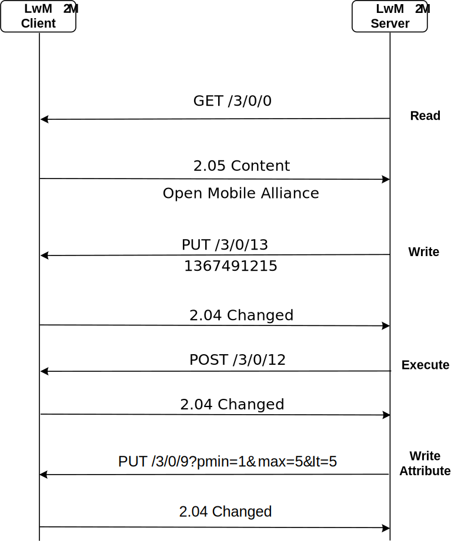

<table border="0" rules="none" cellspacing="0" cellpadding="0" width="600">
<tr>
 <td>
  
 </td>
</tr>

<tr>
<td align="right"><font size="6"><b>Lightweight Machine to Machine Technical Specification: Transport Bindings</b></font></td>
</tr>

<tr>
<td align="right"><font size="5">Draft Version 1.1 – 15 Sep 2017</font></td>
</tr>

<tr>
 <td align="right"><font size="5"><b>Open Mobile Alliance</b></font></td>
</tr>

<tr>
<td align="right"><font size="5">OMA-TS-LightweightM2M-V1_1-Transport-20170915-D</font></td>
</tr>

</table>

Use of this document is subject to all of the terms and conditions of the Use Agreement located at <http://www.openmobilealliance.org/UseAgreement.html>.

Unless this document is clearly designated as an approved specification, this document is a work in process, is not an approved Open Mobile Alliance™ specification, and is subject to revision or removal without notice.

You may use this document or any part of the document for internal or educational purposes only, provided you do not modify, edit or take out of context the information in this document in any manner. Information contained in this document may be used, at your sole risk, for any purposes. You may not use this document in any other manner without the prior written permission of the Open Mobile Alliance. The Open Mobile Alliance authorizes you to copy this document, provided that you retain all copyright and other proprietary notices contained in the original materials on any copies of the materials and that you comply strictly with these terms. This copyright permission does not constitute an endorsement of the products or services. The Open Mobile Alliance assumes no responsibility for errors or omissions in this document.

Each Open Mobile Alliance member has agreed to use reasonable endeavors to inform the Open Mobile Alliance in a timely manner of Essential IPR as it becomes aware that the Essential IPR is related to the prepared or published specification. However, the members do not have an obligation to conduct IPR searches. The declared Essential IPR is publicly available to members and non-members of the Open Mobile Alliance and may be found on the “OMA IPR Declarations” list at <http://www.openmobilealliance.org/ipr.html>. The Open Mobile Alliance has not conducted an independent IPR review of this document and the information contained herein, and makes no representations or warranties regarding third party IPR, including without limitation patents, copyrights or trade secret rights. This document may contain inventions for which you must obtain licenses from third parties before making, using or selling the inventions. Defined terms above are set forth in the schedule to the Open Mobile Alliance Application Form.

NO REPRESENTATIONS OR WARRANTIES (WHETHER EXPRESS OR IMPLIED) ARE MADE BY THE OPEN MOBILE ALLIANCE OR ANY OPEN MOBILE ALLIANCE MEMBER OR ITS AFFILIATES REGARDING ANY OF THE IPR’S REPRESENTED ON THE “OMA IPR DECLARATIONS” LIST, INCLUDING, BUT NOT LIMITED TO THE ACCURACY, COMPLETENESS, VALIDITY OR RELEVANCE OF THE INFORMATION OR WHETHER OR NOT SUCH RIGHTS ARE ESSENTIAL OR NON-ESSENTIAL.

THE OPEN MOBILE ALLIANCE IS NOT LIABLE FOR AND HEREBY DISCLAIMS ANY DIRECT, INDIRECT, PUNITIVE, SPECIAL, INCIDENTAL, CONSEQUENTIAL, OR EXEMPLARY DAMAGES ARISING OUT OF OR IN CONNECTION WITH THE USE OF DOCUMENTS AND THE INFORMATION CONTAINED IN THE DOCUMENTS.

© 2017 Open Mobile Alliance All Rights Reserved.
Used with the permission of the Open Mobile Alliance under the terms set forth above.

## Table of Contents

1. [Scope](#scope)
2. [References](#references)
3. [Terminology and Conventions](#terminology-and-conventions)
4. [Introduction](#introduction)
5. [Security](#security)
6. [Transport Layer Binding and Encodings](#5-transport-layer-binding-and-encodings)

# Scope

This document specifies version 1.0 of the Lightweight Machine-to-Machine (LwM2M) protocol. This Lightweight M2M 1.0 enabler introduces the following features:

-   Simple resource model with the core set of objects and resources defined in this specification. The full list of registered objects can be found at \[OMNA\].

-   Operations for creation, update, deletion, and retrieval of resources.

-   Asynchronous notifications of resource changes.

-   Support for several serialization formats, namely TLV, JSON, Plain Text and binary data formats and the core set of LightweightM2M Objects.

-   UDP and SMS transport support.

-   Communication security based on the DTLS protocol supporting different types of credentials.

-   Queue Mode offers functionality for a LwM2M Client to inform the LwM2M Server that it may be disconnected for an extended period and when it becomes reachable again.

-   Support for use of multiple LwM2M Servers.

-   Provisioning of security credentials and access control lists by a dedicated LwM2M bootstrap-server.

# References

## Normative References

<table>
<tbody>
<tr>
<td>[3GPP-TS_23.003]</td>
<td>3GPP TS 23.003 “Numbering, addressing and identification”</td>
</tr>
<tr>
<td>[CoAP]</td>
<td>Shelby, Z., Hartke, K., Bormann, C., and B. Frank, “The Constrained Application Protocol (CoAP)”, IETF RFC 7252, June 2014</td>
</tr>
<tr>
<td>[CoAP_Blockwise]</td>
<td>C. Bormann, Z. Shelby, “Block-wise transfers in CoAP”, IETF RFC 7959.</td>
</tr>
<tr>
<td>[CoAP-EST]</td>
<td>S. Kumar, P. van der Stok, “EST based on DTLS secured CoAP (EST-coaps)”, draft-vanderstok-core-coap-est-00, October, 2016</td>
</tr>
<tr>
<td>[CoRE_Interface]</td>
<td>Z. Shelby, M. Vial, “CoRE Interfaces”, draft-ietf-core-interfaces-01, Nov 2013</td>
</tr>
<tr>
<td>[ETSI TS 102.221]</td>
<td>“Smart Cards; UICC-Terminal interface; Physical and logical characteristics”, (ETSI TS 102 221 release 11), <a href="http://www.etsi.org/">URL:http://www.etsi.org/</a></td>
</tr>
<tr>
<td>[ETSI TS 102.223]</td>
<td>“Smart Cards; Card Applications Toolkit (CAT) (Release 11)”<br />
<a href="http://www.etsi.org/">URL:http://www.etsi.org/</a></td>
</tr>
<tr>
<td>[ETSI TS 102.225]</td>
<td>ETSI TS 102 225 (V11.0.0): “Smart Cards; Secured packet structure for UICC based applications (Release 11)” <a href="http://www.etsi.org/">URL:http://www.etsi.org/</a></td>
</tr>
<tr>
<td>[GLOBALPLATFORM]</td>
<td>GlobalPlatform v2.2.1 - January 2011 -</td>
</tr>
<tr>
<td>[GP SCP03]</td>
<td>GlobalPlatform Secure Channel Protocol 03 (SCP 03) Amendment D v1.1 Sept 2009</td>
</tr>
<tr>
<td>[OBSERVE]</td>
<td>Hartke, K. “Observing Resources in CoAP”, IETF RFC 7641.</td>
</tr>
<tr>
<td>[RFC2119]</td>
<td>“Key words for use in RFCs to Indicate Requirement Levels”, S. Bradner, March 1997, <a href="URL:http://www.ietf.org/rfc/rfc2119.txt" class="uri">URL:http://www.ietf.org/rfc/rfc2119.txt</a></td>
</tr>
<tr>
<td>[RFC5246]</td>
<td>The Transport Layer Security (TLS) Protocol Version 1.2</td>
</tr>
<tr>
<td>[RFC5280]</td>
<td>D. Cooper, et al., “Internet X.509 Public Key Infrastructure Certificate and Certificate Revocation List (CRL) Profile”, RFC 5280, May 2008.</td>
</tr>
<tr>
<td>[RFC5289]</td>
<td>TLS Elliptic Curve Cipher Suites with SHA-256/384 and AES Galois Counter Mode (GCM)</td>
</tr>
<tr>
<td>[RFC5487]</td>
<td>Pre-Shared Key Cipher Suites for TLS with SHA-256/384 and AES Galois Counter Mode</td>
</tr>
<tr>
<td>[RFC6347]</td>
<td>Rescorla, E. and N. Modadugu, “Datagram Transport Layer Security Version 1.2”, <a href="http://tools.ietf.org/html/rfc6347">RFC 6347</a>, January 2012.</td>
</tr>
<tr>
<td>[RFC6655]</td>
<td>McGrew, D. and D. Bailey, “AES-CCM Cipher Suites for TLS”, RFC6655, July 2012.</td>
</tr>
<tr>
<td>[RFC6690]</td>
<td>Shelby, Z. “Constrained RESTful Environments (CoRE) Link Format”, RFC6690, Aug 2012.</td>
</tr>
<tr>
<td>[WAP-WDP]</td>
<td>Wireless Application Protocol Forum, “Wireless Datagram Protocol”, June 2001.</td>
</tr>
<tr>
<td>[RFC7925]</td>
<td>“Transport Layer Security (TLS) / Datagram Transport Layer Security (DTLS) Profiles for the Internet of Things”, H. Tschofenig, T. Fossati, July 2016, <a href="http://www.ietf.org/rfc/rfc7925.txt">URL:http://www.ietf.org/rfc/rfc7925.txt</a></td>
</tr>
<tr>
<td>[LwM2M-CORE]</td>
<td>Open Mobile Alliance, "Lightweight Machine to Machine Technical Specification: Core Layer", (work in progress), November 2017.</td>
</tr>
</tbody>
</table>

## Informative References

<table>
<tbody>
<tr>
<td>[OMADICT]</td>
<td>“Dictionary for OMA Specifications”, Open Mobile Alliance™,<br />
OMA-ORG-Dictionary-V2_9, <a href="URL:http://www.openmobilealliance.org/" class="uri">URL:http://www.openmobilealliance.org/</a></td>
</tr>
<tr>
<td>[RFC4086]</td>
<td>D. Eastlake, J. Schiller, S. Crocker, “Randomness Requirements for Security”, RFC 4086, June 2005.</td>
</tr>
<tr>
<td>[RFC7459]</td>
<td>“Representation of Uncertainty and Confidence in the Presence Information Data Format Location Object (PIDF-LO)”, M. Thomson, J. Winterbootom, February 2015. <a href="URL:https://tools.ietf.org/html/rfc7459" class="uri">URL:https://tools.ietf.org/html/rfc7459</a></td>
</tr>
<tr>
<td>[SMS-DTLS]</td>
<td>“Transport Layer Security (TLS) / Datagram Transport Layer Security (DTLS) Profiles for the Internet of Things”, H. Tschofenig, T. Fossati, July 2016, <a href="http://www.ietf.org/rfc/rfc7925.txt">URL:http://www.ietf.org/rfc/rfc7925.txt</a></td>
</tr>
<tr>
<td>[SP800-90A]</td>
<td>Elaine Barker, John Kelsey, “Recommendation for Random Number Generation Using Deterministic Random Bit Generators, NIST Special Publication 800-90A”, Revision 1, June 2015, available at <a href="http://nvlpubs.nist.gov/nistpubs/SpecialPublications/NIST.SP.800-90Ar1.pdf" class="uri">http://nvlpubs.nist.gov/nistpubs/SpecialPublications/NIST.SP.800-90Ar1.pdf</a></td>
</tr>
</tbody>
</table>

# Terminology and Conventions

## Conventions

The key words “MUST”, “MUST NOT”, “REQUIRED”, “SHALL”, “SHALL NOT”, “SHOULD”, “SHOULD NOT”, “RECOMMENDED”, “MAY”, and “OPTIONAL” in this document are to be interpreted as described in \[RFC2119\].

All sections and appendixes, except “Scope” and “Introduction”, are normative, unless they are explicitly indicated to be informative.

## Definitions

<table>
<tbody>
<tr>
<td>LwM2M Bootstrap-Server Account</td>
<td>LwM2M Security Object Instance with Bootstrap-Server Resource true</td>
</tr>

<tr>
<td>LwM2M Server Account</td>
<td>LwM2M Security Object Instance with Bootstrap-Server Resource false and associated LwM2M Server Object Instance</td>
</tr>

</table>
</tbody>

Kindly consult \[OMADICT\] for more definitions used in this document.

## Abbreviations

<table>
<tbody>

<tr>
<td>CoAP</td>
<td>Constrained Application Protocol</td>
</tr>

<tr>
<td>DTLS</td>
<td>Datagram Transport Layer Security</td>
</tr>

</table>
</tbody>

Introduction
============

This specification defines the transport bindings for the LwM2M messaging protocol used between the LwM2M Client, the LwM2M Bootstrap Server and with the LwM2M Server. Figure 1 shows the relationships between the transport bindings and the messaging protocol. In particular, this specification defines the following transport bindings: 

-   CoAP over UDP
-   CoAP over DTLS over UDP
-   CoAP over SMS 
-   CoAP over DTLS over SMS 

 
```
Figure 1: The Protocol Stack of the LwM2M Enabler
```

# Security

The LwM2M protocol supports various transport bindings and credentials for securely communicating with LwM2M Servers. This configuration information can be provisioned during manufacturing or through the use of the bootstrap mechanism.


LwM2M supports three different types of credentials, namely

-   Certificates,

-   Raw public keys, and

-   Pre-shared secrets.

Since these credential types offer different properties the LwM2M specification offers support for all of them. \[RFC7925\] provides the necessary details about the use of each of these credentials with DTLS. 

The LwM2M protocol specifies that authorization of LwM2M Servers to access Object Instances and Resources within the LwM2M Client is provided through Access Control Object Instances within the LwM2M Client.

## DTLS-based Security

### Requirements

For authentication of communicating LwM2M entities, the LwM2M protocol requires that all communication between LwM2M Clients and LwM2M Servers as well as LwM2M Clients and LwM2M Bootstrap-Servers are authenticated using mutual authentication. This means that a:

-   LwM2M Client MUST authenticate a LwM2M Server prior to exchange of any information.

-   LwM2M Server MUST authenticate a LwM2M Client prior to exchange of any information.

-   LwM2M Client MUST authenticate a LwM2M Bootstrap-Server prior to exchange of any information.

-   LwM2M Bootstrap-Server MUST authenticate a LwM2M Client prior to exchange of any information.

For confidentiality and data integrity of information between communicating LwM2M entities, the LwM2M protocol requires that all communication between LwM2M Clients and LwM2M Servers as well as LwM2M Clients and LwM2M Bootstrap-Servers are encrypted and integrity protected. This means that a:

-   LwM2M Client MUST encrypt and integrity protect data communicated to a LwM2M Server.

-   LwM2M Server MUST encrypt and integrity protect data communicated to a LwM2M Client.

-   LwM2M Client MUST encrypt and integrity protect data communicated to a LwM2M Bootstrap-Server.

-   LwM2M Bootstrap-Server MUST encrypt and integrity protect data communicated to a LwM2M Client.

Due the sensitive nature of bootstrap information, a particular care has to be taken to ensure protection of that data.

The use of DTLS fulfils these requirements.

### DTLS Overview

CoAP \[CoAP\] is secured using the Datagram Transport Layer Security (DTLS) 1.2 protocol \[RFC6347\], which is based on TLS v1.2 \[RFC5246\]. The DTLS binding for CoAP is defined in Section 9 of \[CoAP\]. DTLS is a communication security solution for datagram based protocols (such as UDP). It provides a secure handshake with session key generation, mutual authentication, data integrity and confidentiality.

This section provides information related to the use of DTLS for use with CoAP over DTLS over UDP as well as for use with CoAP over DTLS over SMS. Section ["SMS Channel Security"](#sms-channel-security) provides additional information regarding the use of DTLS in an SMS context. This document uses the profiles defined in \[RFC7925\], which includes not only ciphersuites but also extensions. 

The DTLS client and the DTLS server SHOULD keep security state, such as session keys, sequence numbers, and initialization vectors, and other security parameters, established with DTLS for as long a period as can be safely achieved without risking compromise to the security context. If such state persists across sleep cycles where the RAM is powered off, secure storage SHOULD be used for the security context.

The credentials used for authenticating the DTLS client and the DTLS server to secure the communication between the LwM2M Client and the LwM2M Server are obtained using one of the bootstrap modes defined in Section 5.2.2. Appendix E.1.1 of [LWM2M-CORE] defines the format of the keying material stored in the LwM2M Security Object Instances.

LwM2M Bootstrap-Servers, LwM2M Servers and LwM2M Clients MUST use different key pairs. LwM2M Clients MUST use keys, which are unique to each LwM2M Client. When a LwM2M Client is configured to utilize multiple LwM2M Servers then the LwM2M Bootstrap-Server may configure different credentials with these LwM2Ms Servers. Such configuration provides better unlinkability properties since each individual LwM2M Server cannot correlate request based on the credentials used by the LwM2M Client. Deployment and application specific considerations dictate what approach to use.

### Ciphersuites

DTLS supports the concept of ciphersuites and they are securely negotiated during the DTLS handshake. This specification recommends a limited number of ciphersuites based on \[RFC7925\]. The recommended ciphersuites have been chosen because of suitability for IoT devices, security reasons and to improve interoperability and depend on the type of credential being used since the ciphersuite concept also indicates the authentication and key exchange mechanism. LwM2M Clients and LwM2M Servers MAY support additional ciphersuites that conform to state-of-the-art security requirements.

### Bootstrapping

The Resources in the LwM2M Security Object (i.e., “Security Mode”, “Public Key or Identity”, “Server Public Key or Identity” and “Secret Key”) are used

1.  for providing UDP channel security in “Client Registration”, “Device Management & Service Enablement”, and “Information Reporting” Interfaces if the LwM2M Security Object Instance relates to a LwM2M Server, or,

2.  for providing channel security in Bootstrap Interface if the LwM2M Security Object instance relates to a LwM2M Bootstrap-Server.

3.  for protecting the communication with a firmware repository server when the LwM2M Client receives a URI in the Package URI of the Firmware Update object.

The content and the interpretation of the Resources in the LwM2M Security Object depend on the type of credential being used.

Concerning Bootstrap from Smartcard a secure channel between the Smartcard and the LwM2M Client SHOULD be established, as described in Appendix G and defined in \[GLOBALPLATFORM 3\], \[GP SCP03\]. Using Smartcard with pre-shared secrets, raw public keys, and with certificates needs no pre-existing trust relationship between LwM2M Server(s) and LwM2M Client(s). The pre-established trust relationship is between the LwM2M Server(s) and the SmartCard(s).

LwM2M Clients MUST either be provisioned for use with a LwM2M Server (manufacturer pre-configuration bootstrap mode) or else be provisioned for use with an LwM2M Bootstrap-Server. Any LwM2M Client, which supports client or server initiated bootstrap mode, MUST support at least one of the following secure methods:

1.  Bootstrapping with a strong (high-entropy) pre-shared secret, as described in Section ["Pre-Shared Keys"](#pre-shared-keys). The ciphersuites defined in Section 7.1.7 MUST NOT be used with a low-entropy secret or with a password.

2.  Bootstrapping with a raw public key or certificate-based method (as described in Section ["Raw Public Keys"](#raw-public-keys) and Section ["X509 Certificates"](#x509-certificates).

In either case, the LwM2M Client MUST be provisioned with a credential that is unique to a device. For full interoperability, a LwM2M Bootstrap-Server MUST support bootstrapping via pre-shared secrets, raw public keys, and certificates.

NOTE: The above security methods can also be used by the LwM2M Bootstrap-Server to provision KIc and KID for the SMS Secured Packet Structure mode (see Section 7.2.2 for SMS Secured Packet Structure mode).

Security credential dynamically provisioned to the LwM2M Client and the LwM2M Server MAY change at any time, even during the lifetime of an ongoing DTLS session. Since the DTLS protocol verifies the credentials only at the beginning of the session establishment (unless the re-negotiation feature is used) it is possible that a change in credential (for example, credentials for the use of a PSK-based ciphersuite) occurs after a DTLS handshake has already been completed and the DTLS session setup is already finalized. Hence, from a DTLS protocol point of view such a change is not recognized and the already established record layer security associations are in use. It is a policy decision for a DTLS client as well as a DTLS server implementation to tear down an already existing session when the credentials change. Such a decision will depend on various factors, such as the application domain in which LwM2M is used. The LwM2M specification does not mandate a specific behaviour in such a case since DTLS allows both communication parties to tear down an established DTLS session for any number of reasons.

### Endpoint Client Name

The LwM2M specification defines the use of the endpoint client name in the Bootstrap-Request and in the Register messages. Since the endpoint client name is not authenticated at the application layer the LwM2M Server MUST compare the received endpoint client name identifier with the identifier used at the DTLS handshake. This comparison may either be an equality match or may involve a dedicated lookup table to ensure that LwM2M Clients cannot intentionally or due to misconfiguration impersonate other LwM2M Clients. The LwM2M Server MUST respond with a “4.00 Bad Request” to the LwM2M Client if these fields do not match.

### LwM2M and DTLS Roles

The client-server roles of DTLS, which indicate who initiates the DTLS handshake, are independent from the client-server relationship of LwM2M. In client-initiated bootstrapping the LwM2M Client is also the DTLS client and the LwM2M Bootstrap Server acts as the DTLS server. For server-initiated bootstrapping, however, the roles are reversed: the LwM2M Client acts in the role of a DTLS server and the LwM2M Bootstrap Server is the DTLS client. Note that using a DTLS server on a LwM2M Client requires additional resources, such as RAM, and flash memory.

When the LwM2M Client acts in the role of a DTLS server then care has to be taken that the following four values are equal:

1.  Value in the Server Name Indication (SNI) extension used in the DTLS exchange,

2.  Endpoint Client Name,

3.  Identifier used with the credential, such as the identifier contained in the DTLS server certificate, and

4.  Value in the LwM2M Server URI Resource.

Note that the DTLS client (acting as the LwM2M Server) for the server-initiated bootstrapping has to be configured with the IP address of the LwM2M Client, an FQDN, and the certificate, raw public key or PSK for use with the LwM2M Client.

### Pre-Shared Keys

If a LwM2M Server supports the pre-shared key credentials it MUST support TLS\_PSK\_WITH\_AES\_128\_CCM\_8, as defined in \[RFC6655\] and mandated in \[RFC7925\].

A LwM2M Client MUST support the Pre-Shared Key mode of DTLS with at least one of the ciphersuites specified for the LwM2M Server.

This mode requires the following resources of the Security Object defined in Appendix E.1 of [LWM2M-CORE] to be populated:

-   The “Security Mode” Resource MUST contain the value 0.

-   The "Public Key or Identity" Resource MUST be used to store the PSK identity, defined in \[RFC4279\].

-   The "Secret Key" Resource MUST be used to store the PSK, defined in \[RFC4279\].

-   The “Server Public Key” Resource MUST NOT be used in the Pre-Shared Key mode.

### Raw Public Keys

If a LwM2M Server supports the raw public key credentials it MUST support TLS\_ECDHE\_ECDSA\_WITH\_AES\_128\_CCM\_8, as defined in \[RFC6655\] and mandated in \[RFC7925\].

If a LwM2M Client supports the raw public key mode it MUST support at least one of the ciphersuites supported by the LwM2M Server.

This mode requires the following resources of the Security Object defined in Appendix E.1 of [LWM2M-CORE] to be populated:

-   The “Security Mode” Resource MUST contain the value 1.

-   The "Public Key or Identity" Resource MUST be used to store the raw public key of the DTLS client.

-   The "Secret Key" Resource MUST be used to store the private key of the DTLS client.

-   The “Server Public Key” Resource MUST be used to store the raw public key of the DTLS server.

This security mode is appropriate for LwM2M deployments where the benefits of asymmetric cryptography are used but without the overhead of the public key infrastructure.

The DTLS client MUST check that the raw public key presented by the DTLS server exactly matches this stored public key.

The DTLS server MUST store its own private and public keys, and MUST have a stored copy of the expected client public key. The DTLS server MUST check that the raw public key presented by the DTLS client exactly matches this stored public key.

### X.509 Certificates

The X.509 Certificate mode requires the use of X.509v3 certificates \[RFC5280\].

If a LwM2M Server supports X.509 Certificate mode it MUST support TLS\_ECDHE\_ECDSA\_WITH\_AES\_128\_CCM\_8, as defined in \[RFC7251\] and mandated in \[RFC7925\].

If a LwM2M Client supports X.509 Certificate mode it MUST support at least one of the above mentioned ciphersuites.

This mode requires the following resources of the Security Object defined in Appendix E.1 of [LWM2M-CORE] to be populated:

-   The “Security Mode” Resource MUST contain the value 2.

-   The "Public Key or Identity" Resource MUST be used to store the X.509 certificate of the DTLS client, or optional its complete certification path (including client certificate but not the trust anchor).

-   The "Secret Key" Resource MUST be used to store the private key of the DTLS client.

-   The “Server Public Key” Resource MUST be used to store either a trust anchor certificate suitable for path validation of the certificate of the DTLS server, or directly the certificate of the DTLS server (“domain-issued certificate mode”). The use of it is explained in more detail below.

The "LwM2M Server URI", and the "Bootstrap Server" Resources are populated according to the description in Appendix E.1 of [LWM2M-CORE].


The algorithm for verifying the service identity, as described in Section 4.4.1 of \[RFC7925\] and in \[RFC6125\], is essential for ensuring proper security when certificates are used and MUST be implemented and used by the DTLS client. Terms like reference identifier and presented identifier are defined in RFC 6125.

Comparing the reference identifier against the presented identifier obtained from the certificate is required to ensure the DTLS client is communicating with the intended DTLS server. To cater for the case that the Server Public Key Resource directly contains the certificate of the DTLS server, DTLS client does not compare the reference identifier against the presented identifier if the certificate from the Server Public Key Resource matches the certificate provided by the DTLS server during the DTLS handshake. If that is not the case, the DTLS client MUST compare the reference identifier against the presented identifier as described below, and perform path validation.

The algorithm description from RFC 6125 assumes that fully qualified DNS domain names (FQDN) are used. If a server node is provisioned with a FQDN, then the DTLS server certificate MUST contain this "FQDN". This FQDN is stored in the SubjectAltName or in Common Name (CN) component of the subject name, as explained in Section 9.1.3.3 of \[RFC7252\], and used by the DTLS client to match it against the FQDN used during the lookup process, as described in \[RFC6125\]. 

Note that the Server Name Indication (SNI) extension \[RFC6066\] allows a DTLS client to tell a DTLS server the name of the DTLS server it is contacting. This is an important feature when the server is part of a hosting solution where multiple virtual servers are using a single underlying network address. Section 3 of \[RFC6066\] only allows FQDN hostname of the DTLS server in the ServerName field. For the DTLS client running on a LwM2M Server the SNI extension allows the LwM2M Server to indicate what certificate it is expecting. The SNI extension MUST be set by the LwM2M client.

In some deployment scenarios DNS is not used and hence LwM2M Clients need to follow a different procedure.

If the CoAP URI stored in the "LwM2M Server URI" Resource contains an IP literal, such as coaps://\[2001:db8::2:1\]/, then certificate provided by the server MUST also contain this IP address in the Common Name (CN) component of the server certificate or in a field of URI type in the SubjectAltName set.

The procedure for a client using such certificates is as follows:

-   The LwM2M Client uses the IP address from the LwM2M Server URI Resource to connect to the LwM2M Server using a DTLS handshake. The IP address becomes the reference identifier.

-   The DTLS stack of the LwM2M Server returns a Certificate message as part of the handshake that contains a certificate. The IP address extracted from the server certificate becomes the presented identifier.

-   The client matches the reference identifier against the presented identifier. If the two match, the client continues with the certificate verification according to RFC 5280, otherwise it aborts the handshake with a fatal alert.

Note: In case no FQDN but IP addresses are used ,and the IP address of the LwM2M server changes, the IP address contained in the LwM2M Server URI Resource will naturally also need to be updated. As a result, in case the “Server Public Key” contains a trust anchor certificate, a new certificate for that LwM2M Server needs to be created.

The use of certificates might require the DTLS client to understand the concept of time since it might need to check the validity of the server-provided certificate if required by the deployment. Different deployments may have different means of obtaining the current time and this specification does not mandate one mechanism. In general, the LwM2M Bootstrap-Server certificate is not expected to expire during the lifetime of the LwM2M Client since it has no easy possibility to recover from such an expired certificate. However, if the LwM2M Client determines that the LwM2M Server certificate is expired it MAY contact the LwM2M Bootstrap-Server to obtain new security credentials for use with the LwM2M Server.

Note that the LwM2M Device Object allows the LwM2M Bootstrap-Server to configure the current time for the LwM2M Client using the Current Time Resource.

###  “NoSec” mode

It is highly recommended to always protect the LwM2M protocol with DTLS. There are, however, scenarios where the LwM2M protocol is deployed in environments where lower layer security mechanisms are provided.

The LwM2M Server MUST compare the endpoint client name identifier used during the Register and the Bootstrap-Request message with the identifier used for network access authentication (typically used to setup link layer security procedures).

The LwM2M protocol may use the NoSec mode with or without a lower-layer security mechanism and matching the endpoint client name identifier with any lower layer identifier may in the latter case not be possible.

### Certificate mode with EST

This mode uses the configuration of the certificate mode defined in Section 7.1.9 with the following changes; instead of generating the certificate and the private key for the client by the LwM2M Bootstrap Server and to provision it to the LwM2M Client the Bootstrap Server MUST set the “Security Mode” Resource to value 4 and provisions the certificate of the DTLS server to the “Server Public Key” Resource. This triggers the LwM2M Client to locally generate a public / private key pair on the LwM2M Client and to initiate an EST over CoAP protocol exchange \[CoAP-EST\] to obtain a certificate. The EST over CoAP specification \[CoAP-EST\] profiles the use of EST for use in constrained environments.

When generating a public / private key pair, the random generator used by the LwM2M Client MUST respect the characteristics of a sufficiently high quality random bit generator, such as defined for example by ISO/IEC 18031:2011, RFC 4086 \[RFC4086\] or NIST Special Publication 800-90a \[SP800-90A\].

Compared to the certificate mode additional over-the-air overhead is introduced by this mode since the LwM2M Client needs to convey the public key to the EST server and needs to demonstrate possession of the private key using the PKCS\#10 defined mechanism, as referenced in the EST specification. Depending on the deployment environment this additional overhead needs to be compared against the added security benefit of not disclosing the private key to other parties.

The "Secret Key" and the "Public Key or Identity" Resources are not used by this mode. The "LwM2M Server URI", and the "Bootstrap Server" Resources are populated according to the description in Appendix E.1.

Enrolment over Secure Transport (EST) offers multiple features, including

-   Simple PKI messages,

-   CA certificate retrieval,

-   CSR Attributes Request,

-   Server-generated key request,

but only the first two are mandatory to implement.

In context of this specification functionality for server-generated key requests is already covered as part of the security mode (1 - Raw Public Key mode and 2 - Certificate mode). CSR Attributes Request is also not required for this specification either since the LwM2M Bootstrap Server is typically in possession of the required attributes for generating a certificate. The CA certificate retrieval, while mandatory to implement for EST, is not used by version 1.0 of this specification since only the domain issued certificate mode is supported, as described in Section 7.1.9. Hence, CA certificates are not utilized.

## SMS Channel Security

Channel security for \[CoAP\] has been defined for the UDP transport and is based on the Datagram Transport Layer Security (DTLS) \[RFC6347\]

This section defines the security modes for the transport of CoAP over SMS.

LwM2M Clients supporting SMS, when the SMS Channel is only used for debugging purposes MAY support the NoSec mode.

LwM2M Clients supporting UDP and SMS, when the SMS Channel is only used for triggering as defined in chapter 8.4 MUST support the adequate mechanism for securing UDP Channel as defined in chapter 7.1 UDP channel security. Those clients MAY use any SMS security mode. In particular SMS NoSec mode can be used for SMS triggering since all other communication will be secured by UDP channel security.

Using SMS NoSec for SMS triggering could induce issues as “Denial of Service” (DoS), SMS auto reply attacks (based on PoR:) and is strongly not recommended.

LwM2M Clients supporting SMS for communications other than triggering, or supporting only the SMS Channel MUST support SMS Secured Mode. In any security mode except for debugging purposes, when an SMS message is received from an MSISDN that is not recorded in the LwM2M Server SMS Number resource of the LwM2M Server Access Security, the SMS message MUST be silently ignored.

### SMS “NoSec” Mode

It is highly recommended to always use LwM2M with one of the security mechanisms described in this section. However, there are few scenarios and use cases where security is provided by lower layers. For example, LwM2M devices in a controlled environment behind a gateway, or, tests focussing first on other functions before performing end-to-end tests including security.

This security profile is also useful to support SMS triggering when all other exchanges run over UDP Channel.

### SMS Secured Mode

The SMS Secured mode specified in this section MUST be supported when the SMS binding is used.

A LwM2M Client which uses the SMS binding MUST either be directly provisioned for use with a target LwM2M Server (Factory Bootstrap or Bootstrap from Smartcard) or else be able to bootstrap via the UDP binding.

The end-point for the SMS channel (delivery of mobile terminated SMS, and sending of mobile originated SMS) MAY be either on the Smartcard or on the Device. When the LwM2M Client device doesn’t support a Smartcard, the end-point is on the LwM2M Client device.

A LwM2M Client, Server or Bootstrap-Server supporting SMS binding MUST discard SMS messages which are not correctly protected using the expected parameters stored in the “SMS Binding Key Parameters” Resource and the expected keys stored in the “SMS Binding Secret Keys” Resource, and MUST NOT respond with an error message secured using the correct parameters and keys.

#### Device End-Point

The Secured Packet Structure is based on \[3GPP TS 31 115\] / \[ETSI TS 102 225\] which was originally designed for securing packet structures for UICC based applications. However, for LwM2M it is suitable for securing the SMS payload exchanged between client and server. Usage of Secured Packet Structure Packet mode in LwM2M device needs evolution towards the introduction of a secure environment. The intention is to evolve the specifications in the next LwM2M release.

In LwM2M Enabler 1.0 if the SMS channel end-point is on the Device, the Channel security for \[CoAP\] is based on the Datagram Transport Layer Security (DTLS) \[RFC6347\]. For that reason the main lines of Section 7.1 on “DTLS-based Security” relative to DTLS binding on CoAP are also applicable to that section.

Appendix A of \[RFC7925\] describes how to bind CoAP/DTLS message to the SMS channel and specifies the restrictions on DTLS for fitting the SMS channel specific functioning and narrow bandwidth.

##### Header Definitions (for one SMS)

a) SMS Frame for basic Request/Response Interaction message (no Token field required)

```
|----------------------------------------------------------------------------------------|
|                                 TPDU (140 bytes)                                       |
|------------------------------------|---------------------------------------------------|
| DTLS (29 bytes)                    | CoAP + Effective Payload                          |
|------------------------------------|---------------------------------------------------|
| Header (13), Nonce (8), IV (8)     |                                                   |
|------------------------------------|---------------------------------------------------|
|                                    | CoAP ( 4 bytes)  | Effective Payload ( 107 bytes) |
|------------------------------------|---------------------------------------------------|
```

Model calculation using these header definitions,

-   Overall TPDU : 140 bytes

    -   DTLS requires 29 bytes: 13 bytes header according to (RFC 6347 and Appendix B of \[RFC7925\] + 8 bytes for the explicit nonce and 8 bytes for the integrity check value when an AES-128-CCM-8 ciphersuite is used. This ciphersuite uses a short integrity check value.

    -   CoAP header of variable length with at least 4 bytes \[CoAP\]

    -   Available bytes for the effective LwM2M payload from one SMS: 107 bytes

b) SMS Frame for messages of the Information Reporting Interface (Token field required)

```
|----------------------------------------------------------------------------------------|
|                                 TPDU (140 bytes)                                       |
|------------------------------------|---------------------------------------------------|
| DTLS (29 bytes)                    | CoAP + Effective Payload                          |
|------------------------------------|---------------------------------------------------|
| Header (13), Nonce (8), IV (8)     |                                                   |
|------------------------------------|---------------------------------------------------|
|                                    | CoAP ( 4+8 bytes) | Effective Payload ( 99 bytes) |
|------------------------------------|---------------------------------------------------|
```

Model calculation using these header definitions,

-   DTLS takes 29 bytes: 13 bytes (reference, RFC 6347) of header + 16 bytes of integrity check for CoAP in DTLS \[RFC 6655\] . Cipher suite mandated by CoAP (AES-128)

-   CoAP header 4+8 \[CoAP\] (Token field required)

-   Available bytes for the effective LwM2M Payload from one SMS: 99 bytes

#### Smartcard End-Point

If the SMS channel end-point is on the smart card, a CoAP message as defined in \[CoAP\] MUST be encapsulated in \[3GPP 31.115\] Secured Packets, in implementing - for SMS Point to Point (SMS\_PP) - the general \[ETSI 102 225\] specification for UICC based applications.

The following settings MUST be applied:

Class 2 SMS as specified in \[3GPP TS 23.038\]. The \[3GPP TS 23.040\] SMS header MUST be defined as below:

-   TP-PID : 111111 (USIM Data Download) as specified in \[3GPP TS 23.040\]

-   TP-OA : the TP-OA (originating address as defined in \[3GPP 23.040\] of an incoming command packet (e.g CoAP request) MUST be re-used as the TP-DA of the outgoing packet (e.g CoAP response)

##### Secure SMS Transfer to UICC

A SMS Secured Packet encapsulating a CoAP request received by the LwM2M device, MUST be – according to \[ETSI TS 102 225\]/\[3GPP TS 31.115\] - addressed to the LwM2M UICC Application in the Smartcard where it will be decrypted, aggregated if needed, and checked for integrity.

If decryption and integrity verification succeed, the message contained in the SMS MUST be provided to the LwM2M Client.

If decryption or integrity verification failed, SMS MUST be discarded.

The mechanism for providing the decrypted CoAP Request to the LwM2M Client relies on basic GET\_DATA commands of \[GP SCP03\] .This data MUST follow the format as below:

> data\_rcv \_ ::= &lt;address&gt; &lt;coap\_msg&gt;
>
> address ::= TP\_OA ; originated address
>
> coap\_msg ::= CoAP\_TAG &lt;coap\_request\_length&gt; &lt;coap\_request&gt;
>
> coap\_request\_length ::= 16BITS\_VALUE
>
> coap\_request ::= CoAP message payload

NOTE: In current LwM2M release, the way the LwM2M Client Application is triggered for retrieving the available message from the Smartcard is device specific: i.e. a middle class LwM2M Device implementing \[ETSI TS 102 223\] ToolKit with class “e” and “k” support could be automatically triggered by Toolkit mechanisms, whereas a simpler LwM2M device could rely on a polling mechanisms on Smartcard for fetching data when available.

##### Secured SMS Transfer to LwM2M Server

For sending a CoAP message to the LwM2M Server, the LwM2M Client prepares a data containing the right TP-DA to use, concatenated with the CoAP message and MUST provide that data to the LwM2M UICC Application in using the \[GP SCP03\] STORE-DATA command.

According to \[ETSI TS 102 225\] / \[3GPP TS 31.115\] the Smartcard will be in charge to prepare (encryption / concatenation) the CoAP message before sending it as a SMS Secure Packet (\[ETSI TS 102 223\] SEND\_SMS command).

The SMS Secured Packet MUST be formatted as Secured Data specified in section 7.2.2.3.

The Secure Channel as specified in Appendix H of this document SHOULD be used to provide the prepared data to the Smartcard.

#### SMS Secured Packet Binding for CoAP messages

In SMS Secured Packet Structure mode, a CoAP message as defined in \[CoAP\] MUST be encapsulated in \[3GPP 31.115\] Secured Packets, in implementing - for SMS Point to Point (SMS\_PP) - the general \[ETSI 102 225\] specification for UICC based applications.

-   The “Command Packet” command specified in \[3GPP 31.115\] /\[ETSI TS 102 225\] MUST be used for both CoAP Request and Response message

-   The Structure of the Command Packet contained in the Short Message MUST follow \[3GPP 31.115\] specification

-   SPI MUST be set as follow (see coding of SPI in \[ETSI TS 102 225\] section 5.2.1):

    -   use of cryptographic checksum

    -   use of ciphering

        -   The ciphering and crypto graphic checksum MUST use either AES or Triple DES

        -   Single DES MUST NOT be used

        -   AES SHOULD be used

        -   When Triple DES is used , then it MUST be used in outer CBC mode and 3 different keys MUST be used

        -   When AES is used it MUST be used with CBC mode for ciphering (see coding of KIc in \[ETSI TS 102 225\] section 5.2.2) and in CMAC mode for integrity (see coding of KID in \[ETSI TS 102 225\] section 5.2.3).

    -   process if and only if counter value is higher than the value in the RE

    -   PoR depends on LwM2M Server Policy

-   TAR MUST be set to ‘B2 02 03’ value for the LwM2M UICC Application as registered in \[ETSI TS 101 220\] Appendix D

-   Secured Data : contains the Secured Application Message which MUST be coded as a BER-TLV, the Tag (TBD : e.g 0x05) will indicate the type (e.g CoAP type) of that message

### LPWA Security

Low Power Wide Area (LPWA) networks are dedicated networks for communications with very resource constrained devices. Such devices are often battery driven and have limited processing capabilities.

LWM2M can be deployed as a “thin” service layer providing security in LPWA scenarios since LWM2M has been designed to keep the requirements of constrained devices in mind. However, some of the LPWA radio technologies offer their own link layer security mechanisms, which need to be considered when offering additionally LWM2M security based on DTLS. For example, when deploying link layer security as well as DTLS together the resulting double encryption (for some part of communication path) will result in higher power consumption and additional transmission overhead, which might not be acceptable for a range of battery driven devices.

In case the LPWA network offers link layer security and the threat analysis concluded that no additional communication security at higher layers, such as with DTLS, is necessary, the LWM2M “NoSec” mode MAY be used. Protecting LWM2M communication using DTLS remains a deployment choice. Protocol designers may need to take into account that the link layer security mechanism typically terminates at a different node than security mechanisms offered at higher layers and solely relying on link layer security may leave some segment of the communication path unprotected.

Examples of LPWA network security mechanisms can, for example, be found in TS 33.401 “SAE, Security architecture” describes the keys and processes for Narrow band IoT (NB-IoT) security based on what is called “end-to-middle (e2m) security” from the device to the 3GPP network.

When using LWM2M security based on DTLS in a LPWA environment it is recommended to consider the work done in IETF on “DTLS In Constrained Environments” (DICE), see (REF draft-ietf-dice-profile-17). (REF draft-ietf-dice-profile-17) does not introduce any changes to DTLS and TLS but rather offers guidance for use of various extensions for increased interoperability, and gives recommendations for improving the handshake procedures.

(REF draft-ietf-dice-profile-17) gives recommendations for three types of credentials, namely pre-shared keys, raw public keys, and X.509 certificates. LWM2M works with all three types of credentials but the performance and security trade-offs for these three mechanisms are different. As a summary, the three credential types have the following properties:
 
  * The pre-shared key profile offers the most efficient solution for integration of DTLS into LWM2M since DTLS pre-shared ciphersuites recommended in (REF draft-ietf-dice-profile-17) are computationally efficient (since they use the most efficient cryptographic primitives), and require a minimum amount of flash as well as RAM. The size of the exchanged messages is also kept at a minimum. There is, however, a downside as well: symmetric keys need to be available to both communication endpoints.
  * The certificate-based profile re-uses widely used X.509 certificates. This allows both tools as well as existing infrastructure, such as Certification Authorities (CAs), to be re-used. Unlike the typical web browser use of certificates the DICE profile (REF draft-ietf-dice-profile-17) uses certificates for clients and servers. The use of certificates comes at a price. The use of asymmetric cryptography is more complex to implement, requires more bandwidth for the exchanged messages, is computationally more demanding, and requires a larger code size as well as more RAM. The benefits are, in addition to the re-use of existing technologies, the need to only share the certificates (and the public key that is contained inside the certificate) with other communication partners and to keep the private key local to each party. This property of asymmetric cryptography reduces the risk of exposing private keying material.
  * The raw public key profile offers features that sit between the pre-shared key and the certificate-based profile and combines the benefits of these two profiles. The use of asymmetric cryptography offers improved security but avoids the overhead associated with certificates and the PKI.

For purpose of DTLS usage with LWM2M over LWPAN this specification RECOMMENDs the implementation and use of the pre-shared key profile primarily due to the over-the-wire communication overhead. Deployments MAY implement other profiles as well.
The subsequent text summarizes the key aspects of the pre-shared key profile described in (REF draft-ietf-dice-profile-17) which is based on TLS_PSK_WITH_AES_128_CCM_8 that uses the AES-128-based without offering perfect forward secrecy:

  * The Maximum Fragment Length extension described in Section 15 of (REF draft-ietf-dice-profile-17) allows a client to lower their RAM requirements and client implementations MUST implement this extension.  Without this extension a client is required to maintain a maximum buffer size of 16KB.
  * Session resumption, described in Section 7 of (REF draft-ietf-dice-profile-17), offers slightly improved performance for a PSK-based ciphersuite and is RECOMMENDED. Session resumption allows a client to abbreviate the handshake based on session state established in an executed full handshake. This results in fewer messages and smaller message sizes. It is therefore RECOMMENDED to maintain session state information as long as possible (consistent with the security requirement to protect session key material on both Client and Server; e.g. a long-lived session key must be managed at least as securely as an underlying pre-shared key).
  * Compression offered by DTLS is NOT RECOMMENDED due to security attacks, as described in Section 8 of (REF draft-ietf-dice-profile-17). Compression functionality is better offered by higher layer protocols and various components used in LWM2M make use of compression techniques, such as CoAP with header compression, and the binary encoding of payloads.
  * The timeout recommendations provided in Section 11 of (REF draft-ietf-dice-profile-17) MUST be followed since the modified timer settings prevent spurious retransmissions. Failure to increase the timeout value can lead to failed protocol exchanges.
  * A number of DTLS extensions are not applicable or are not recommended for use with the PSK-based ciphersuite and the recommendations made throughout (REF draft-ietf-dice-profile-17) have to be taken into account. Note that the use of False Start, described in Section 21 of (REF draft-ietf-dice-profile-17), is not required since the ability to transmit application data earlier is less important with long-lived DTLS sessions.

The guidance for credential-based profile can be found in Section 4.4 of (REF draft-ietf-dice-profile-17) and guidance for the raw public key profile can be found in Section 4.3 of (REF draft-ietf-dice-profile-17). Both profiles use Elliptic Curve Cryptography algorithms and offer perfect forward secrecy, as described in Section 9 of (REF draft-ietf-dice-profile-17).


# Transport Layer Binding and Encodings

This section defines the CoAP transport binding used by LwM2M interfaces.

## Required Features

For realization of the LwM2M interfaces, only the basic binary CoAP message header, and a small subset of options are required. This section explicitly defines the features of the CoAP standard that are required for LwM2M.

-   The 4-byte binary CoAP message header is defined in Section 3 of \[CoAP\]. This same base message is used for Request and Response interactions.

-   Confirmable, Acknowledgement and Reset messages MUST be supported. The Reset message is used as a message layer error message in response to a malformed Confirmable message. Non-Confirmable messages MAY be used by a Client for sending Information Reporting notifications as per \[Observe\].

-   GET, PUT, POST and DELETE methods MUST be supported. LwM2M Operations map to these methods.

-   A subset of Response Codes MUST be supported for LwM2M response message mapping.

-   The Uri-Path Option MUST be supported to indicate the identifier of the interface, Object Instance and Resource being requested.

-   The Location-Path Option MUST be supported to indicate the handle of a registration for future update and delete operations.

-   The Uri-Query Option MUST be supported.

-   The Content-Format Option MUST be used to indicate the data format of the payload.

-   The Accept Option MAY be included in a LwM2M Server data request, to specify the payload Content-Format this Server prefers to receive. The Client returns the preferred Content-Format if available. If this Accept option is not given or if the LwM2M Client doesn’t support that option, the LwM2M Client will use its own preferred data format reported in the Content-Format of the response message. If the preferred Content-Format cannot be returned, then a 4.06 “Not Acceptable” value MUST be sent as a response.

-   The Token Option MAY be used to enable multiple requests in parallel with an endpoint, and MUST be supported for the Information Reporting interface.

-   CoAP Blockwise transfer for CoAP MUST be supported by the LwM2M Client when the Firmware Update Object (ID:5) is implemented by the client and MUST be supported by the LwM2M Server. This functionality is motivated by limitations of CoAP, as defined in \[RFC7252\] since CoAP was not designed for transmission of large payloads. Because the CoAP header itself does not contain length information the UDP length header is used instead. The maximum UDP datagram size is limited to ~64 KiB and transmitting data beyond the (path) maximum transmission (MTU) size will additionally lead to inefficiency because of fragmentation at lower layers (IP layer, adaptation layer, and link layer). Blockwise Transfer for CoAP \[CoAP_Blockwise\] was specifically designed to lift this limitation in order to transfer large payloads larger than ~64 KiB via CoAP, such as firmware images. Note: \[CoAP\_Blockwise\] is also beneficial for use with firmware images smaller than 64 KiB since the block-wise transmission allows the server to deliver firmware images in chunks suitable to the MTU and thereby avoiding fragmentation at lower layers. A LwM2M client may choose to support block-wise transfer for objects other than the Firmware Update object. This may, for example, be useful with objects that are larger in size, such as the security object which may contain certificates. The specifics of how this functionality is utilized by a LwM2M Server are out of scope for this release of LwM2M.

## URI Identifier & Operation Mapping

Although CoAP supports a URI in requests, it is not used in the same way as in HTTP. The URI in CoAP is broken down into binary parts, minimizing overhead and complexity. In LwM2M only path segment and query string URI components are needed. The URI path is used to simply identify the interface, Object Instance or Resource that the request is for, and is encoded in Uri-Path options. The LwM2M Registration interface also makes use of query string parameters to pass on meta-data with the request separately from the payload. Each query parameter is encoded in a Uri-Query Option. Likewise, the LwM2M operations for each interface are mapped to CoAP Methods. All the LwM2M operations using CoAP layer MUST be Confirmable CoAP messages, except as follows:

  * “Notify” which may be a Non-Confirmable CoAP message
  * UQT mode triggering an execution on a resource can be a Non-Confirmable CoAP message

### Firewall/NAT

For a firewall to support LwM2M, it should be configured to allow outgoing UDP packets to destination port 5683 (other ports can be configured), and allow incoming UDP packets back to the source address/port of the outgoing UDP packet for a period of at least 240 seconds. These UDP packets may contain DTLS or CoAP payloads. When a firewall is configured as such any LwM2M Clients behind it should use Queue Mode.

For a firewall to support LwM2M it can be configured to allow both outgoing and incoming UDP packets to destination port 5683 (other ports can be configured). These UDP packets may contain DTLS or CoAP payloads. When a firewall is configured as such any LwM2M Clients behind it are not required to use Queued Mode, but may use it for other reasons (e.g., a battery powered sleeping device).

Any LwM2M Clients behind a NAT can use Queued Mode. There are other mechanisms to transverse a NAT, however they are out of scope for the LwM2M Enabler.

### Alternate Path

By default, the LwM2M Objects are located under the root path. However, devices might be hosting other CoAP Resources on an endpoint, and there may be the need to place LwM2M Objects under an alternate path.

When registering, or updating its registration, a LwM2M Client MAY include an OMA LwM2M link in addition to the Object links in the registration payload. The link is identified by the RFC 6690 [RFC6690] Resource Type parameter “oma.lwm2m”.

This link MUST NOT contain numerical URI segment.

For instance, the Example Client from Appendix F may place Objects under the “/lwm2m” path. The registration payload would be as follows:

&lt;/lwm2m&gt;;rt="oma.lwm2m", &lt;/lwm2m /1/0&gt;,&lt;/lwm2m /1/1&gt;,&lt;/lwm2m /2/0&gt;,&lt;/lwm2m /2/1&gt;,&lt;/lwm2m /2/2&gt;,&lt;/lwm2m /2/3&gt;,&lt;/lwm2m /2/4&gt;,&lt;/lwm2m /3/0&gt;,&lt;/lwm2m /4/0&gt;,&lt;/lwm2m /5&gt;

When using the Device Management & Service Enablement Interface and the Information Reporting Interface, the LwM2M Server MUST prepend the OMA LwM2M link to the path in the CoAP messages. Example: GET /lwm2m/3/0/0.

When using the Bootstrap Interface, the LwM2M Bootstrap-Server MUST use CoAP paths only in the form /{Object ID}/{Object Instance ID}/{Resource ID}. It is the responsibility of the LwM2M Client to map these paths to its alternate path.

The Resource Type value “oma.lwm2m” is part of IANA registry.

### Bootstrap Interface

The bootstrap interface is used to optionally configure a LwM2M Client so that it can successfully register with a LwM2M Server. The client bootstrap operation is performed by sending a CoAP POST request to the LwM2M Bootstrap-Server at the /bs path including the Endpoint Client Name as a query string parameter. When bootstrap operation is terminated the Bootstrap-Server MUST send a Bootstrap-Finish indication.

The Client Bootstrap operation is initiated by the LwM2M Client itself. In addition, this operation can be requested by an authorized LwM2M Server executing the "Bootstrap-Request Trigger" Resource of a Server Object Instance, or even by a proprietary mechanism (e.g. based on SMS).
Note: the execution of a Bootstrap-Request Trigger Resource by a LwM2M Server in a LwM2M Client is performed through an already established registration and is therefore covered by the access rights mechanisms.   

During the Bootstrap Phase, the Client MAY ignore requests and flush all pending responses not related to the Bootstrap sequence.

In "Client Initiated Bootstrap" mode, when the Bootstrap-Server receives Bootstrap-Request operation, the Bootstrap-Server can perform Write, Discover and/or Delete operations. The Delete operation targets an Object or an Object Instance, the Discover operation targets an Object, while a Write operation targets Object, Object Instance or a Resource. The Write, Discover and Delete operations can be sent multiple times. Only in Bootstrap Interface, Delete operation MAY target to “/” URI to delete all the existing Object Instances - except LwM2M Bootstrap-Server Account - in the LwM2M Client, for initialization purpose before LwM2M Bootstrap-Server sends Write operation(s) to the LwM2M Client. Different from “Write” operation in Device Management and Service Enablement interface, the LwM2M Client MUST write the value included in the payload regardless of an existence of the targeting Object Instance(s) or Resource and access rights.

Only in Bootstrap Interface, the Discover command MAY target to “/” URI to discover all Objects and Object Instances supported in the Device.

The Bootstrap-Server MUST send finish indication after it has sent all object instances/resources. Bootstrap-Server send finish message by sending CoAP POST to “/bs” location path with empty payload.

<table>
<tr>
<td>Operation</td>
<td>CoAP Method</td>
<td>URI</td>
<td>Success</td>
<td>Failure</td>
</tr>


<tr>
<td>Bootstrap-Request</td>
<td>POST</td>
<td>/bs?ep={Endpoint Client Name}</td>
<td>2.04 Changed</td>
<td>4.00 Bad Request, 4.15 Unsupported content format</td>
</tr>

<tr>
<td>Write</td>
<td>PUT</td>
<td>/{Object ID}/{Object Instance ID}/ {Resource ID}</td>
<td>2.04 Changed</td>
<td>4.00 Bad Request</td>
</tr>

<tr>
<td>Delete</td>
<td>DELETE</td>
<td>/{Object ID}/{Object Instance ID}</td>
<td>2.02 Deleted</td>
<td>4.00 Bad Request</td>
</tr>

<tr>
<td>Discover</td>
<td>GET Accept:
application/linkformat</td>
<td>/{Object ID}</td>
<td>2.05 Content</td>
<td>4.00 Bad Request, 4.04 Not Found</td>
</tr>

<tr>
<td>Bootstrap-Finish</td>
<td>POST</td>
<td>/bs</td>
<td>2.04 Changed</td>
<td>4.00 Bad Request, 4.06 Not Acceptable</td>
</tr>

</table>
<span id="table-mapping" class="anchor"></span>

```
Table 1: Operation to Method and URI Mapping (Bootstrap Interface)
```

 
```
Figure 2: Example of Client initiated Bootstrap exchange
```

 
```
Figure 3: Example of Server initiated Bootstrap exchange
```

### Registration Interface

The registration interface is used by a LwM2M Client to register with a LwM2M Server, identified by the LwM2M Server URI.

Registration is performed by sending a CoAP POST to the LwM2M Server URI /rd, with registration parameters passed as query string parameters as per Table 24 and Object and Object Instances included in the payload as specified in Section 5.3.1. The response includes Location-Path Options, which indicate the path to use for updating or deleting the registration. The LwM2M Server MUST return a location under the /rd path segment.

As the network connectivity may be limited or intermittent, it is advised to make several retries of the Registration if no reply is received from the LwM2M Server before considering the registration as failed.

When a new DTLS Session is started, or in NoSec mode when the LwM2M Client IP address changes, the Client MUST register again to the LwM2M Server.

Registration update is performed by sending a CoAP POST to the Location path returned to the LwM2M Client as a result of a successful registration.

De-registration is performed by sending a CoAP DELETE to the Location path returned to the LwM2M Client as a result of a successful registration.

<table>
<tr class="odd">
<td>Operation</td>
<td>CoAP Method</td>
<td>URI</td>
<td>Success</td>
<td>Failure</td>
</tr>
<tr class="even">
<td><strong>Register</strong></td>
<td>POST</td>
<td>/rd?ep={Endpoint Client Name}&amp;lt={Lifetime}&amp;sms={MSISDN}<br />
&amp;lwm2m={version}&amp;b={binding}</td>
<td>2.01 Created</td>
<td>4.00 Bad Request, 4.03 Forbidden, 4.12 Precondition Failed</td>
</tr>
<tr class="odd">
<td><strong>Update</strong></td>
<td>POST</td>
<td>/{location}?lt={Lifetime}&amp;sms={MSISDN}<br />
&amp;b={binding}</td>
<td>2.04 Changed</td>
<td>4.00 Bad Request, 4.04 Not Found</td>
</tr>
<tr class="even">
<td><strong>De-register</strong></td>
<td>DELETE</td>
<td>/{location}</td>
<td>2.02 Deleted</td>
<td>4.00 Bad Request, 4.04 Not Found</td>
</tr>
</table>

```
Table 2: Operation to Method and URI Mapping (Registration Interface)
```

Note: Throughout the present document the format of the MSISDN must be as specified in \[3GPP-TS\_23.003\]. According to this definition “+” is not preceding the country code.

") 
```
Figure 4: Example register, update and de-register operation exchanges (shorthand in [CoAP] example style, actual messages using CoAP binary headers)
```

### Device Management & Service Enablement Interface

The Device Management & Service Enablement Interface is used to access Resource, an array of Resource Instances, an Object Instance or all the Object Instances of an Object. An Object Instance is identified by the path /{Object ID}/{Object Instance ID}. If Object doesn’t support multiple Object Instances, the Object Instance is identified by the path /{Object ID}/0. A Resource is identified by the path /{Object ID}/{Object Instance ID}/{Resource ID}.

An Object Instance or Resource is Read by sending a CoAP GET to the corresponding path. The response includes the value in the corresponding Plain Text, Opaque, TLV or JSON format according to the specified Content-Format (see section 6.4).The request MAY specify an Accept option containing the preferred Content-Format to receive. When the specified Content-Format is not supported by the LwM2M Client, the request MUST be rejected.

Note that the response payload may be empty, for instance when performing a Read operation on an Object with no Object Instance. In this case the response code is still 2.05 Content.

An Object Instance or Resource is Written to by sending either a CoAP PUT or a CoAP POST to the corresponding path. The request includes the value to be written in the corresponding Plain Text, Opaque, TLV or JSON format according to the Content-Format option which MUST be specified \[CoAP\]. The Write request MUST be rejected when the specified Content-Format is not supported by the LwM2M Client

A CoAP PUT is used for the Replace and CoAP POST is used for Partial Update mechanism of the “Write” operation as described in 5.4.3.

A Resource is Executed by sending a CoAP POST to the corresponding path. The request MAY include a list of arguments as value of the payload expressed in Plain Text format. The definition of the Executable Resource and its arguments is given in Appendix D.

The list of argument can be empty, 2 arguments of the arguments list are separated by a comma. The syntax of the arguments is provided in Section Execute (5.2.4).

Note that the behaviour of the “Execute” operation, whether it uses arguments and how those are interpreted, and how it returns values is specified in the Resource description of the Object.

An Object Instance is Created by sending a CoAP POST to the corresponding path. The request includes the value to be written in the corresponding TLV or JSON format according to the Content-Format option which MUST be specified. The rules governing the creation of Resources in the targeted Object Instance are specified in section 7.3.2.3 (Operation on Object Instance). If Object Instance is not listed at the request, the LwM2M Client MUST assign ID of that Object Instance and send back Object Instance ID with “2.01 Created” to the LwM2M Server when Object Instance is Created.

An Object Instance is Deleted by sending a CoAP DELETE to the corresponding path.

When a Resource supports multiple instances the Resource value is an array of Resource Instances.

&lt;NOTIFICATION&gt; class Attributes MAY be set by a LwM2M Server using the “Write-Attributes” operation by sending a CoAP PUT on the corresponding path, and can be accessed using the “Discover” operation. The Discover operation (uses a CoAP GET on the corresponding path along with the application/link-format Content type, to retrieve a list of Objects, Object Instances, Resources and their attached attributes, from the LwM2M Client (see Section 5.4.2 for more details on DISCOVER command). With the “Write-Attributes” operation one or more Attributes can be written at a time. The values of these Attributes are used by the Information Reporting interface to determine how often Notifications are sent regarding that Resource. A LwM2M Client MAY support a set of these Attributes for each LwM2M Server it is configured for.

A Write Attribute command specifies which value is set to which Attribute and at which level (Object / Object Instance / Resource). In a similar way, the same command without value for the specified Attribute, MUST be used to unset this Attribute for the given level; then the precedence rules applies when notification occurs (section 5.1.1 Attributes definitions and Rules)

As example:

1.  Write-Attributes /3/0/9?pmin=1 means the Battery Level value will be notified to the Server with a minimum interval of 1sec; this value is set at the Resource level.

2.  Write-Attributes /3/0/9?pmin means the Battery Level will be notified to the Server with a minimum value (pmin) given by the default one (resource 2 of Object Server ID=1), or with another value if this Attribute has been set at another level (Object or Object Instance: see section 5.1.1).

3.  Write-Attributes /3/0?pmin=10 means that all Resources of Instance 0 of the Object ‘Device (ID:3)’ will be notified to the Server with a minimum interval of 10 sec; this value is set at the Object Instance level.

4.  Write-Attributes /3/0/9?gt=45&st=10 means the Battery Level will be notified to the Server when:

    1.  old value is 20 and new value is 35 due to step condition

    2.  old value is 45 and new value is 50 due to gt condition

    3.  old value is 50 and new value is 40 due to both gt and step conditions

    4.  old value is 35 and new value is 20 due to step condition

5.  Write-Attributes /3/0/9?lt=20&gt=85&st=10 means the Battery Level will be notified to the Server when:

    1.  old value is 17 and new value is 24 due to lt condition

    2.  old value is 75 and new value is 90 due to both gt and step conditions

    3.  old value is 50 and new value is 10 due to both lt and step conditions

    4.  old value is 87 and new value is 99 due to step condition

<table>
<tr>
<td>Operation</td>
<td>CoAP Method</td>
<td>Path</td>
<td>Success</td>
<td>Failure</td>
</tr>

<tr>
<td>Read</td>
<td>GET Accept: Content Format ID (see section 6.4)</td>
<td>/{Object ID}/{Object Instance ID}/{Resource ID}</td>
<td>2.05 Content</td>
<td>4.00 Bad Request, 4.01 Unauthorized, 4.04 Not Found, 4.05 Method Not Allowed, 4.06 Not Acceptable</td>
</tr>

<tr>
<td>Discover</td>
<td>GET Accept: application/link-format</td>
<td>/{Object ID}/{Object Instance ID}/{Resource ID}</td>
<td>2.05 Content</td>
<td>4.00 Bad Request, 4.04 Not Found, 4.01 Unauthorized, 4.05 Method Not Allowed</td>
</tr>

<tr>
<td>Write</td>

<td>
<table>
<tr>
<td>PUT Content Format:</td>
</tr>
<tr>
<td>POST Content Format:</td>
</tr> 
</table>
</td>

<td>
<table>
<tr>
<td>/{Object ID}/{Object Instance ID}/{Resource ID}</td>
</tr> 
<tr>
<td>/{Object ID}/{Object Instance ID}</td>
</tr> 
</table>
</td>

<td>2.04 Changed, 2.31* Continue</td>

<td>
<table>
<tr>
<td>4.00 Bad Request, 4.04 Not Found, 4.01 Unauthorized, 4.05 Method Not Allowed, 4.06 Not Acceptable, 4.08* Request Entity Incomplete, 4.13* Request entity too large</td>
</tr> 
</table>
</td>

</tr>

<tr>
<td>Write-Attributes</td>
<td>PUT</td>
<td>/{Object ID}/{Object Instance ID}/{Resource ID}?pmin={minimum period}&pmax={maximum period}&gt={greater than}&lt={less than}&st={step}</td>
<td>2.04 Changed</td>
<td>4.00 Bad Request, 4.04 Not Found, 4.01 Unauthorized, 4.05 Method Not Allowed</td>
</tr>

<tr>
<td>Execute</td>
<td>POST</td>
<td>/{Object ID}/{Object Instance ID}/{Resource ID}</td>
<td>2.04 Changed</td>
<td>4.00 Bad Request, 4.01 Unauthorized, 4.04 Not Found, 4.05 Method Not Allowed</td>
</tr>

<tr>
<td>Create</td>
<td>POST Content Format:</td>
<td>/{Object ID}</td>
<td>2.01 Created</td>
<td>4.00 Bad Request, 4.01 Unauthorized, 4.04 Not Found, 4.05 Method Not Allowed, 4.06 Not Acceptable</td>
</tr>

<tr>
<td>Delete</td>
<td>DELETE</td>
<td>/{Object ID}/{Object Instance ID}</td>
<td>2.02 Deleted</td>
<td>4.00 Bad Request, 4.01 Unauthorized, 4.04 Not Found, 4.05 Method Not Allowed</td>
</tr>

</table>
```
Table 3: Operation to Method and URI Mapping (Device Management & Service Enablement Interface)
```

 
```
Figure 5: Example of Device Management & Service Enablement interface exchanges
```

 
```
Figure 6: Example of Object Creation and Deletion
```

### Information Reporting Interface

Periodic and event-triggered reporting about Resource values from the LwM2M Client to the LwM2M Server is achieved through CoAP Observation \[OBSERVE\]. This simple mechanism allows the LwM2M Server to send a GET request with Observe option =0 for an Object, Object Instance, or Resource which results in asynchronous notifications whenever that Object Instance changes (periodically or as a result of an event). Token of CoAP layer is used to match the asynchronous notifications with the Observe GET. The LwM2M Server can cancel the “Observe” operation by sending Reset message as the response for Notify message in which the LwM2M Server is not interested any more. When the LwM2M Client receives a Reset in response of a “Notify” operation, the LwM2M Client MUST cancel the Observation regardless if the Notify was sent as a confirmable CoAP message as defined in \[OBSERVE\] or as a non-confirmable CoAP message. The LwM2M Server can also cancel the “Observe” operation at any moment, on a specified Resource, or specified Object Instance(s), by sending a GET request with Observe option=1. The LwM2M Server may set the Observe attributes of a Resource to affect the behavior its notifications using the ”Write-Attributes” operation (see Section 5.4.4 Write-Attributes).

Please note that this enabler provides two ways for the LwM2M Server to cancel observation:

1.  in response to a “Notify” operation for which it is not interested in any more, the LwM2M Server can send a “Reset Message”.

2.  at any moment, by sending a GET request with Observe option=1, the LwM2M Server can cancel an “Observe” operation on a specified Resource, or specified Object Instance(s).

<table>
<tr>
<td>Operation</td>
<td>CoAP Method</td>
<td>Path</td>
<td>Success</td>
<td>Failure</td>
</tr>

<tr>
<td>Observe</td>
<td>GET with Observe option = 0</td>
<td>/{Object ID}/{Object Instance ID}/{Resource ID}</td>
<td>2.05 Content with Observe option</td>
<td>4.00 Bad Request, 4.04 Not Found, 4.01 Unauthorized, 4.05 Method Not Allowed</td>
</tr>

<tr>
<td>Cancel Observation</td>
<td>GET with Observe option= 1</td>
<td>/{Object ID}/{Object Instance ID}/{Resource ID}</td>
<td>2.05 Content without Observe option</td>
<td>4.00 Bad Request, 4.04 Not Found, 4.01 Unauthorized,4.05 Method Not Allowed</td>
</tr>

<tr>
<td>Notify</td>
<td>Asynchronous Response</td>
<td></td>
<td>2.05 Content with Values</td>
<td></td>
</tr>

</table>
<span id="_Toc492480606" class="anchor"></span>
```
Table 4: Operation to Method and URI Mapping (Information Reporting Interface)
```

 
```
Figure 7: Example of an Information Reporting exchange
```

## Queue Mode Operation

The LwM2M Server MUST support Queue Mode and the LwM2M Client SHOULD support Queue Mode.

When the LwM2M Client has registered with Current Transport Binding and Mode parameter including “Q” (see chapter 5.4), the LwM2M Server does not immediately send downlink requests on the transport used in Queue Mode, but instead waits until the LwM2M Client is online. As such, the Queue Mode offers functionality for a LwM2M Client to inform the LwM2M Server that it may be disconnected for an extended period of time and also when it becomes reachable again. The LwM2M Server uses this information to adjust timers and relay messages from and to the LwM2M Client accordingly.

The LwM2M Client lets the LwM2M Server know it is awake by sending a registration update message as a Confirmable message. Absent any application specific profiles it is RECOMMENDED that the LwM2M Client waits at least MAX\_TRANSMIT\_WAIT seconds \[CoAP\] from the last CoAP message it sent to the LwM2M Server before intentionally going offline.

In order to find out whether a message was successfully delivered from the LwM2M server to the LwM2M client the LwM2M server has to rely on a response. This response tells the server that the message has been received and processed (regardless of what the result of the processing was). A response can be conveyed to the server in two ways:

-   ACK piggybacking the response, or

-   Separate CON/non-CON containing the response.

If message delivery fails, for example, because the message got lost due to network connectivity issues or because the LMW2M Client was sleeping then CoAP re-transmission behaviour at the LwM2M Server will try to retransmit the message. The CoAP stack at the LwM2M Server will resend the message up to a certain number of attempts, as described in Section 4.2 of \[CoAP\]. If these retransmission attempts fail, the CoAP stack at the LwM2M Server will give up and inform the LwM2M layer. The LwM2M Server has to inform the application about this failed delivery but this API is outside the scope of the LwM2M specification.

Due to the congestion control approach used by CoAP the LwM2M Server has to wait for a response to a request before sending out the next request from the queue since \[CoAP\] limits the number of simultaneous outstanding interactions to 1.

Despite the title of the functionality, i.e. Queue Mode, this specification does not mandate an implementation to use queues nor does it specify where such a queue would exist (or any details of such queuing mechanism).

A typical Queue Mode sequence follows the following steps:

1.  The LwM2M Client registers to the LwM2M Server and requests the LwM2M Server to run in Queue mode by using the correct Binding value in the registration.

2.  The LwM2M Client is recommended to use the CoAP MAX\_TRANSMIT\_WAIT parameter to set a timer for how long it shall stay awake since last sent message to the LwM2M Server. After MAX\_TRANSMIT\_WAIT seconds without any messages from the LwM2M Server, the LwM2M Client enters a sleep mode.

3.  At some point in time the LwM2M Client wakes up again and transmits a registration update message. Note: During the time the LwM2M Client has been sleeping the IP address assigned to it may have been released and / or existing NAT bindings may have been released. If this is the case, then the client needs to re-run the DTLS handshake with the LwM2M Server since an IP address and/or port number change will destroy the existing security context. For performance and efficiency reasons it is RECOMMENDED to utilize the DTLS session resumption.

4.  When the LwM2M Server receives a message from the Client, it informs determines whether any messages need to be sent to the LwM2M Client, as instructed by the application server.

Below is an example flow for Queue Mode in relation to Device Management & Service Enablement Interface.


```
Figure 8: Example of Device Management & Service Enablement interface exchanges for Queue Mode
```

Below is an example flow for Queue Mode in relation to Information Reporting Interface

 
```
Figure 9: Example of an Information Reporting exchange for Queue Mode
```

## Update Trigger Mechanism

When the LwM2M Client has registered with Current Transport Binding and Mode parameter with “UQS” or "UQT", the LwM2M Server MAY make the LwM2M Client come online and register on UDP by executing Registration Update Trigger Resource in Device Object Instance (refer to Appendix E.2). Below is an example flow how to trigger the LwM2M Client in Queue Mode to send Update message to the LwM2M Server regardless of expiration of Lifetime. Post /1/x/8 would bring the LwM2M Client online to talk to the LwM2M server, where “x” represents the right instance pointing to the server.

 
```
Figure 10: Example of Device Management & Service Enablement interface exchanges for Queue Mode with SMS Registration Update Trigger
```

## Response Codes

This section lists available response codes of each operation. The codes are divided into each interface. These are the only valid response codes defined in for the LwM2M Enabler.

<table>
<tr>
<td>Operations</td>
<td>Available CoAP Response Codes</td>
<td>Reason Phrase</td>
</tr>

<tr>
<td>Bootstrap-Request</td>
<td>

<table>
 <td>2.04 Changed</td>
 <tr>
 <td>4.00 Bad Request</td>
 </tr>
</table>

</td>

<td>

<table>
<td>Bootstrap-Request is completed successfully</td>
<tr>
 <td>Unknown Endpoint Client Name</td>
 </tr>
</table>

</td>
</tr>

<tr>
<td>Write</td>
<td>

<table>
<td>2.04 Changed</td>
 <tr>
<td>4.00 Bad Request</td>
 </tr>
 <tr>
<td>4.15 Unsupported content format</td>
 </tr>
</table>

</td>
<td>

<table>
<td>“Write” operation is completed successfully</td>
 <tr>
<td>The format of data to be written is different</td>
 </tr>
 <tr>
<td>The specified format is not supported</td>
 </tr>
</table>

</td>
</tr>

<tr>
<td>Discover</td>
<td>

<table>
<td>2.05 Content</td>
 <tr>
<td>4.00 Bad Request</td>
 </tr>
 <tr>
<td>4.04 Not Found</td>
 </tr>
</table>

</td>
<td>

<table>
<td>“Discover” operation is completed successfully</td>
 <tr>
<td>Undetermined error occurred</td>
 </tr>
 <tr>
<td>URI of “Discover” operation is not found</td>
 </tr>
</table>

</td>
</tr>

<tr>
<td>Delete</td>
<td>

<table>
<td>2.02 Deleted</td>
 <tr>
<td>4.00 Bad Request</td>
 </tr>
</table>

</td>
<td>

<table>
<td>“Delete” operation is completed successfully</td>
 <tr>
<td>Bad or unknown URI provided</td>
 </tr>
</table>

</td>
</tr>

<tr>
<td>Bootstrap-Finish</td>
<td>

<table>
<td>2.04 Changed</td>
 <tr>
<td>4.00 Bad Request</td>
 </tr>
<tr>
 <td>4.06 Not Acceptable</td>
 </tr>
</table>

</td>
<td>

<table>
<td>Bootstrap-Finished is completed successfully</td>
 <tr>
<td>Bad URI provided</td>
 </tr>
 <tr>
<td>Inconsistent loaded configuration</td> 
 </tr>
</table>

</td>

</tr>
</table>

```
Table 5: Response Codes: Bootstrap Interface
```

<table>

<tr>
<td>Operations</td>
<td>Available CoAP Response Codes</td>
<td>Reason Phrase</td>
</tr>

<tr>
<td>Register</td>
<td>

<table>
 <td>2.01 Created</td>
<tr> 
 <td>4.00 Bad Request</td>
</tr>
<tr> 
 <td>4.03 Forbidden</td>
</tr>

<tr> 
<td>4.12 Precondition Failed</td>
</tr>
</table>

</td>
<td>

<table>
 <td>“Register” operation is completed successfully</td>
<tr>
 <td>The mandatory parameter is not specified or unknown parameter is specified; Unknown Endpoint Client Name Endpoint Client; Name does not match with CN field of X.509 Certificates</td>
</tr> 
<tr>
 <td>The Endpoint Client Name registration in the LwM2M Server is not allowed.</td>
</tr>
<tr>
 <td>Supported LwM2M Versions of the Server and the Client are not compatible</td>
</tr>
</table>

</td>
</tr>


<tr>
<td>Update</td>
<td>

<table>
 <td>2.04 Changed</td>
<tr>
 <td>4.00 Bad Request</td>
</tr>
<tr>
 <td>4.04 Not Found</td>
</tr>
</table>

</td>
<td>

<table>
<td>“Update” operation is completed successfully</td>
<tr>
 <td>The mandatory parameter is not specified or unknown parameter is specified</td>
</tr>
<tr>
 <td>URI of “Update” operation is not found</td>
</tr>
</table>

</td>
</tr>

<tr>
<td>De-register</td>
<td>

<table>
<td>2.02 Deleted</td>
<tr>
<td>4.00 Bad Request</td>
</tr>
<tr>
<td>4.04 Not Found</td>
</tr>
</table>

</td>
<td>

<table>
<td>“De-register” operation is completed successfully</td>
<tr>
<td>Undetermined error occurred</td>
</tr>
<tr>
<td>URI of “De-register” operation is not found</td>
</tr>
</table>

</td>

</tr>
</table>

```
Table 6: Response Codes: Client Registration Interface
```


<table>

<tr>
<td>Operations</td>
<td>Available CoAP Response Codes</td>
<td>Reason Phrase</td>
</tr>

<tr>
<td>Create</td>
<td>

<table>
<td>2.01 Created</td>
<tr>
 <td>4.00 Bad Request</td>
</tr>
<tr>
 <td>4.01 Unauthorized</td>
</tr>
<tr>
<td>4.04 Not Found</td>
</tr>
<tr>
<td>4.05 Method Not Allowed</td>
</tr>
<tr>
<td>4.15 Unsupported content format</td>
</tr>
</table>

</td>
<td>

<table>
<td>“Create” operation is completed successfully</td>
<tr>
<td>Target (i.e., Object) already exists Mandatory Resources are not specified Content Format is not specified</td>
</tr>
<tr>
<td>Access Right Permission Denied</td>
</tr>
<tr>
<td>URI of “Create” operation is not found</td>
</tr>
<tr>
<td>Target is not allowed for “Create” operation</td> 
</tr>
<tr>
<td>The specified format is not supported</td>
</tr>
</table>

</td>
</tr>


<tr>
<td>Read</td>
<td>

<table>
<td>2.05 Content</td>
<tr>
<td>4.00 Bad Request</td>
</tr>
<tr>
<td>4.01 Unauthorized</td>
</tr>
<tr>
<td>4.04 Not Found</td>
</tr>
<tr>
<td>4.05 Method Not Allowed</td> 
</tr>
<tr>
<td>4.06 Not Acceptable</td>
</tr>
</table>

</td>
<td>

<table>
<td>“Read” operation is completed successfully</td>
<tr>
<td>Undetermined error occurred</td>
</tr>
<tr>
<td>Access Right Permission Denied</td>
</tr>
<tr>
<td>URI of “Read” operation is not found</t>
</tr>
<tr>
<td>Target is not allowed for “Read” operation</td>
</tr>
<tr>
<td>None of the preferred Content-Formats can be returned</td>
</tr>
</table>

</td>
</tr>

<tr>
<td>Write</td>
<td>

<table>
<td>2.04 Changed</td>
</tr>
<tr>
<td>2.31 Continue</td>
</tr>
<tr>
<td>4.00 Bad Request</td>
</tr>
<tr>
<td>4.01 Unauthorized</td> 
</tr>
<tr>
<td>4.04 Not Found</td> 
</tr>
<tr>
<td>4.05 Method Not Allowed</td>
</tr>
<tr>
<td>4.08 Request Entity Incomplete</td>
</tr>
<tr>
<td>4.13 Request entity too large</td>
</tr>
<tr>
<td>4.15 Unsupported content format</td>
</tr>
</table>

</td>
<td>

<table>
<td>“Write” operation is completed successfully</td>
<tr>
<td>_</td>
</tr>
<tr>
<td>The format of data to be written is different</td>
</tr>
<tr>
<td>Access Right Permission Denied</td>
</tr>
<tr>
<td>URI of ”Write“ operation is not found</td> 
</tr>
<tr>
<td>Target is not allowed for “Write” operation</td> 
</tr>
<tr>
<td>_</td> 
</tr>
<tr>
<td>_</td> 
</tr>
<tr>
<td>The specified format is not supported</td>
</tr>
</table>

</td>
</tr>


<tr>
<td>Delete</td>
<td>

<table>
<td>2.02 Deleted</td>
<tr>
<td>4.00 Bad Request</td>
</tr>
<tr>
<td>4.01 Unauthorized</td> 
</tr>
<tr>
<td>4.04 Not Found</td> 
</tr>
<tr>
<td>4.05 Method Not Allowed</td>
</tr>
</table>

</td>
<td>

<table>
<td>“Delete” operation is completed successfully</td>
<tr>
<td>Undetermined error occurred</td>
</tr>
<tr>
<td>Access Right Permission Denied</td>
</tr>
<tr>
<td>URI of “Delete” operation is not found</td>
</tr>
<tr>
<td>Target is not allowed for “Delete” operation</td> 
</tr>
</table>

</td>
</tr>


<tr>
<td>Execute</td>
<td>

<table>
<td>2.04 Changed</td>
<tr>
<td>4.00 Bad Request</td>
</tr>
<tr>
<td>4.01 Unauthorized</td> 
</tr>
<tr>
<td>4.05 Method Not Allowed</td>
</tr>
</table>

</td>
<td>

<table>
<td>“Execute” operation is completed successfully</td>
<tr>
<td>The LwM2M Server doesn‟t understand the argument in the payload</td>
</tr>
<tr>
<td>Access Right Permission Denied</td>
</tr>
<tr>
<td>URI of “Execute” operation is not found</td>
</tr>
<tr>
<td>Target is not allowed for “Execute” operation</td> 
</tr>
</table>

</td>
</tr>


<tr>
<td>Write-Attributes</td>
<td>

<table>
<td>2.04 Changed</td>
<tr>
<td>4.00 Bad Request</td>
</tr>
<tr>
<td>4.01 Unauthorized</td>
</tr>
<tr>
<td>4.04 Not Found</td> 
</tr>
<tr>
<td>4.05 Method Not Allowed</td>
</tr>
</table>

</td>
<td>

<table>
<td>“Write-Attributes” operation is completed successfully</td>
<tr>
<td>The format of attribute to be written is different</td>
</tr>
<tr>
<td>Access Right Permission Denied</td>
</tr>
<tr>
<td>URI of “Write-Attributes” operation is not found</td>
</tr>
<tr>
<td>Target is not allowed for Write-Attributes operation</td> 
</tr>
</table>
</tbody>

</td>
</tr>


<tr>
<td>Discover</td>
<td>

<table>
<td>2.05 Content</td>
<tr>
<td>4.00 Bad Request</td>
</tr>
<tr>
<td>4.01 Unauthorized</td>
</tr>
<tr>
<td>4.04 Not Found</td> 
</tr>
<tr>
<td>4.05 Method Not Allowed</td>
</tr>
</table>

</td>
<td>

<table>
<td>“Discover” operation is completed successfully</td>
<tr>
<td>Undetermined error occurred</td>
</tr>
<tr>
<td>Access Right Permission Denied</td>
</tr>
<tr>
<td>URI of “Discover” operation is not found</td>
</tr>
<tr>
<td>Target is not allowed for Discover operation</td> 
</tr>
</table>

</td> 

</tr>
</table>

```
Table 7: Device Management and Service Enablement Interface
```

<table>
 
<tr>
<td>Operations</td>
<td>Available CoAP Response Codes</td>
<td>Reason Phrase</td>
</tr>


<tr>
<td>Observe, Cancel Observe</td>
<td>

<table>
<td>2.05 Content</td>
<tr>
<td>4.00 Bad Request</td>
</tr>
<tr>
<td>4.01 Unauthorized</td>
</tr>
<tr>
<td>4.04 Not Found</td>
</tr>
<tr>
<td>4.05 Method Not Allowed</td>
</tr>
<tr>
<td>4.06 Not Acceptable</td>
</tr>
</table>

</td>
<td>

<table>
<td>Operation is completed successfully</td>
<tr>
<td>Undetermined error occurred</td>
</tr>
<tr>
<td>Access Right Permission Denied</td>
</tr>
<tr>
<td>URI of Operation is not found or not supported</td> 
</tr>
<tr>
<td>Target is not allowed for the Operation</td>
</tr>
<tr>
<td>None of the preferred Content-Formats can be returned</td>
</tr>
</table>

</td>
</tr>

<tr>
<td>Notify</td>
<td>

<table>
<td>2.05 Content</td>
</table>

</td>
<td>

<table>
<td>“Notify” operation is completed successfully</td>
</table>

</td>

</tr>
</table>

```
Table 8: Information Reporting Interface
```

If any operation in Table 2 to Figure 8 cannot be completed in the client and the reason cannot be described by a more specific response code, then a generic response code of “**5.00 Internal Server Error”** MUST be returned.

## Transport Bindings

The LwM2M Server and the LwM2M Client MUST support UDP binding specified in Section 8.6.1 UDP Binding and the LwM2M Server SHOULD support SMS binding and the LwM2M Client MAY support SMS binding specified in Section 8.6.2 SMS Binding.

### UDP Binding

The CoAP binding for UDP is defined in \[CoAP\]. The protocol has a IANA registered scheme of coap:// and a default port of 5683. The UDP binding is used in NoSec (no security) mode. Reliability over the UDP transport is provided by the built-in retransmission mechanism of CoAP.

### SMS Binding

CoAP is used over SMS in this transport binding by placing a CoAP message in the SMS payload using 8-bit encoding. SMS concatenation MAY be used for messages larger than 140 characters. CoAP retransmission is disabled for this binding. An LwM2M Client indicates the use of this binding by including a parameter (sms) in its registration to the LwM2M Server including the node’s MSISDN number. The LwM2M Client MAY interact with the server using both UDP and SMS bindings.

# Change History (Informative)

## Approved Version 1.1 History
<table>
<tbody>

<tr>
<td>Reference</td>
<td>Date</td>
<td>Description</td>
</tr>

<tr>
<td>n/a</td>
<td>n/a</td>
<td>No prior version</td>
</tr>
</table>
</tbody>

## Draft Version 1.1 History

<table>
<tbody>

<tr>
  <td>Document Identifier</td>
  <td>Date</td>
  <td>Sections</td>
  <td>Description</td>
</tr>
<tr>
  <td rowspan="6">Draft Versions </br>OMA-TS-LightWeightM2M-V1_1</td>
  <td>04 May 2016</td>
  <td>n/a</td>
  <td>First baseline</td>
</tr>
<tr>
  <td>05 Jul 2016</td>
  <td>1, 2, 3, 4, 4.1, 5, 6, 7, 8, A-I</td>
  <td>Incorporated CR:OMA-DM-LightweightM2M-2016-0076-CR_LWM2M_1.1_baseline_update, Editorial changes</td>
</tr>
<tr>
  <td>11 Jul 2016</td>
  <td>7.1.1</td>
  <td>Incorporated CR: OMA-DM-LightweightM2M-2016-0078-CR_LPWA_security</td>
</tr>
<tr>
  <td>20 Jul 2016</td>
  <td>7.1.1, 7.1.2, 7.1.3, 7.1.4</td>
  <td>Incorporated CR: OMA-DM-LightweightM2M-2016-0088-CR_Section_7_alignment</td>
</tr>
<tr>
  <td>02 Sep 2016</td>
  <td>2, J</td>
  <td>Incorporated CR: OMA-DM-LightweightM2M-2016-0105R01-CR_Annex_on_LWM2M_over_NB_IoT</td>
</tr>
<tr>
  <td>15 Sep 2017</td>
  <td>Multiple</td>
  <td>New baseline:  OMA-TS-LightweightM2M_Transport-V1_1-20170915-D </td>
</tr>
</table>
</tbody>
